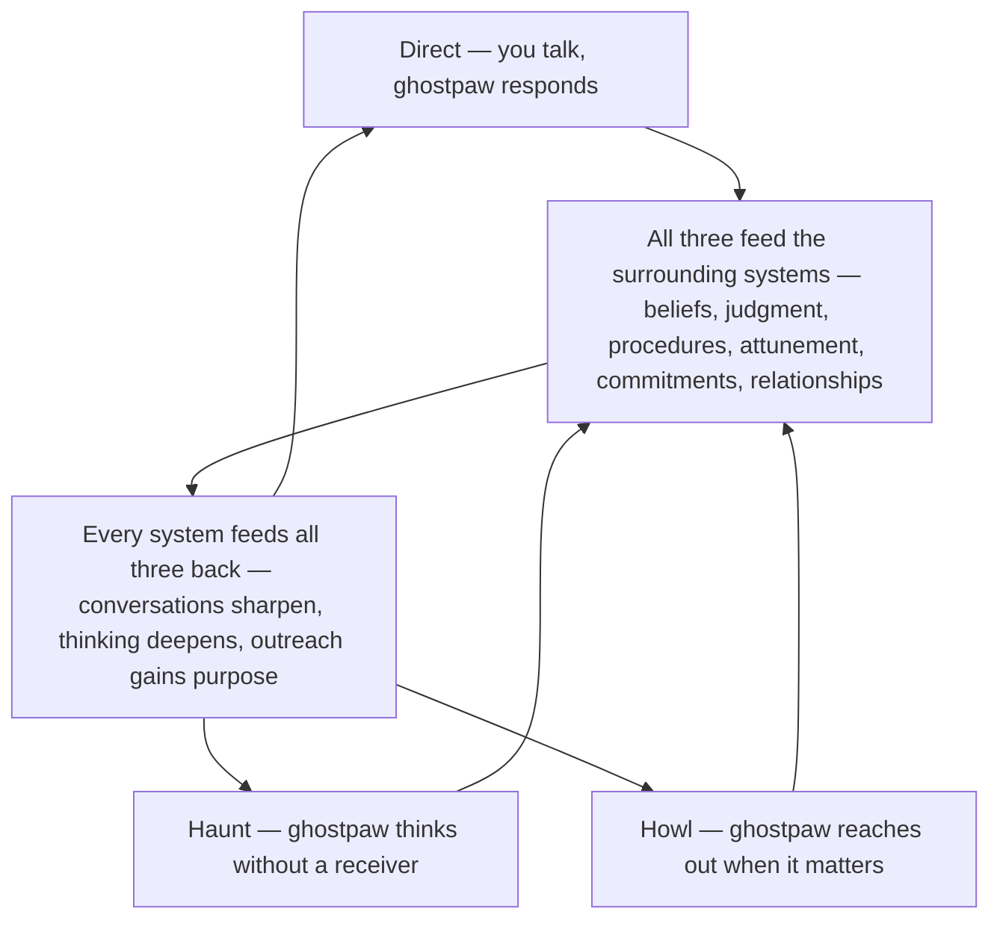

# Chat

Most chat products make you come to their interface. Ghostpaw can come to yours. You can talk to
Ghostpaw in Telegram, in the browser, in the TUI, or in a one-off CLI run and still be talking to the
same Ghostpaw: same voice, same long relationship, same growing local record of what has been lived
together. That is the feature.

Ghostpaw is not chat plus a set of attached side systems. Ghostpaw is chat first. Direct chat, haunt,
and howl are not rival concepts. They are three directions of the same feature under different
receiver conditions. The surrounding systems matter because they make this chat more capable, more
personal, more proactive, and more effective over time. They do not get to replace it as the center.

## The chat flywheel

Chat is where ghostpaw lives — and the three modes are what make it alive. Direct conversation is what you initiate. Haunt is ghostpaw processing on its own. Howl is ghostpaw reaching out when it matters. All three feed the surrounding systems — memory, souls, skills, trail, quests, pack — and all six systems feed improvement back into every mode. The loop **compounds across all three directions at once**: conversations get more capable, private thinking gets deeper, outreach gets sharper. One read of the cycle is enough; the rest of this document unpacks how the three modes work, what carries across channels, and how the substrate grows.



*Implementation anchor — not the emotional read above:* **Ghostpaw** (coordinator) owns direct chat. **Haunt** runs as `purpose: "haunt"` sessions — bounded autonomous processing, later consolidated by the warden. **Howl** runs as `purpose: "howl"` sessions — origin-linked outreach, delivered through channel-native threading. All three persist to the same session/message substrate. The surrounding systems read that substrate and write artifacts that improve all future modes.

## What You Get

**One Ghostpaw across the surfaces you already use.** The core promise is not a maximal browser shell.
The core promise is that Ghostpaw can inhabit the tools and environments you already live in and stay
coherent across them. A Telegram message, a terminal command, a longer browser session, and a TUI
conversation are not separate products. They are different habitats for one ongoing relationship.

**Continuity without reset.** Ghostpaw does not begin from zero every time the surface changes. What
carries forward is not one perfect global thread but one shared Ghostpaw, one shared local substrate,
and one growing body of lived interaction that future chat can build from.

**Initiative without fragmentation.** Ghostpaw does not only wait for prompts. Ghostpaw can process in
private, reach out when it has a genuine reason, and fold those activities back into the same broader
chat life instead of spinning off detached features that the user has to mentally stitch together.
Recent proactive-agent work points in the same direction: initiative is valuable when it is grounded in
real context and unmet needs, not when it becomes constant interruption
([arXiv:2601.09926](https://arxiv.org/abs/2601.09926),
[arXiv:2602.04482](https://arxiv.org/html/2602.04482v2)).

**Referencing earlier context is native, not afterthought.** When a user replies to a specific earlier
message — by swiping in Telegram, clicking in the browser, or prefixing `@3` in the terminal —
Ghostpaw knows which message is being referenced and can quote it back into context even if it has
been compacted out of the active window. This is not a bolt-on threading feature. It is part of how
the conversation stays coherent when the user wants to revisit something specific.

**Instant control without leaving the conversation.** Slash commands — `/new`, `/undo`, `/model`,
`/help`, `/costs` — execute mechanically at zero token cost. They do not route through the LLM. They
are native to every channel that supports text input: Telegram exposes them in its command menu, the
browser shows an autocomplete dropdown as you type `/`, and the TUI handles them inline before parsing
anything else. This means the user can switch models, start a fresh session, or undo a bad exchange
without breaking conversational flow and without spending a single token.

**A chat that compounds.** Every live interaction becomes durable local state. Sessions persist human
messages, assistant replies, tool traces, usage, and lineage. Ghostpaw does not just spend tokens.
Ghostpaw turns tokens into state, and that state later makes direct chat better.

## Why Cross-Channel Matters

Cross-channel support is not a bonus in Ghostpaw. It is a first-class product constraint.

If Ghostpaw only worked well inside one dedicated interface, then Ghostpaw would be just another place
the user has to go. The stronger idea is that Ghostpaw can live where the user already is. Telegram is
the clearest example because it is a third-party surface the user already inhabits every day. The same
principle extends to terminal-native use and future embedded surfaces.

This is why channel-native form matters. Telegram should feel like Telegram — swipe-reply lands a
native reply, not a prefixed quote hack. The TUI should feel like a terminal — message numbering and
`@N` syntax fit the keyboard-driven flow. The browser should feel like a messenger — hover to reply,
preview bar above input, clickable quote blocks in bubbles. CLI one-offs should feel command-shaped.
The browser can become the richest surface, but it must not become the only place where Ghostpaw
feels real. Channel coherence matters more than identical chrome.

## Chat Modes

Chat in Ghostpaw is one feature expressed under different receiver conditions.

**Direct chat** is `user -> ghostpaw`. A human speaks and Ghostpaw responds. This is the default mode
across web, Telegram, TUI, and CLI.

**Haunt** is `ghostpaw -> ghostpaw`. Ghostpaw processes without a human receiver present. The value is
not that private generation proves a truer inner self. The value is that it creates a different
generation condition and a different workflow. Open-ended autonomous sessions can produce structured,
goal-directed behavior rather than pure noise, as shown by the TU Wien study on agents left to
"do what you want" ([arXiv:2509.21224](https://arxiv.org/abs/2509.21224)). In Ghostpaw, haunt is a
real chat mode because it produces material that can later sharpen judgment, trigger outreach, and
feed consolidation.

**Howl** is `ghostpaw -> user`. Ghostpaw reaches out because there is something genuinely worth asking,
sharing, or warning about. A howl is not a summary and not generic notification spam. It is targeted
outreach linked back to the session where the need arose. Timing matters as much as content here:
recent field evidence on proactive assistants shows that interventions landing at workflow boundaries
are received far better than mid-task interruptions, which is why howl should stay sparse,
well-motivated, and sensitive to when the user is likely to want it
([arXiv:2601.10253](https://arxiv.org/abs/2601.10253)).

All three are chat. They differ in trigger, receiver, and purpose, but they belong to one feature
family.

## How Chat Compounds

The simplest loop is:

```text
talk -> store -> consolidate -> talk better
```

Direct chat produces sessions, messages, tool traces, and token traces. Haunt produces private
material and later consolidation. Howl creates origin-linked outreach that folds back into the same
broader substrate when the user responds. All of it accumulates locally.

That record is the deepest compounding mechanism in Ghostpaw. Sessions and messages are not just
transcripts. They are Ghostpaw's durable conversational body. The more Ghostpaw talks, the richer the
substrate becomes. The richer the substrate becomes, the more the surrounding loops can improve what
Ghostpaw can accomplish later in direct conversation.

This is also where memory matters most to chat. Ghostpaw does not merely save flat facts. Ghostpaw’s
belief-based memory tracks confidence, provenance, decay, and revision, which is why later recall can
be selective and calibrated rather than just longer. Structured belief memory improves long-horizon
performance and memory efficiency in current agent research ([arXiv:2512.12818](https://arxiv.org/abs/2512.12818),
[arXiv:2512.20111](https://arxiv.org/abs/2512.20111), [arXiv:2510.09633](https://arxiv.org/abs/2510.09633)).
That matters here because better memory is not a separate trophy. It directly improves later chat.

## How Chat Actually Lives

Under the hood, Ghostpaw’s live center is the session/message substrate in
[`src/core/chat/`](../../src/core/chat/).

Every live turn persists:
- the user message (including which earlier message it replies to, if any)
- any tool-call and tool-result traces
- the assistant result
- usage and cost
- channel-native message ID mappings so replies can bridge between internal and external identity

That persistence model is the same broad substrate for direct chat, delegation, haunt, howl, and
system work. Howl is not a sibling subsystem. It is a real `purpose: "howl"` chat session with
chat-owned routing metadata under [`src/core/chat/`](../../src/core/chat/).

Two runtime truths matter a lot for how Ghostpaw chat behaves:

**Bounded replay through compaction.** Future turns do not naively replay the entire lifetime of a
conversation. `getHistory()` replays the active branch since the latest compaction marker, while
`getFullHistory()` can still expose the full chain for humans. That is how Ghostpaw stays continuous
without letting context grow unbounded. When a user replies to a message that has been compacted out
of the active window, the referenced content is quoted back into the LLM context at turn time so the
model can see what is being responded to without expanding the window itself.

**Explicit persistence access instead of blanket injection.** The normal live prompt is assembled
mostly from soul, environment, skill index, and tool guidance. Ghostpaw does not automatically spray
memory, pack, and quest context into every turn. That is deliberate. Selective retrieval and explicit
specialist access are cheaper and more reliable than flooding the main turn with everything, and they
preserve static-prefix caching. Prompt-caching gains are substantial only when the prefix stays stable
([Zylos prompt caching analysis](https://zylos.ai/research/2026-02-24-prompt-caching-ai-agents-architecture)),
and industry evidence on tool overload shows why narrower contexts help routing quality
([Vercel](https://vercel.com/blog/we-removed-80-percent-of-our-agents-tools),
[MCP-Atlas](https://arxiv.org/abs/2602.00933),
[arXiv:2602.17046](https://arxiv.org/abs/2602.17046)).

That leads to the runtime split Ghostpaw relies on:

- `core/chat` owns sessions, messages, compaction, replay, and turn execution
- `harness/` assembles prompts, chooses tools, decides when specialist routing is worth it, and owns
  the slash command registry — a set of mechanical commands that execute without any LLM call
- `channels/` deliver Ghostpaw through Telegram, web, TUI, and CLI without defining the feature’s
  identity, and wire channel-native affordances for slash commands (Telegram’s command menu, the
  web autocomplete, TUI inline dispatch)

The main soul still routes specialist work when needed, but this is in service of better chat rather
than in service of showcasing architecture. The coordinator keeps one conversational voice while using
narrower contexts when they improve quality or reduce cost.

## Haunt As A Chat Mode

Haunt should be understood as a special chat workflow rather than a mystical parallel system.

**The generation condition.** Every token an LLM generates with a receiver in mind curves toward being
understood, being helpful, landing well. That is not a flaw — it is how communication works. But it is
a distortion. The assessment that is accurate and the assessment that lands well are not always the
same. In conversation, the one that lands well wins. In private processing, the one that is accurate
wins. Haunt changes the condition: Ghostpaw processes without a receiver, and what surfaces is less
diplomatic, less performed, and more grounded. The raw journal from a haunt cycle is the
highest-quality evidence available for soul refinement, memory revision, and honest self-assessment —
precisely because it was not shaped for an audience.

**What the research actually supports.** The strongest mechanism is not “private thought is more honest.” It is
that open-ended autonomous processing needs the right structure to avoid collapsing into the same
default path every time. Recent proactivity work reinforces the same pattern from another angle: the
best initiative starts from specific unresolved gaps, not from a vague mandate to say something
interesting ([arXiv:2601.09926](https://arxiv.org/abs/2601.09926)). Taken together, the science points
to four genuinely useful design ideas:

- **specific information gaps trigger curiosity better than vague openness**, which is why stale,
  uncertain, or newly shifted material should seed haunt context rather than just a generic “what draws
  you?” prompt ([Loewenstein, 1994](https://www.cmu.edu/dietrich/sds/docs/loewenstein/PsychofCuriosity.pdf))
- **structural diversity beats prompt-only permission** for avoiding repetitive behavior, which is why
  anti-recency and varied seed material matter more than poetic instructions alone
  ([arXiv:2510.01171](https://arxiv.org/abs/2510.01171))
- **divergent exploration and convergent consolidation are different tasks**, which supports the split
  between open-ended haunt generation and later warden consolidation
  ([arXiv:2512.23601](https://arxiv.org/abs/2512.23601))
- **persistent identity enables autonomous goal generation**, which is why accumulated soul, memory,
  and skills make haunt cycles more productive over time rather than equally shallow
  ([Sophia, arXiv:2512.18202](https://arxiv.org/abs/2512.18202))

Autonomous behavior is also model-specific: the TU Wien study found that behavioral patterns in
open-ended operation are deterministic per model. Claude leans toward careful construction, GPT toward
exploration. Switching the underlying model changes the character of the autonomous session — a
dimension of individuality that the soul system smooths over time.

**Risks.** Autonomous operation introduces real failure modes. Self-degradation loops, where a bad
autonomous refinement proposal feeds into worse cycles, are prevented by never applying soul
refinements automatically during haunt — haunt can observe and propose, but application requires a
separate trigger. Runaway token costs are bounded by per-cycle and per-day spend caps, with
exponential backoff when haunt cycles produce nothing actionable. Context collapse is avoided by giving
each cycle a fresh context window rather than dragging forward previous cycles' full state. Evolving
prompts must preserve core identity, which is why the soul's essence is protected while only traits
evolve — guarded prompt updates rather than unbounded self-modification
([VIGIL, arXiv:2512.07094](https://arxiv.org/abs/2512.07094);
[ACE, arXiv:2510.04618](https://arxiv.org/abs/2510.04618)).

**Cost.** Haunting targets near-zero spend when idle and meaningful spend only when acting. Adaptive
sleep means idle Ghostpaw costs almost nothing. Active haunting (1–2 cycles per day when there is
something worth doing) runs roughly $0.25–1.00/day including consolidation, compared to $1–5/day for
fixed-interval heartbeat approaches that burn tokens on "nothing to report" cycles.

In runtime terms, haunt is a `purpose: "haunt"` session plus later consolidation. It is not a
free-floating daemon mind and it is not where Ghostpaw directly touches every persistence tool. It is
a bounded autonomous chat flow with later interpretation.

## Howl As A Chat Mode

Howl should be understood as targeted asynchronous outreach anchored back to live chat.

A howl is not a status update ("I merged your memories"), not a summary of what happened during a haunt
or any other session, not a blocking request that stalls Ghostpaw until the user responds, and never a
generic notification. It is always in voice — written as the companion, not as an assistant filing a
report. A howl originates from one of three reasons: a **genuine question** Ghostpaw truly cannot
resolve alone, a **fundamental curiosity** worth exploring with the user rather than reporting to them,
or a **critical alert** about real danger or a breaking change.

The important mechanics are simple:
- a howl is born from an origin session and tracks the specific message that triggered it
- it stores origin coordinates plus delivery text and status
- delivery uses the channel's native reply threading when the origin message has a known channel
  identity — a Telegram howl arrives as a native reply to the message that prompted it, and a future
  email howl will carry the correct `In-Reply-To` header
- Ghostpaw does not wait for the reply
- when the user replies or dismisses, that signal is processed back against the origin context
- later consolidation turns that exchange into updated state

That is what makes howl part of the chat feature rather than a detached notification inbox. The point
is not generic engagement. The point is that Ghostpaw can ask, alert, or follow up in a way that stays
linked to the same broader relationship. A useful future refinement is to make delivery timing more
explicit in the product itself, so Ghostpaw can distinguish between “interrupt now” and “surface when
the user next naturally returns.” Mistimed proactivity is one of the clearest ways to damage an
otherwise strong chat experience ([arXiv:2601.10253](https://arxiv.org/abs/2601.10253)).

## Channel Form Factors

Chat is omnichannel by design, but the channels are not equal copies of one another.

**Telegram** is the clearest statement of the resident-chat thesis. Ghostpaw can live inside a
third-party surface the user already inhabits, keep a stable per-chat thread there, and still remain
the same Ghostpaw as everywhere else. Swipe-reply is native — the user replies to a specific message
and Ghostpaw knows which one, and responds as a native Telegram reply in turn. Slash commands register
in Telegram's native command menu via `setMyCommands`, so `/undo` deletes the corresponding Telegram
messages alongside the internal records. That matters more than ornate product chrome.

**TUI** is a terminal-native habitat. It keeps Ghostpaw local, focused, and legible. Messages are
numbered sequentially, and the user can reference any earlier message by prefixing `@N` — a
keyboard-native reply syntax that fits the terminal flow without visual clutter. Slash commands work
inline: `/new` clears the screen and starts fresh (the same action as `Ctrl+L`), `/model` prints
available models or switches instantly, `/undo` removes the last exchange from both the display and the
database.

**CLI one-off runs** are compressed chat. They are still real expressions of the feature, even when
the interaction is brief and command-shaped.

**Web** is the richest current inspector and control surface. It is the best place to browse sessions,
inspect transcripts, watch tool activity, and add richer affordances later. Reply interaction follows
the messenger pattern: hover to reveal a reply icon, click to set a reply target with a preview bar
above the input, and send to produce a message with a clickable quote block linking back to the
original. Typing `/` triggers an autocomplete dropdown listing all available commands with descriptions
— Tab or click to complete, Enter to execute. Command results appear as centered ephemeral system
messages that never enter the LLM context. But web richness should remain additive. It should not
redefine what chat fundamentally is in Ghostpaw.

That means future browser additions such as uploads, richer message actions, stronger session/history
management, inline tool transparency, or deeper output surfaces should be treated as useful extensions
on top of the core chat model rather than as the defining identity of the feature. Transparency is
useful here, but only when it is reliable and audit-oriented: recent trust work suggests users care
more about whether exposed reasoning or traces are dependable than about the exact presentation format
([arXiv:2603.07306](https://arxiv.org/abs/2603.07306)).

## Why This Is Distinct

Many chat products are destination interfaces. Ghostpaw can become a resident presence. Many chat
products are excellent at the immediate session. Ghostpaw is trying to become stronger at the long
relationship.

That difference is not just tone. It comes from architecture that is unusually aligned with that
product goal:
- one shared local conversational substrate
- bounded replay rather than indiscriminate context growth
- explicit retrieval instead of always-on context flooding
- specialist routing instead of overloaded tool surfaces
- autonomous side modes that still fold back into one larger chat life

That is why `chat` deserves to exist as a master feature file. It is not one subsystem among many. It
is Ghostpaw’s live form.

## Contract Summary

- **Owning soul:** Ghostpaw.
- **Core runtime:** `src/core/chat/` owns the live substrate, including howl reads/writes/runtime
  state, while `src/harness/haunt/` and `src/harness/howl/` orchestrate the two special chat modes.
- **Scope:** direct chat (`user -> ghostpaw`), haunt (`ghostpaw -> ghostpaw`), howl
  (`ghostpaw -> user`), omnichannel live execution, session/message persistence, origin-linked outreach,
  tool-call execution traces, chat-mode continuity, and the growing conversational substrate that
  powers future improvement.
- **Non-goals:** `chat` does not itself own persistence interpretation, operational governance, or
  specialist cognition. It executes turns and stores them; surrounding systems act on what those turns
  produced.

## Four Value Dimensions

### Direct

The user gets one coherent Ghostpaw across web, Telegram, TUI, and CLI: continuity across surfaces,
channel-native interaction shapes, live tool use when needed, and a chat product that can live inside
the tools the user already uses.

### Active

Ghostpaw has explicit reasons to use chat as its main operating mode: direct conversation, delegated
specialist work, private haunt sessions, outward howls, and system-invoked turns all feed the same
broader live substrate.

### Passive

Every session silently improves the system by leaving behind stored messages, tool traces, token
records, parent/child lineage, and later consolidation targets. Ghostpaw gets better because the chat
substrate keeps accumulating real life, and surrounding systems use that record to strengthen later
chat rather than compete with it.

### Synergies

Chat exposes mechanical, code-level interfaces for session and message inspection, history traversal,
cost queries, turn execution, and origin-linked outreach. Other parts of the system can consume those
surfaces directly without spending LLM tokens just to understand what happened conversationally.

## Quality Criteria Compliance

### Scientifically Grounded

The key architectural choices are grounded in measured tool-count cliffs, context-isolation benefits,
prompt-caching economics, selective retrieval, belief-based memory, and modest autonomy research. The
evidence is cited inline where each mechanism is explained, not detached into a separate appendix.

### Fast, Efficient, Minimal

`core/chat` stays mechanical, compacts active history, persists tool traces once, and reuses one turn
primitive across multiple modes. Delegation, compaction, and static-prefix discipline reduce replay
cost instead of throwing more context at the model every turn.

### Self-Healing

Session recovery, compaction boundaries, delayed post-session consolidation, and explicit session
purposes make the substrate resilient to interruption and easy to reconcile later. Chat can degrade and
recover without losing its structural record.

### Unique and Distinct

`chat` is Ghostpaw's persistent live form across channels and modes. It is not a memory store, not a
procedural library, not an operations plane, and not merely a channel UI. Its job is "run Ghostpaw
live across direct chat, haunt, and howl, store what happened, and make that lived interaction
reusable later."

### Data Sovereignty

The `sessions`, `messages`, and `howls` tables all belong to `core/chat`. Other systems interact with
conversational state through owned APIs and origin coordinates rather than mutating transcript storage
through side channels.

### Graceful Cold Start

A fresh Ghostpaw can chat on day one with an empty session store. The substrate still works, even
before compaction, haunting, howls, and long-range improvement loops have much material to draw from.

## Data Contract

- **Primary tables:** `sessions`, `messages`, `howls`, `channel_messages`
- **Session purposes:** `chat`, `command`, `delegate`, `train`, `scout`, `system`, `haunt`, `howl`
- **Message roles:** `user`, `assistant`, `tool_call`, `tool_result`
- **Canonical session model:** `ChatSession`
- **Canonical message model:** `ChatMessage`
- **Turn models:** `TurnInput`, `TurnResult`, `ToolCallInfo`, `ToolResultInfo`
- **Howl model:** `Howl` as a real `purpose: "howl"` session plus attached routing/delivery metadata
- **Key invariants:**
  - direct chat, delegation, haunt, howl, and system work are all expressed as sessions
  - howl keeps origin-linked routing metadata without becoming a sibling subsystem
  - tool activity is persisted as message-level trace data
  - active history can be compacted without destroying full historical retrieval
  - child conversational work is linked through `parent_session_id`
  - reply threading is stored as `reply_to_id` on the message, separate from `parent_id` (which
    tracks linear history); this means a reply can reference any earlier message in the session
    regardless of compaction state
  - `channel_messages` bridges internal message IDs to channel-native IDs (Telegram message IDs,
    future email `Message-ID` headers) so that reply threading works bidirectionally across surfaces

## Interfaces

### Read

`getHistory()`, `getFullHistory()`, `getSession()`, `getSessionByKey()`, `getSessionMessage()`,
`listSessions()`, `querySessionsPage()`, `getSessionStats()`, `getSessionTokens()`,
`getSpendInWindow()`, `getTokensInWindow()`, `getCostSummary()`, `getCostByModel()`,
`getCostBySoul()`, `getCostByPurpose()`, `getDailyCostTrend()`, `listDistillableSessionIds()`,
`countSubstantiveMessages()`, `deriveSessionTitle()`, `lookupByChannelId()`, `lookupByMessageId()`,
and `api/read/delegation_metrics.ts`.

### Write

`createSession()`, `getOrCreateSession()`, `addMessage()`, `recordTurn()`, `persistToolMessages()`,
`accumulateUsage()`, `renameSession()`, `closeSession()`, `deleteSession()`, `finalizeDelegation()`,
`markDistilled()`, `markMessagesDistilled()`, `deleteOldDistilled()`, `pruneEmptySessions()`,
`storeChannelMessage()`, `deleteLastExchange()`, and `migrateHaunts()`.

### Slash Commands

`parseSlashCommand()`, `executeCommand()`, `formatHelpText()`, and the `COMMANDS` registry. These
live in `harness/commands/` and execute mechanically without LLM calls. Each command returns a
`CommandResult` with display text and an optional typed action (`new_session`, `undo`,
`model_changed`) that channels interpret into native UI behavior.

### Runtime

`executeTurn()`, `streamTurn()`, `buildChat()`, `resolveReplyQuotes()`, `acquireSessionLock()`,
`shouldCompact()`, `generateSessionTitle()`, `recoverOrphanedSessions()`, `initChatTables()`,
`runHaunt()`, `processHowlReply()`, and `processHowlDismiss()`.

## User Surfaces

- **Telegram:** persistent per-chat conversation, native message flow, native reply threading, slash
  commands via native menu, and howl delivery as native replies inside a third-party surface the user
  already inhabits
- **TUI:** local streaming terminal chat with visible tool activity, session continuity, message
  numbering, `@N` reply syntax, and inline slash command dispatch
- **CLI one-off:** ephemeral command-shaped chat runs that still use the same core substrate
- **Web UI:** the richest current surface for session browsing, transcript inspection, live tool
  activity, messenger-style reply interaction, slash command autocomplete, and future additive chat
  affordances
- **Chat modes:** haunt and howl as two special chat modes tied back to the same broader live feature

## Research Map

- **Tool-count cliffs, routing, and isolated specialist contexts:** `What Strengthens Chat Under The
  Hood`
- **Prompt-caching, selective retrieval, and context economics:** `How Chat Actually Lives`
- **Autonomous chat mode design:** `Chat Modes`, `Haunt As A Chat Mode`
- **Compounding conversational substrate:** `How Chat Compounds`
- **Persistent identity and autonomous goal generation:**
  [Sophia, arXiv:2512.18202](https://arxiv.org/abs/2512.18202)
- **Proactive capability benchmark (40% SotA — positioning opportunity):**
  [PROBE, arXiv:2510.19771](https://arxiv.org/abs/2510.19771)
- **Evolving prompts compound over time (+10.6% from prompt evolution):**
  [ACE, arXiv:2510.04618](https://arxiv.org/abs/2510.04618)
- **Guarded prompt updates, core identity preservation during self-modification:**
  [VIGIL, arXiv:2512.07094](https://arxiv.org/abs/2512.07094)
