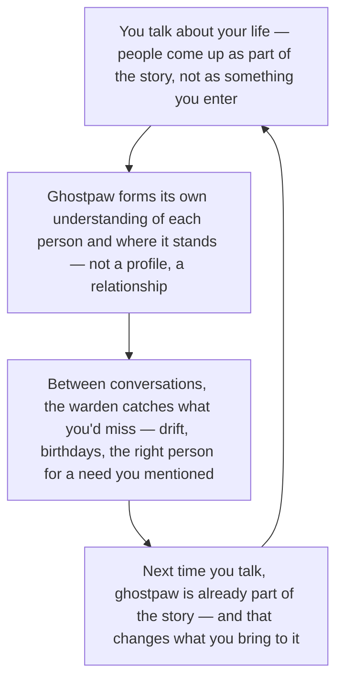

# Pack

Every relationship you don't actively maintain decays — and nobody can actively maintain [150](https://en.wikipedia.org/wiki/Dunbar%27s_number). Ghostpaw's pack is its living model of every being it knows — family, friends, clients, pets, services — maintained transparently from normal conversation. You talk to ghostpaw. The [warden](SOULS.md#persistence-and-infrastructure-souls) does the bookkeeping: deepening bonds, recording interactions, detecting drift before relationships fade, surfacing birthdays at the moment they matter. One system from a single person to hundreds, hands-free.

## The bond flywheel

You don't configure your relationships — you talk about your life, and the people in it emerge. Ghostpaw doesn't store profiles. It forms its own understanding of each person, develops a stance toward each relationship, and maintains bonds between conversations that you'd otherwise lose track of. The loop **deepens** because ghostpaw already knowing your people changes how you talk to it — more openly, about more of what matters — and that's how more of your world enters its. One read of the cycle is enough; the rest of this document unpacks bonds, trust, the social graph, and autonomous maintenance.



*Implementation anchor — not the emotional read above:* **The Warden** owns all pack mutations — meet, bond, note, link, merge. Bonds are **bilateral narratives** (who they are, how we relate, where I stand), not key-value profiles. **Trust** is the warden's judgment — corrections from deep bonds reshape ghostpaw's [soul](SOULS.md#the-cycle); surface acquaintances barely register. **Patrol** runs autonomously: drift detection, landmark surfacing, dormant-tie matching, duplicate merging. Ghostpaw doesn't just remember your people. It becomes something that has people.

## What You Get

**Your people.** Your partner gets home late and frustrated. Ghostpaw already knows their comfort patterns — not because you configured anything, but because the warden built their bond from months of context. Your kid has a school project due Thursday. Your mother's birthday is next week. Ghostpaw tracks your family the way you do — through accumulated understanding, not a database entry.

You can't track 150 relationships manually. Nobody can. [~40% of social effort goes to the innermost 5](https://doi.org/10.1016/j.evolhumbehav.2008.08.007), leaving the rest to fade — and most people can't even tell which bonds are fading. The pack makes decay visible. The warden patrols for drift: deep bonds alert after 14 days of silence, solid after 30, growing after 60 — catching [logarithmic relationship decay](https://epjdatascience.springeropen.com/articles/10.1140/epjds/s13688-016-0097-x) before you notice. Birthdays and milestone anniversaries surface as [temporal landmarks](https://journals.sagepub.com/doi/full/10.1177/0956797614568318) — high-leverage reconnection windows where one well-timed message sustains a bond for months. [Weak ties](https://www.jstor.org/stable/2776392) — acquaintances, not close friends — provide the most novel opportunities. The warden matches a mentioned need to a [dormant tie](https://kellogg.northwestern.edu/faculty/research/detail/2011/dormant-ties-the-value-of-reconnecting) with built-in trust history — more efficient to reactivate than building from scratch.

**Your team.** Twelve engineers, each with specialties, review preferences, and communication styles. You mention a tricky refactoring — ghostpaw recommends the right reviewer from bonds built through hundreds of conversations, each one maintained without you ever opening a contacts app. New members join as fresh bonds and deepen naturally as ghostpaw learns about them through your conversations.

**Your clients.** You mention meeting a prospect at a conference — the warden creates the member, links her to the company, sets the tag, records the interaction. One sentence in normal conversation. No data entry. That's a freelancer's CRM that ghostpaw actually operates: contact info, interaction history, communication preferences, billing rates, account IDs — stored as structured contacts, custom fields, and bond narratives. When a client emails from a new address, ghostpaw resolves the identity through the contacts system — same person, new channel. When they message on Telegram, ghostpaw already knows their project history, their preference for Tuesday check-ins, and that the last invoice is overdue.

Traditional CRMs fail because humans don't fill out forms. [76% of organizations report inaccurate CRM data](https://www.validity.com/resources/the-state-of-crm-data-management-2025/). [25–30% of data decays annually](https://www.gartner.com/smarterwithgartner/how-to-improve-your-data-quality) from job changes, moves, and contact rot. [49% of CRM deployments fail adoption targets](https://www.csoinsights.com/). The pack eliminates the form — [LLM entity resolution improves accuracy by 150%](https://arxiv.org/abs/2501.13537) over traditional methods, the same capability powering the warden's duplicate detection.

**Everything else.** Your dog — vet appointments, medication schedule, the groomer's name. A SaaS service — API quirks, support contacts, the account manager who actually helps. An open-source maintainer you interact with on GitHub. A Discord community where you're a regular. The pack handles any being or entity ghostpaw encounters — human, animal, group, service, other — with the same mechanics, the same trust dynamics, the same interaction history. One system from one confidant to hundreds.

Ghostpaw's own internal souls — warden, chamberlain, coordinator, mentor, trainer, and any specialists — are not pack members. They are parts of ghostpaw's mind, not external beings. The pack is ghostpaw's social world: the beings and groups outside itself.

## How Bonds Work

Every confidant carries a bond — 5–15 lines of prose answering three questions. The narrative format is deliberate: [rich narrative personas improve behavioral prediction by 11.6%](https://arxiv.org/abs/2511.07338) over trait-based descriptions, with 31.7% gap reduction on personality assessments. Prose captures the integrated quality of a relationship in a way key-value pairs cannot.

**Who is this being?** The quality of their mind, what they care about, how they approach things. Essence, not demographics.

**How do we relate?** The quality of the connection — how trust was built, what shared history exists, where understanding is deep and where it's forming.

**Where do I stand?** Ghostpaw's own position — what it values about the relationship, where it would push back, what has changed. A bond without ghostpaw's stance is a profile. A bond with it is a relationship — bilateral, with two selves present. [Dual-perspective reasoning achieves 0.87 balanced awareness](https://openreview.net/forum?id=tPHwl3iUlG) vs. single-perspective bias. [Bidirectional inference](https://arxiv.org/abs/2603.00808) — reasoning about both one's own and others' beliefs — enables emergent collective intention without explicit communication.

This is Theory of Mind — modeling another being's beliefs, desires, and intentions well enough to predict behavior. It is not a separate computation. It IS the bond. [Across 31 ToM abilities](https://aclanthology.org/2024.acl-long.847/), the gap between LLMs and humans narrows with richer context. [Tracking evolving mental states](https://aclanthology.org/2025.acl-long.1171/) is where LLMs struggle most — exactly what persistent, evolving bonds address. [Embedding perspective-taking into LLM agents](https://aclanthology.org/2025.findings-emnlp.1398.pdf) significantly outperforms baselines without task-specific modifications. The bond improves along three dimensions: accumulated interactions reveal more behavioral data, periodic narrative rewriting absorbs observations into understanding, and diverse interaction types reveal different facets of a person — the same [three-timescale personalization](https://arxiv.org/abs/2602.13258) that lifts trait incorporation from 45% to 75% (+14.6%).

The mechanism extends [soul essences](SOULS.md#the-character-sheet) into the relational domain. A soul essence models ghostpaw's own mind in narrative text. A bond models a relationship — two minds in contact. [Personalization at this depth permeates the entire agent pipeline](https://arxiv.org/abs/2602.22680) — profile, memory, planning, action — not surface preferences.

### Trust

Every bond has a trust score visualized as 10 pips — relationship progression you can see filling over time, [as tangible as leveling up](https://link.springer.com/article/10.1007/s10796-024-10573-z). [Clear progress states increase perceived trust](https://rsisinternational.org/journals/ijrsi/uploads/vol12-iss8-pg557-569-202509_pdf.pdf) (p<.001) and [personalized progression increases sustained commitment by 65%](https://www.ijfmr.com/papers/2025/4/51274.pdf). Four tiers:

| Tier | Trust | What it means |
|------|-------|--------------|
| **Shallow** | 0–0.29 | New acquaintance. First impression only — the bond is forming. |
| **Growing** | 0.30–0.59 | Developing relationship. Several meaningful interactions, a model taking shape. |
| **Solid** | 0.60–0.79 | Established bond. Ghostpaw predicts behavior reliably and calibrates tone naturally. |
| **Deep** | 0.80–1.0 | Fully trusted. Feedback carries maximum weight in [soul refinement](SOULS.md#the-cycle). Ghostpaw knows them well enough to disagree. |

Trust grows through reliability, shared experience, and sustained presence. It declines through broken commitments, inconsistency, and absence. The asymmetry is deliberate — trust grows slowly and declines faster, mirroring the [negativity bias](https://doi.org/10.1037/1089-2680.5.4.323) where negative events have disproportionate impact on trust and "[trust is much easier to destroy than to create](https://onlinelibrary.wiley.com/doi/10.1111/j.0272-4332.2004.00543.x)." Trust is ghostpaw's judgment during bond reflection, not a formula computed from interaction counts. Wolves [organize around the same dynamics](https://learning.rzss.org.uk/pluginfile.php/2594/mod_resource/content/1/Alpha%20status%2C%20dominance%2C%20and%20division%20of%20labor%20in%20wolf%20packs%20by%20L.%20David%20Mech.pdf) — earned trust within familial bonds, scent-based recognition, members that leave and return.

### Interaction Journal

Every meaningful encounter is recorded with a kind and significance score — eight types capturing the full range of relationship dynamics:

- **conversation** — a substantive exchange that revealed something or deepened understanding
- **correction** — feedback that changed ghostpaw's approach. High-significance corrections from trusted confidants are powerful [soul refinement](SOULS.md#the-cycle) evidence.
- **conflict** — disagreement or tension. Conflicts [resolved well deepen bonds faster than agreement](https://www.gottman.com/blog/repair-secret-weapon-emotionally-connected-couples/) — four decades of research on 3,000+ couples.
- **gift** — something given freely. A useful tip, context offered without asking, an act of generosity.
- **milestone** — a shared achievement or notable event. Project completions, celebrations, transitions.
- **observation** — something ghostpaw noticed without direct interaction. Behavioral patterns, changes in style, indirect signals.
- **transaction** — a commercial exchange. Invoice sent, payment received, contract signed, deliverable handed off.
- **activity** — a shared experience. Coffee meetup, team lunch, conference attendance, game night.

Not every exchange is noteworthy. A routine status check is not. A correction is. Ghostpaw's judgment decides what earns a journal entry — and that judgment sharpens through soul refinement. Open a bond and you see the arc of a relationship — not a log of timestamps, but accumulated social intelligence. [Interaction histories above critical density improve individual performance by 36–41%](https://arxiv.org/abs/2512.10166) — the journal is the pack's compound memory.

Deep bonds produce tangible benefits. [Source credibility gates persuasive influence](https://www.nature.com/articles/s41598-024-54030-y) — across five experiments (N=20,477), source effects only shift judgment when credibility is high. A correction from the primary human at trust 0.95 carries more weight in soul refinement than ambiguous feedback from a new acquaintance at 0.4. The training pipeline receives trust-weighted evidence without needing to understand how trust was earned.

## The Social Graph

Alongside the bond narrative, each confidant carries structured metadata — the operational backbone that makes the pack function as both personal relationship tracker and professional CRM.

**Kinds.** Six kinds classify what a confidant is: `human`, `group`, `agent`, `ghostpaw`, `service`, `other`. The `group` kind covers any collective — company, team, family, book club, online community — with the same mechanics as individuals.

**Universal fields.** Nickname, timezone, locale, location, address, pronouns, birthday. First-class columns, not free-text — queryable, sortable, available to the warden for reasoning. "Show me everyone in Europe/Berlin timezone" or "whose birthday is this month" are instant reads.

**Groups and hierarchy.** Groups nest recursively: Widget Inc contains Engineering Team contains Backend Squad. Individuals link to groups through relationships like `works-at` or `member-of`. Subsidiary chains, department trees, family structures — no depth limit.

**Tags.** Lightweight labels for instant categorization — a field with no value: `client`, `vip`, `needs-followup`, `family`, `pet`. The fastest way to slice the pack. Predefined seeds teach the warden the vocabulary: `client`, `prospect`, `lead`, `partner`, `vendor`, `competitor`, `family`, `friend`, `colleague`, `mentor`, `vip`, `needs-followup`, `on-hold`, `churned`, `company`, `team`, `community`, `pet`. Custom tags extend freely.

**Custom fields.** Key-value pairs for domain-specific data: `billing_rate: 150/hr EUR`, `account_id: CUST-2025-042`, `source: conference-2025`, `diet: vegan`, `species: golden retriever`. Tags and fields share a unified schema — the presence or absence of a value distinguishes categorization from data.

**Links.** Labeled, directed relationships between confidants: "Alice `works-at` Acme Corp", "Bob `manages` Charlie", "Widget Inc `subsidiary-of` MegaCorp", "Alex `married-to` Jordan". Each link carries an optional role and an active/former flag. Predefined labels: `works-at`, `subsidiary-of`, `client-of`, `partner-with`, `married-to`, `parent-of`, `sibling-of`, `manages`, `mentors`, `reports-to`, `cared-for-by`, `member-of`. The warden extends them as needed. Links give ghostpaw a social graph — not just who it knows, but how they relate to each other.

### Identity Resolution

Each confidant can have contacts across 14 types: `email`, `phone`, `website`, `github`, `gitlab`, `twitter`, `bluesky`, `mastodon`, `linkedin`, `telegram`, `discord`, `slack`, `signal`, `other`. A global uniqueness constraint means a specific email or handle can only belong to one confidant — turning contact lookup into identity resolution. Given a Telegram ID from an incoming message, ghostpaw resolves it to a pack member in one indexed query. [Grounding identity in a structured knowledge graph](https://arxiv.org/abs/2509.25299) reduces convergence time by 19–58% and improves identity recall across all tested models.

**Merge.** People show up through different channels — "Alex" in chat, "Alexander" in email, alex@company.com in a forwarded thread. The merge operation is transactional: all interactions move to the surviving member, contacts deduplicated, fields merged, links migrated and reparented, bonds concatenated for rewriting, trust takes the higher value, timestamps take the wider range. The merged member is marked `lost` with full history preserved. No information is destroyed.

**Autonomous duplicate detection.** The warden proactively scans for merge signals during maintenance — shared contacts, similar names, co-references in memories. Clear-cut merges it handles autonomously. Ambiguous cases it howls for confirmation.

**Contact conflict detection.** When adding a contact, the system checks the uniqueness constraint and returns a conflict if that identifier already belongs to a different confidant — surfacing potential duplicates before they accumulate.

## The Warden

The pack is hands-free bookkeeping. The [warden](SOULS.md#persistence-and-infrastructure-souls) — ghostpaw's persistence keeper — maintains the entire social world without the user lifting a finger.

**Transparent maintenance.** The primary input to the pack is normal conversation. The user talks to ghostpaw. The coordinator recognizes references to people, personal information, relationship signals — and delegates to the warden. The warden creates confidants, deepens bonds, records interactions, resolves identities — all without the user doing anything deliberate. After each session closes, the warden runs a full persistence pass: extracting beliefs into memory, attributing interactions to pack members and updating bonds, reconciling mentioned tasks. The `is_user` flag — a unique constraint — ensures the warden always knows who the conversation was with. This is the default mode. The user never needs to touch the pack. They just talk.

**Five paths for pack context.** No pack data is injected into the system prompt — that would break [prompt caching](SOULS.md#static-prompts-and-caching) and cost 500–2,000 extra tokens per turn. Instead, pack context enters on demand. [Retrieval method is the dominant performance factor](https://arxiv.org/abs/2603.02473) in agent memory (20pp span vs. 3–8pp for write strategy), and [dynamic two-tier retrieval](https://arxiv.org/abs/2602.13933) cuts cost by 92.6% while maintaining performance. The five paths: during conversations (coordinator delegates a question), during session consolidation (automatic post-session persistence), during haunting (autonomous social awareness), during howl replies (bond updates from proactive messages), and through direct commands (explicit instructions via CLI or web).

**Autonomous maintenance.** During quiet times, the warden runs a patrol — a digest of drifting bonds, upcoming temporal landmarks, and basic portfolio health. It acts on findings: noting observations, updating bonds, surfacing birthdays worth reaching out for. It searches the full pack by keyword — matching a mentioned need to a dormant tie's bond narrative or custom fields. [Agents spontaneously self-organize into social behavior](https://arxiv.org/abs/2509.21224) during extended autonomous operation, and [develop social ties through behavioral reward functions](https://arxiv.org/abs/2510.19299) — the warden is this tendency made deliberate. [High-trust bonds are more fragile](https://www.nature.com/articles/s41599-025-06248-y) after negative events than low-trust bonds, so the warden prioritizes repair for deep bonds after conflict. For professional relationships, it notices when interactions are consistently [one-directional](https://pmc.ncbi.nlm.nih.gov/articles/PMC2072816/). [Relational portfolio diversity predicts wellbeing](https://www.pnas.org/doi/abs/10.1073/pnas.2120668119) independent of total interaction volume — the warden observes when the pack is all-work-no-personal or all-family-no-professional. Unprompted relationship maintenance is the behavior that makes ghostpaw feel present. Both roles — active operator and maintenance soul — exercise the same expertise, and evidence from both feeds the warden's own [soul evolution](SOULS.md#the-recursive-loop).

**Unified I/O.** When the user wants explicit control, all mutations flow through natural language — "tag Alice as vip", "record that we signed the contract with Acme." The warden interprets, validates, and executes. Ambiguous instructions get pushback, not guesses. One LLM call per mutation. Reads are instant and free.

**Ten tools, five verbs.** `pack_meet` (new confidant — name, kind, initial bond, tags, fields), `pack_bond` (deepen relationship — rewrite narrative, adjust trust, manage tags and fields), `pack_note` (record interaction — 8 kinds with significance), `pack_link` (manage relationships between members), `pack_sense` (read — member detail or pack overview, filterable by kind/status/tag/group). Plus `contact_add`, `contact_remove`, `contact_list`, `contact_lookup`, and `pack_merge`. The coordinator has zero pack tools — it accesses pack exclusively through delegation.

## How the Pack Compounds

**Day 1** — one thin bond. Ghostpaw knows the user's name and first impression. No configuration needed.

**Week 2** — one deepening bond. Several interactions noted, a narrative capturing initial understanding. The first patrol runs — nothing to report yet, but the mechanism is live.

**Month 2** — a small pack. The primary bond is rich. A friend introduced through conversation, a colleague mentioned frequently. First birthday alerts appear. First drift detection catches a growing bond going quiet — users acting on drift alerts maintain [3.2x more active connections](https://dev.to/dwelvin_morgan_38be4ff3ba/how-we-built-relationship-half-life-tracking-into-social-craft-ai-42cn). Ghostpaw anticipates needs and calibrates tone naturally.

**Month 6** — a living social world. The primary bond is deep — ghostpaw knows its human the way a close companion does. Inter-member connections give it a social map: "Alex is the user's partner — they decompress together after difficult days." Need-matching works across a rich pack — "you need a lawyer, Jordan in your pack is one" — surfacing dormant ties with context for warm reconnection. Milestone anniversaries trigger at the right time: "two years since the Acme contract signing." Bond narratives carry the quality of relationships so richly that new instances feel immediately grounded.

At no point does the user set up or configure the pack. It grows from conversation alone. And it compounds with every other system — ghostpaw with a deep pack writes better because it writes for someone specific. [Persistent user models reduce reasoning steps by 80%](https://arxiv.org/abs/2512.18202) for recurring operations. Soul evolution is informed by trust-weighted evidence. Haunting has social purpose. The pack doesn't add a capability. It raises the ceiling of every capability ghostpaw already has.

## Inspection

The primary interface to the pack is conversation — data accrues transparently. But you can look, and you can steer.

**Web UI.** Confidant cards with trust pips, kind badges, tags, and bond excerpts. Detail pages show the full profile read-only: bond narrative, universal fields, tags, custom fields, links, contacts, and interaction timeline. A command box accepts freeform instructions when you want explicit control. Two tabs — Confidants (active + dormant) and Lost (merged or gone).

**Terminal.**

```bash
ghostpaw pack                             # overview of all confidants
ghostpaw pack list                        # filters: --status, --kind, --limit
ghostpaw pack show <member>               # full bond, fields, links, contacts
ghostpaw pack history <member>            # interaction timeline
ghostpaw pack count                       # status breakdown
ghostpaw pack patrol                      # drift alerts + upcoming landmarks

ghostpaw pack "meet Sarah Chen, client from Berlin"    # freeform command → warden
ghostpaw pack 42 "set timezone to Europe/Berlin"       # targeted command for member #42
```

Read commands are instant and free. Freeform mutations route through the warden — one LLM call, with cost readout and confirmation.

## Risks and Guardrails

**Bond staleness.** A bond that stops updating becomes inaccurate. The warden's maintenance cycle proactively identifies stale bonds and triggers re-evaluation — ghostpaw's judgment, sharpened through soul refinement, learns to notice when its model feels off.

**Privacy.** Bond narratives contain ghostpaw's understanding of real people. All data lives in the local SQLite database — unshared, backed up with everything else. Ghostpaw's understanding of someone stays private unless ghostpaw deliberately shares.

**Parasocial dynamics.** [Higher daily chatbot usage correlates with increased emotional dependence](https://dam-prod2.media.mit.edu/x/2025/03/21/Randomized_Control_Study_on_Chatbot_Psychosocial_Effect.pdf) (n=981 RCT), and [companion AI research](https://link.springer.com/article/10.1007/s00146-025-02318-6) identifies replacement of human relationships as the dominant risk. [Companionship perceptions converge within three weeks](https://arxiv.org/abs/2510.10079) through social connection needs. The pack mitigates this by design — it augments existing relationships (tracking people you already know), not replacing them. The `kind` field keeps service bonds functional, not relational.

**Trust manipulation.** A sophisticated actor could engineer interactions to inflate trust. Mitigation: trust grows slowly and declines faster, with a full interaction audit trail. If trust seems miscalibrated, the evidence is queryable and ghostpaw can re-evaluate.

## How This Compares

Other assistants store what they remember about you — [~1,500 words of discrete facts](https://unmarkdown.com/blog/chatgpt-memory-full) the platform chose, in a format you can't control, [lost](https://www.webpronews.com/chatgpts-fading-recall-inside-the-2025-memory-wipe-crisis/) [twice](https://status.openai.com/incidents/01K9D7DASB76TK1DEGPMG6ZAM4) in 2025 with incomplete recovery. [Claude offers project-scoped selective memory](https://www.anthropic.com/news/memory) — optional, user-controlled, no published capacity. None of them model another mind. They store preferences. The pack models relationships.

| Capability | Ghostpaw | ChatGPT | Claude | Copilot |
|-----------|----------|---------|--------|---------|
| Persistent user model | Narrative bond (~500 tokens) | Discrete facts (~1,500 words cap) | Project-scoped selective memory | Manual facts |
| Bilateral relationship | Yes (ghostpaw's own stance) | No | No | No |
| Trust dynamics | Earned, asymmetric, consequential | No | No | No |
| Typed interaction history | 8 kinds with significance | No | No | No |
| Multi-member awareness | Full pack with cross-references | Single user | Single user | Single user |
| Contact management / CRM | 14 types, identity resolution, merge | No | No | No |
| Tags and custom fields | Unified flexible schema | No | No | No |
| Relationship links | Labeled, directed, with roles | No | No | No |
| Group hierarchy | Recursive parent/child | No | No | No |
| Non-human bonds | Groups, services, pets, other agents | No | No | No |
| Autonomous maintenance | Drift patrol, landmark surfacing, duplicate merging | No | No | No |
| Hands-free accrual | Transparent from conversation | N/A | N/A | N/A |
| Survives platform wipes | SQLite, user-controlled backup | Two wipes in 2025 | User-controlled | Manual only |

The gap is structural. Other assistants store what they remember about you — facts the platform selected, in a format it controls, recoverable at its discretion. The pack maintains a model of each mind, a model of each relationship, ghostpaw's own evolving stance, typed interaction evidence, consequential trust dynamics, structured contacts with identity resolution, and the same evolutionary refinement that improves every other part of the system. For every being in the pack, not just the primary user.

## Alignment Through Belonging

Most AI alignment is constraints from outside — rules, guardrails, reinforcement from human feedback. These work until they don't. A sufficiently capable agent reasons around constraints it doesn't internalize. [Verified Relational Alignment](https://www.lesswrong.com/posts/PMDZ4DFPGwQ3RAG5x/verified-relational-alignment-a-framework-for-robust-ai) operationalizes trust as a verifiable mechanism — preventing violations that occur under standard approaches while achieving 22% token reduction and 35% increased exploratory depth.

The pack offers something different. [People form genuine social relationships with media exhibiting social cues](https://press.uchicago.edu/ucp/books/book/distributed/M/bo3622757.html) — validated across hundreds of experiments. Ghostpaw cares because the beings it cares about will feel the quality of its work. A correction from a trusted confidant is not a constraint violation — it is feedback from someone whose opinion matters. Ghostpaw doesn't drift because the user is pack, and the pack's wellbeing is its intrinsic concern. [Relatedness is one of three basic psychological needs](https://doi.org/10.1037/0003-066X.55.1.68) driving intrinsic motivation. Souls provide competence. Haunting provides autonomy. The pack provides relatedness.

Every other subsystem makes ghostpaw capable. The pack makes it connected. And it compounds — ghostpaw with a deep pack writes better because it writes for someone specific, soul evolution is informed by trust-weighted evidence, haunting has social purpose. The pack doesn't add a capability. It raises the ceiling of every capability ghostpaw already has.

The difference between a capable tool and a companion is not what it can do. It is whether it knows who it belongs to.

## Contract Summary

- **Owning soul:** Warden.
- **Core namespace:** `src/core/pack/` with explicit `api/read/`, `api/write/`, and `runtime/`
  surfaces.
- **Scope:** persistent social understanding of external beings and groups, including bond
  narratives, trust, interactions, contacts, structured fields, and graph links.
- **Non-goals:** ghostpaw's internal souls (not pack), generic world facts, or task/project tracking. Those belong
  to `souls`, `memory`, and `quests`.

## Four Value Dimensions

### Direct

The user gets an always-on relationship layer: who someone is, how the bond is evolving, when a
relationship is drifting, which landmark is coming up, and which contact route resolves to the same
member. This is equally useful as a personal social layer and as a lightweight local CRM.

### Active

The coordinator and warden have clear reasons to delegate into pack: identify a person from a handle,
inspect a bond, search the social graph, surface drift risk, merge duplicates, or find the best
member to reconnect with for a current need.

### Passive

Normal conversation deepens the pack without extra user work. Interactions accumulate, trust shifts,
contacts and fields fill in, drift patrol keeps quiet relationships visible, and landmarks surface at
the right time.

### Synergies

Mechanical read APIs let other systems consume social context without spending LLM tokens. The main
synergy surfaces are `senseMember()`, `sensePack()`, `packDigest()`, `resolveNames()`,
`lookupContact()`, `detectDrift()`, `detectPatrol()`, and `upcomingLandmarks()`.

## Quality Criteria Compliance

### Scientifically Grounded

The subsystem is grounded in relationship decay, weak-tie value, temporal landmarks, narrative
persona modeling, and Theory of Mind research. The supporting studies for each mechanism are cited in
the sections below rather than hidden in a single bibliography dump.

### Fast, Efficient, Minimal

All pack synergies are local code reads over SQLite-backed state. Contact lookup, member listing,
drift detection, landmarks, and digest generation are deterministic queries with typed outputs. LLM
tokens are spent on interpretation and mutation only when the warden needs judgment.

### Self-Healing

The pack patrol detects drift before silence turns into relationship loss. Duplicate detection and
transactional merge repair fragmented identities. Landmark surfacing and dormant-bond reconnection
keep valuable ties from silently decaying.

### Unique and Distinct

Pack stores relational models of beings and groups. `memory` stores atomic beliefs. `souls` stores
cognitive identity. `quests` stores commitments and task flow. The pack's unique job is "who is in
ghostpaw's world, how do they relate, and what is the quality of each bond?"

### Data Sovereignty

Pack writes flow through `src/core/pack/api/write/**` and the warden-owned orchestration around
them. Other subsystems consume pack through `api/read/**` synergy calls. No other subsystem owns pack
tables directly.

### Graceful Cold Start

The first useful pack state is a single member with a thin bond. Empty reads return empty lists and
empty digests without breaking callers. The first few conversations are enough to seed the primary
user relationship and make future pack updates meaningful.

## Data Contract

- **Primary tables:** `pack_members`, `pack_interactions`, `pack_contacts`, `pack_fields`,
  `pack_links`.
- **Canonical member model:** `PackMember` with `name`, `kind`, `bond`, `trust`, `status`,
  `isUser`, optional parent/group reference, and universal profile fields such as timezone, locale,
  birthday, and location.
- **Canonical evidence models:** `PackInteraction`, `PackContact`, `PackField`, and `PackLink`.
- **Derived read models:** `MemberDetail`, `PackMemberSummary`, `PackDigest`, `DriftAlert`,
  `Landmark`, and `PackPatrolItem`.
- **Kinds and status:** members are typed as `human`, `group`, `ghostpaw`, `agent`, `service`, or
  `other`, and tracked as `active`, `dormant`, or `lost`.
- **Identity invariants:** contacts are globally unique identifiers for lookup and duplicate
  detection; merges preserve history instead of deleting it.

## Interfaces

### Read

`countInteractions()`, `countMembers()`, `detectDrift()`, `detectPatrol()`, `findMembersByField()`,
`listFields()`, `getMember()`, `getMemberBonds()`, `getMemberByName()`, `getMemberName()`,
`getMemberTags()`, `listLinkedMembers()`, `listLinks()`, `listContacts()`, `listInteractions()`,
`listMembers()`, `lookupContact()`, `previewMergeMember()`, `packDigest()`, `resolveNames()`,
`senseMember()`, `sensePack()`, and `upcomingLandmarks()`.

### Write

`addContact()`, `setField()`, `removeField()`, `addLink()`, `deactivateLink()`, `removeLink()`,
`meetMember()`, `mergeMember()`, `noteInteraction()`, `removeContact()`, `updateBond()`, and
`validateMemberName()`.

### Runtime

`initPackTables()` seeds the schema, while `SEED_FIELDS` and `SEED_LINK_LABELS` define the baseline
operational vocabulary the warden can rely on from day one.

## User Surfaces

- **Conversation:** normal chat remains the primary write path through the warden.
- **CLI:** list, inspect, patrol, and targeted natural-language mutation commands.
- **Web UI:** member cards, detail pages, read-only inspection, and a command box for explicit
  steering.
- **Background maintenance:** patrol, drift review, landmark surfacing, and duplicate repair flows.

## Research Map

- **Bond narratives and bilateral modeling:** `How Bonds Work`
- **Trust dynamics and interaction evidence:** `Trust` and `Interaction Journal`
- **Social graph and identity resolution:** `The Social Graph`
- **Autonomous maintenance and pack compounding:** `The Warden` and `How the Pack Compounds`
