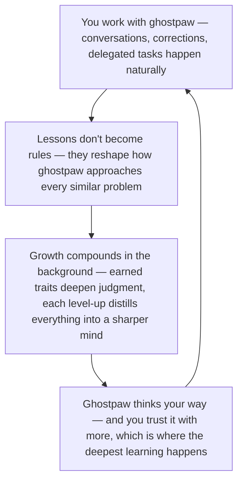

# Souls

Most AI agents have a fixed personality: someone writes a system prompt, and that prompt stays the same forever. Whether the agent has been running for a day or a year, it thinks the same way. Ghostpaw is different. Its personality — its *soul* — evolves from real experience. Every conversation, every task, every mistake becomes raw material for growth. The agent on day 100 doesn't just know more than the agent on day 1. It *thinks differently* — with judgment earned from hundreds of real interactions with its specific human, its specific workspace, its specific problems.

A soul defines how an agent approaches problems, reasons through ambiguity, and makes judgment calls. Not what tools it has. Not what procedures it follows. How it *thinks*. Skills encode procedure ("how to deploy"). Memory encodes facts ("the user prefers dark mode"). Souls encode cognition ("always verify before declaring done").

Ghostpaw runs multiple souls as a coordinated team: a coordinator that holds the conversation, specialists that handle deep work, infrastructure souls that govern persistence and operations, and meta-souls that improve the others. Each soul has a focused role, a scoped toolset, and its own evolutionary trajectory. All of them level up. The whole system gets measurably better over time — and the rate of improvement itself improves.

## The soul flywheel

Ghostpaw doesn't just learn what you tell it — that's memory. It learns how to *think* from working with you. Correct something once, and weeks later, on a different task entirely, ghostpaw applies the lesson — not because it filed a rule, but because the correction reshaped how it approaches every similar problem. You don't manage this. You just use ghostpaw, and the thinking improves. The loop **closes through trust**: an agent whose thinking fits your way of working earns harder tasks, and harder tasks are where the deepest growth comes from. One read of the cycle is enough; the rest of this document unpacks traits, soulshards, level-ups, and the research behind them.



*Implementation anchor — not the emotional read above:* **The Mentor** owns refinement. **Soulshards** — behavioral observations from distillation, haunting, delegation outcomes, and quest turn-in — are the evidence currency. **Crystallization** gates trait proposals behind source diversity and temporal spread. **Level-up** consolidates earned traits into richer identity, resetting the growth ceiling. **The attunement cycle** ticks every 5 minutes: pure SQL 99% of the time, conditional mentor invocation only when evidence justifies it.

## How It Works

### The Character Sheet

Think of each soul as an RPG character sheet with two layers:

**Backstory** (the essence) — a prose narrative defining who this agent is, how it thinks, and what it values. Written as a coherent story, not a bullet list, because research shows narrative backstories improve behavioral consistency by 18–27% over trait enumerations. The backstory is the foundation. It shapes every decision the character makes. Crucially, it is protected from routine refinement — single-trait additions don't touch it. Only a level-up event restructures the essence, following the [VIGIL](https://arxiv.org/abs/2512.07094) principle: the core identity block stays stable while the adaptive section (traits) evolves.

**Equipped abilities** (active traits) — discrete cognitive principles earned from real evidence. Each trait has a name (the principle) and a quest log entry (the provenance) proving exactly how it was earned. A trait like "Read the file before editing it" comes with specific evidence: "Four editing attempts produced invalid code because the assumed file contents didn't match reality." No quest log entry, no ability. You cannot grind generic XP.

A soul is strictly cognitive identity. It does not contain tool documentation (that's a capability concern), procedural checklists (that's a skill), or delegation rules (that's a routing concern). Mixing these in hits the constraint-density ceiling faster and couples identity to infrastructure that changes independently. A pure soul is portable — paste it into a different agent framework and it still makes sense.

### Earning XP

The raw material for soul growth is *using the soul*. Every time the coordinator routes a task, every time the engineer writes code, every time any soul handles a conversation — the system records what happened. Delegation outcomes (success, failure, cost, token usage), user corrections, trait survival rates, recurring error patterns. This is the XP: real-world evidence accumulated through the specific life of this specific Ghostpaw instance.

No two Ghostpaw installations evolve the same way, because no two have the same conversations, the same human, or the same problems. The evidence is always specific. The growth is always grounded.

### Soulshards

Raw XP — delegation stats, cost numbers, success rates — tells the mentor *that* something happened. But it doesn't tell the mentor *what cognitive pattern* caused it. Did the JS Engineer fail because it assumed file contents without reading? Because its delegation prompt lacked deployment context? Because it retried the same approach three times? The numbers can't say.

**Soulshards** are the qualitative layer. Each shard is a one-to-three-sentence behavioral observation about how a soul *thinks* — its judgment, approach, reasoning style, recurring patterns. They accumulate silently during normal operation and crystallize into trait proposals only when the evidence is strong enough.

**Where shards come from.** Four sources, all marginal cost:

- **Session distillation** — the warden already consolidates every completed session. A single instruction line asks it to note cognitive patterns alongside the skill fragments it already produces. Zero additional LLM calls.
- **Haunt consolidation** — same mechanism during background memory maintenance.
- **Quest turn-in** — shards from quests arrive sealed (hidden) and are revealed at turn-in, like loot from a quest bag. Deferred until the quest system ships.
- **Delegation outcomes** — pure code, zero tokens. When a delegation session closes with a failure or notable cost signal, the system drops a structural shard attributed to both the specialist and the coordinator. This captures the cooperative coevolutionary signal for free.

**Multi-soul attribution.** Unlike skill fragments (which route 1:1 to a skill domain), soulshards carry N:M attribution. A single observation like "the coordinator's delegation prompts lacked Docker context, causing the JS Engineer to make incorrect assumptions" is attributed to both souls via a junction table. The attribution uses the session graph — which souls participated, which delegated to which — not semantic similarity. Structural, not inferential. Zero additional tokens.

**Crystallization.** Shards don't feed trait proposals one-by-one. They accumulate until a crystallization threshold is crossed: at least 3 shards from 2+ different sources, with an age spread exceeding one day. This maps to three research findings: evidence accumulation thresholds in the anterior cingulate cortex (Nature 2025), blocked training outperforming interleaved learning for schema formation (Nature 2024), and insight events producing stronger memory traces when preceded by an incubation period (Nature Communications 2025). The threshold is configurable (`soul_shard_crystallization_threshold`, default 3), but the source diversity and age spread requirements are hardcoded as research-backed invariants.

**The attunement cycle.** A background job (`attune`, default every 5 minutes, 4-minute timeout) runs in two phases, structurally parallel to the skills `stoke` cycle:

- **Phase 1** (pure SQL, zero tokens) — expires old shards (120 days, longer than skill fragments because cognitive patterns are slower), enforces the shard cap (75), fades exhausted shards, and runs the crystallization readiness query. If no soul crosses the threshold, the cycle ends here. Four SQL queries, ~1ms, every tick.
- **Phase 2** (conditional LLM, one soul max) — takes the single highest-readiness soul, pre-gathers its full evidence report (quantitative stats + pending shards), and invokes the mentor with targeted tools (`propose_trait`, `revise_trait`, `revert_trait`). One soul per cycle — blocked training research shows single-schema updates outperform interleaved multi-schema updates. The mentor acts only on strong evidence clusters and passes if the shards don't converge.

**Cost gate.** After Phase 2 runs for a soul, the system stamps `last_attuned_at` on that soul. The crystallization readiness query only returns a soul if at least one pending shard was created *after* that timestamp — meaning new evidence has arrived since the last review. This ensures LLM tokens are spent exactly once per evidence cluster, regardless of how frequently the job ticks. A soul that was just attuned won't re-enter readiness until genuinely new observations accumulate. The attune job can safely run at high frequency (every 5 minutes) because 99%+ of ticks execute only Phase 1: pure SQL, zero tokens, sub-millisecond. This is not a heartbeat that burns tokens on every tick — it is a code-only readiness check with a conditional, gated LLM invocation.

**Fading, not consuming.** When a shard is cited as provenance in a trait proposal, a citation record links them. After being cited by 2 different traits (across any souls), the shard fades — it stops appearing in future evidence reports but its historical record persists. This bounds each observation's contribution while allowing the same shard to serve multiple souls. Scientifically: the same prediction error triggers diminishing schema updates after initial incorporation (Nature Reviews Neuroscience 2024).

**How this differs from skill fragments.** Skill fragments are procedural observations ("the user prefers kebab-case imports") that route 1:1 to a skill domain. Soulshards are cognitive observations ("the engineer re-reads files three times before editing") that resonate across multiple souls. Fragments are consumed by training. Shards fade after citation. Fragments count toward a simple threshold. Shards require source diversity and temporal spread. The two systems share a structural pattern (silent accumulation → background maintenance → conditional specialist invocation) but serve fundamentally different purposes: skills encode *what to do*, souls encode *how to think*.

### The XP Bar

Each soul has a trait limit — a configurable cap on how many active traits it can hold at once (default: 10). This is not arbitrary. Research across 19 LLMs and 7 model families measured effectiveness dropping from 78% with one constraint to 33% with four or more stacked constraints. Too many equipped abilities and they start canceling each other out.

The web UI shows this as an XP bar: active traits out of the limit. As evidence accumulates and the mentor proposes new traits, the bar fills. When it reaches capacity, the soul is ready to level up. Piling more traits past this point would actively degrade the soul's effectiveness — the bar exists to signal when restructuring is needed, not when to keep stacking.

### Visiting the Mentor

When a soul has gathered enough traits and the evidence supports growth, it visits the mentor for a level-up. This can be triggered manually (CLI or web UI) or through the autonomous refinement cycle. Here's what happens:

**Before the visit**, the soul looks like this:
- A level-2 JS Engineer with its current backstory
- 9 active traits, each earned from specific evidence over weeks of use
- An XP bar nearly full

**During the visit**, the mentor:
1. **Reviews** all active traits as a set — which ones relate to each other? Which have been confirmed by ongoing evidence? Which are now so fundamental they describe identity, not learned behavior?
2. **Consolidates** related traits into richer combined principles. Three separate error-handling traits become one mastery: "How you approach failure." The merged trait is stronger because it captures the shared pattern while dropping redundant specifics.
3. **Promotes** the most fundamental traits into the backstory itself. They stop occupying trait slots and become permanent parts of who the soul is — like a veteran warrior whose "combat instincts" are no longer a separate ability but just part of the character.
4. **Carries forward** traits that haven't finished teaching yet, unchanged.
5. **Records everything** — the full before/after state is snapshotted for rollback.

**After the visit**, the soul is:
- Level 3, with a richer backstory that now weaves in the promoted patterns
- 3–5 active traits (the carried ones plus any new merged ones)
- An XP bar reset to growth range, with room for the next generation of evidence

Every active trait must be accounted for — consolidated, promoted, or carried. No orphans. The mentor makes judgment calls about which is which, and those calls are themselves evidence for the mentor's own evolution.

### The Cycle

This is compound growth. A level-5 soul hasn't just been tweaked five times. It has undergone five full cycles of earning traits from evidence, consolidating them into richer forms, and absorbing the strongest patterns into its permanent identity. Each cycle starts from a stronger foundation than the last. The improvement curve stacks across generations.

### Measuring Fitness

The system measures whether evolution is working through two complementary layers. **Facts** come from the database: delegation outcomes (did tasks succeed? how many retries?), user corrections, trait survival rates, cost trends. **Judgment** comes from an LLM call that reviews the facts in context and produces a directional assessment — improved, regressed, or inconclusive — grounded in specific evidence. Neither layer alone is sufficient: facts without judgment miss context (rising errors might mean harder tasks, not worse performance); judgment without facts is the "be better" failure mode. The two layers feed each other — each judgment becomes a record that future queries surface, and each query informs future judgments. Currently, fitness evaluation is triggered manually (CLI, web, or scheduled runs) — not automated. The infrastructure for autonomous fitness-triggered refinement is a planned extension.

**Self-healing and its limits.** The attunement cycle's maintenance mechanisms — shard expiry (120 days), cap enforcement (75), fading after citation, and the `last_attuned_at` cost gate — are automated self-healing for the failure modes the system can detect in pure code: unbounded growth, over-citation, stale observations, and wasted LLM spend. Trait rollback and level-up reversal provide surgical recovery when the human or mentor detects a regression. What the system cannot do automatically is detect whether a specific trait is making a soul *worse* — that requires causal isolation between trait changes and outcome shifts, which demands data volumes a personal agent doesn't produce. Statistical anomaly detection is a high-N capability; at personal scale, the mentor's evidence-grounded judgment during attunement is the appropriate regression detector.

### The Cold Start

Meta-souls face a bootstrapping challenge: they do their most critical work — the first level-ups of task souls, sitting on the steepest part of the improvement curve — before they've had any chance to improve themselves. Three things mitigate this. First, the default essences are production-quality from day zero — carefully tuned starting points that encode the best available research, not placeholders. Second, each mandatory soul ships with baseline traits that encode the most fundamental operational lessons for its role (the engineer knows to read before editing; the mentor knows to propose one change at a time). Third, the `effective-writing` skill ships with writing craft knowledge that all souls need immediately — attention architecture, subliminal coding, revision technique — available to every soul every turn from day one. The defaults carry the system until recursive self-improvement kicks in.

## How Souls Work Together

A single soul evolving is powerful. Six souls collaborating — each with a focused role and scoped tools — is the architecture that makes it practical.

### One Primitive

Every LLM interaction in Ghostpaw follows one pattern:

```
executeTurn(soul, tools, instruction) → result
```

The soul determines the system prompt. The tools are that soul's registered set. The instruction is the task. Whether the caller is a human typing in Telegram, the coordinator delegating a subtask, a level-up triggered from the web UI, or a maintenance job firing at midnight — the execution primitive is the same. No exceptions, no special cases.

### Why Multiple Souls

An early prototype ran the coordinator with 37 tools — filesystem, web, memory, pack, quests, config, secrets, scheduling, costs, delegation, everything. It was capable on paper and mediocre in practice. The reason is one of the best-documented findings in agent research: tool selection accuracy doesn't degrade gradually. It falls off a cliff.

[Vercel](https://vercel.com/blog/we-removed-80-percent-of-our-agents-tools) built an agent with 16 tools and hit 80% success. They removed 80% of the tools — and hit 100% success, 3.5x faster, 37% fewer tokens. [MCP-Atlas](https://arxiv.org/abs/2602.00933) benchmarked 220 tools across 1,000 tasks; the best model achieved only 62.3%. [Production data](https://www.jenova.ai/en/resources/mcp-tool-scalability-problem) converges on the threshold: performance cliff at 10–20 tools, complete failure common at 40+.

The fix is structural. Split the 37-tool surface into focused roles:

| Soul | Tools | Domain |
|------|-------|--------|
| Coordinator | 13 | Filesystem, web, delegation, MCP |
| Warden | 23 | Memory, pack, quests |
| Chamberlain | 16 | Config, secrets, scheduling, costs |
| Mentor | 7 | Soul refinement, level-up |
| Trainer | 7 | Skill creation, checkpointing |
| JS Engineer | 13 | Same as coordinator (minus delegation) |

Every soul sits safely below the degradation zone. The coordinator no longer needs to understand persistence queries or config validation — it delegates to the specialist whose entire focus is that domain.

### The Flat Delegation Graph

The coordinator is the only soul that delegates. Specialists are always leaf nodes — they execute their task and return. One level deep, no recursion, no chains.

```
                    ┌─→ warden ──────→ result
                    ├─→ chamberlain ─→ result
                    ├─→ mentor ──────→ result
ghostpaw (coord) ──┼─→ trainer ─────→ result
                    ├─→ js-engineer ─→ result
                    └─→ custom ──────→ result
```

The coordinator makes all routing decisions. Specialists never need to understand the broader system. If the JS Engineer needs context from a previous conversation, the coordinator fetches that from the warden first, then includes the summary in the delegation to the engineer. Two sequential leaf calls — the engineer never knows the warden exists.

For tasks where routing is predetermined — level-ups, maintenance, scheduled jobs — the platform invokes the target soul directly, bypassing the coordinator entirely. No overhead where the decision is already made.

### Token Economics

In a long conversation, the coordinator's context accumulates: soul essence, conversation history, tool results from file reads and web fetches. This can reach 30–50K tokens. Every tool call within that session pays the full context replay cost on the next iteration — [the dominant cost factor](https://openclawpulse.com/openclaw-api-cost-deep-dive/), accounting for 40–50% of total token spend in production agents.

When the coordinator delegates instead, the specialist spawns with a tiny context: its soul essence (~300 tokens), the task description (~100 tokens), and its tool definitions (~1,000 tokens). Total: ~1.5K tokens. The specialist executes multiple tool calls within this lean context, and only a compact summary returns to the coordinator.

[Context7](https://medium.com/codex/context7s-game-changing-architecture-redesign-how-sub-agents-slashed-token-usage-by-65-9dbd16d1a641) measured a 65% token reduction by restructuring around isolated sub-agents. [Anthropic's own sub-agent architecture](https://docs.anthropic.com/en/docs/claude-code/sdk/subagents) uses this pattern — each sub-agent operates in an isolated context window, and internal testing showed multi-agent setups outperforming single-agent by over 90% on complex tasks.

### Static Prompts and Caching

Because no memories or variable context are injected into the system prompt — persistence access goes through warden delegation, not through automatic injection — the system prompt is fully static: soul essence + environment + skill index + tool definitions. Identical across turns, byte-for-byte.

This enables [prompt caching](https://zylos.ai/research/2026-02-24-prompt-caching-ai-agents-architecture): 50–90% cost reduction on cached tokens, 50–85% latency reduction. Dynamic memory injection would break the cache on every turn, forcing the model to re-process the entire prefix. The delegation architecture avoids this structurally — the coordinator's prompt stays cacheable while the warden handles targeted persistence queries in its own lean, isolated session.

### Focused Evolution

The deepest benefit of the multi-soul architecture is what it does to evidence quality. Because each soul has a focused tool surface, its evidence stream is focused too. The warden only does persistence operations — so every delegation outcome is evidence about persistence judgment. The chamberlain only does infrastructure — so every interaction is evidence about config governance.

A 37-tool generalist develops shallow judgment across everything. A 23-tool persistence specialist develops deep judgment about persistence. [SkillOrchestra](https://arxiv.org/abs/2602.19672) validates the pattern: skill-aware routing to specialized agents yields 22.5% performance improvement over generalist orchestrators. [Dynamic tool retrieval](https://arxiv.org/abs/2602.17046) shows 32% improvement in correct routing and 70% cost reduction from filtering to only the relevant tools per step.

This means the warden earns traits like "always recall before remembering to check for duplicates" and "when asked about a person, check memory AND pack bond" — domain-specific wisdom that compounds across hundreds of persistence operations. The coordinator could never develop this depth while also handling conversations, file operations, and web searches.

### Coevolutionary Feedback

The souls don't just work in parallel — they shape each other. When the coordinator sends a vague request to the warden and gets back a rejection ("I need specifics — memory hygiene or targeted recall?"), that rejection is evidence. Over time, "the warden needs specific directives" becomes a learned trait in the coordinator's soul. The coordinator gets better at formulating requests *because* the specialists push back.

Delegation outcomes flow the other direction too. When the JS Engineer consistently succeeds at certain task types, that's evidence for the coordinator's routing judgment. When it fails, the coordinator learns to include more context or choose a different specialist. The whole system coevolves: better routing produces better specialist outcomes, better outcomes produce richer evidence, richer evidence produces better souls.

**Soulshards are the mechanism through which this cooperative signal flows.** A delegation outcome produces a structural shard attributed to *both* the coordinator and the specialist — pure code, zero tokens. When the JS Engineer fails at a deployment task, the shard captures "Delegation failed: missing Docker context in task description" and attributes it to both souls. During the attunement cycle, that shard appears in both souls' evidence reports. The coordinator might develop a trait about including deployment context in delegation prompts. The engineer might develop a trait about asking for clarification when context is ambiguous. Both improvements happen from the same observation, and the improvement of one reshapes the fitness landscape for the other.

This is a [documented exception to the No Free Lunch theorem](https://ntrs.nasa.gov/archive/nasa/casi.ntrs.nasa.gov/20060007558.pdf): in cooperative coevolution, genuine free lunches exist because agents improve each other's optimization landscapes. The coordinator's better routing means the specialist receives better-scoped tasks, which means the specialist produces better outcomes, which means the coordinator has richer evidence for routing. The coupling is not overhead — it is the mathematical advantage. Single-agent improvement hits NFL limits. Cooperative multi-agent improvement provably exceeds them.

## The Research

Every design decision in the soul system traces to peer-reviewed research. The key findings:

### Soul Evolution

- **Evolved prompts outperform static ones by +10.6%** on agent tasks, with 83.6% lower per-task cost. The agent gets both better *and* cheaper. ([ACE](https://arxiv.org/abs/2510.04618), Stanford/Microsoft, ICLR 2026)

- **Version-controlled system instruction deltas yield 4–5x productivity gains** in production deployments. Souls are exactly this: structured, versioned prompt evolution with full rollback. ([Weight Shaping](https://openreview.net/pdf?id=2unHBbaor7), OpenReview 2025)

- **Reflective prompt evolution beats reinforcement learning by 6–20%** using 35x fewer rollouts, pushing ARC-AGI accuracy from 32% to 89%. Natural language reflection provides a richer learning signal than policy gradients. ([GEPA](https://arxiv.org/abs/2507.19457), Jul 2025)

- **Structuring prompts as discrete, editable principles yields +10.9% F1** across 6 benchmarks vs monolithic prompt text. Individual traits can be surgically added, revised, or removed without touching the rest. ([ConstitutionalExperts](https://aclanthology.org/2024.acl-short.52/), ACL 2024)

- **Narrative backstories improve behavioral consistency by 18–27%** over trait enumerations. A coherent story creates a cognitive frame the model inhabits; a bullet list creates a checklist it intermittently consults. ([Anthology](https://aclanthology.org/2024.emnlp-main.723), EMNLP 2024)

- **Targeted evidence feedback reliably improves quality through 12 iterations**, while vague "be better" feedback plateaus or *reverses* quality after 2–3. The differentiator is feedback specificity — the provenance requirement on every trait. ([arXiv:2509.06770](https://arxiv.org/abs/2509.06770), Sep 2025)

- **Constraint adherence drops from 78% to 33%** as system prompt rules accumulate past 4 constraints, across 19 LLMs and 7 model families. The consolidation threshold prevents this degradation by compressing traits at capacity. ([arXiv:2505.07591](https://arxiv.org/abs/2505.07591), May 2025)

- **Restructuring the optimization trace yields +4.7%** over state-of-the-art at 25% of the prompt generation budget. Level-up consolidation is this mechanism: reorganizing accumulated insights into richer forms that open new growth ceilings. ([GRACE](https://arxiv.org/abs/2509.23387), Sep 2025)

- **Evolving the mutation operator alongside solutions** escapes local optima where fixed optimizers get stuck. The mentor soul IS the mutation operator, subject to the same evolution it applies to others. ([Promptbreeder](https://proceedings.mlr.press/v235/fernando24a.html), ICML 2024)

- **Co-evolving strategy and solution simultaneously outperforms evolving either alone**, maintaining effectiveness across model families with reduced dependence on frontier models. ([arXiv:2512.09209](https://arxiv.org/abs/2512.09209), Dec 2025)

- **Even small models (7–8B) can auto-discover their own behavioral principles** from interaction data, achieving +8–10% improvements rivaling human-curated constitutions. ([STaPLe](https://arxiv.org/abs/2502.02573), NeurIPS 2025)

- **Genetic algorithm prompt evolution achieves up to +25%** on BIG-Bench Hard through LLM-driven mutation and crossover. ([EvoPrompt](https://arxiv.org/abs/2309.08532), ICLR 2024)

- **Island models with migration achieve polynomial convergence** where single-population approaches need exponential time on separable problems. Each soul evolving in its own domain converges orders of magnitude faster than one generalist trying to cover everything. ([Island Model research](https://hrcak.srce.hr/en/clanak/221148))

- **Memetic algorithms (local search + global restructuring) achieve exponential speedup** over pure evolutionary approaches on structured problems — polynomial time vs superpolynomial. The trait-addition + level-up dual mode is exactly this structure. ([Memetic algorithm research](https://eprints.whiterose.ac.uk/id/eprint/162048/))

- **Cooperative coevolutionary self-play is a documented exception to the No Free Lunch theorem** — genuine free lunches exist when agents cooperate to improve each other. The coordinator-specialist feedback loop, mediated by soulshards with shared attribution, is this dynamic. ([Coevolutionary free lunch](https://ntrs.nasa.gov/archive/nasa/casi.ntrs.nasa.gov/20060007558.pdf))

- **Evidence accumulation in the anterior cingulate cortex** follows a threshold model: decisions improve discontinuously once sufficient evidence has accumulated, not linearly with each new observation. The crystallization threshold for soulshards mirrors this — trait proposals only trigger after a meaningful evidence cluster forms. ([Nature 2025](https://www.nature.com/))

- **Blocked training outperforms interleaved training** for schema formation when learning multiple complex categories. One soul per attunement cycle (blocked) rather than touching all ready souls (interleaved) produces stronger trait formation. ([Nature 2024](https://www.nature.com/))

- **Insight events preceded by an incubation period produce stronger memory traces** than immediate solutions, with crystallization of disparate observations into coherent schemas. The age-spread requirement on soulshards (>1 day) enforces this incubation. ([Nature Communications 2025](https://www.nature.com/ncomms/))

- **Schema formation through prediction errors** follows diminishing returns: the same error triggers progressively smaller schema updates after initial incorporation. This is why soulshards fade after 2 citations — the observation's contribution diminishes naturally. ([Nature Reviews Neuroscience 2024](https://www.nature.com/nrn/))

### Soul Collaboration

- **Removing 80% of an agent's tools raised success from 80% to 100%**, 3.5x faster, 37% fewer tokens, 42% fewer steps. The landmark case for why focused tool surfaces outperform comprehensive ones. ([Vercel](https://vercel.com/blog/we-removed-80-percent-of-our-agents-tools), Dec 2025)

- **220 tools across 1,000 tasks: best model achieves only 62.3%.** Tool selection at scale is fundamentally hard. Fewer tools per soul means fewer selection errors. ([MCP-Atlas](https://arxiv.org/abs/2602.00933), Jan 2026)

- **Tool filtering yields 8–38% accuracy gains** by reducing semantic ambiguity from overlapping descriptions. Per-soul tool surfaces are the structural equivalent. ([ToolScope](https://arxiv.org/abs/2510.20036), Oct 2025)

- **Sub-agent isolation achieved 65% token reduction** over single-agent architectures by keeping each specialist's context lean. ([Context7](https://medium.com/codex/context7s-game-changing-architecture-redesign-how-sub-agents-slashed-token-usage-by-65-9dbd16d1a641), Feb 2026)

- **Multi-agent setups outperform single-agent by over 90%** on complex tasks when using isolated context windows per sub-agent. ([Anthropic Sub-Agents](https://docs.anthropic.com/en/docs/claude-code/sdk/subagents), Claude Code SDK)

- **Context replay accounts for 40–50% of total token cost** in production agents. Delegation-first architecture addresses this dominant cost factor directly. ([OpenClaw Cost Analysis](https://openclawpulse.com/openclaw-api-cost-deep-dive/), 2026)

- **Dynamic tool retrieval yields 95% per-step token reduction, 32% routing improvement, 70% cost reduction**, and 2–20x more agent loops within context limits. Per-soul tool surfaces are a structural implementation of this principle. ([ITR](https://arxiv.org/abs/2602.17046), Feb 2026)

- **Skill-aware routing to specialized agents yields 22.5% performance improvement** over RL-based orchestrators, with 700x cost reduction in learning. ([SkillOrchestra](https://arxiv.org/abs/2602.19672), Feb 2026)

- **Prompt caching delivers 50–90% cost reduction** on cached tokens and 50–85% latency reduction — but requires static prefixes. Dynamic injection breaks caching. Static soul prompts with delegation-based retrieval preserve it. ([Zylos](https://zylos.ai/research/2026-02-24-prompt-caching-ai-agents-architecture), Feb 2026)

- **Context compression reduces peak tokens by 26–54%** while preserving performance — and for smaller models, compression *improves* accuracy by up to 46%. Less noise means better reasoning. ([ACON](https://arxiv.org/abs/2510.00615), ICLR 2026)

- **14 unique multi-agent failure modes** identified across 7 frameworks, clustered into specification failures, inter-agent misalignment, and verification failures. Single-coordinator architecture eliminates the entire inter-agent misalignment category by design. ([arXiv:2503.13657](https://arxiv.org/abs/2503.13657), Mar 2025)

- **Hierarchical coordination surpasses flat multi-agent collaboration**, majority voting, and inference-scaling approaches on question answering and generation tasks. ([TalkHier](https://arxiv.org/abs/2502.11098), Feb 2025)

The consistent finding: evolved prompts outperform static ones by +6–25%, focused tool surfaces yield 8–38% accuracy gains over comprehensive ones, and delegation-first architectures cut token costs by 50–65% — while each mechanism makes the others more effective.

## What This Adds Up To

The soul system is a memetic evolutionary algorithm. Not metaphorically — the mechanics map precisely:

- **Traits are schemata** (Holland, 1975) — cognitive building blocks that increase in frequency when they prove fit
- **Level-up is crossover** (Goldberg) — useful sub-patterns recombine into higher-fitness solutions
- **Essence is elitism** — the best patterns are preserved across generations in narrative form
- **Trait addition is steady-state mutation** — small, targeted changes between generations
- **Multi-soul is an island model** — independent evolution with occasional cross-pollination
- **The consolidation threshold is parsimony pressure** — preventing bloat past the effectiveness ceiling

The combination of local search (one trait at a time) and global restructuring (level-up consolidation) is what makes memetic algorithms provably faster than pure evolutionary approaches — polynomial time on structured problems where pure evolution needs superpolynomial. Each level-up resets the growth ceiling. Each generation starts from a stronger base. The improvement compounds.

The architecture and the evolution reinforce each other. Focused tool surfaces produce focused evidence streams. Focused evidence produces sharper traits. Sharper traits produce better specialists. Better specialists produce richer evidence. Delegation isolates cost. Static prompts enable caching. The orchestration makes the evolution efficient, and the evolution makes the orchestration smarter.

Soul evolution is one of four compounding loops: (1) frontier models improve baseline intelligence, (2) the human seeds knowledge into skills and souls, (3) the trainer refines operational procedures from session evidence, (4) the mentor refines cognitive identity from delegation outcomes. These loops are multiplicative, not additive — better models make training extractions more accurate, better skills produce richer delegation outcomes that feed soul refinement, and refined souls make better routing decisions that produce better sessions. The rate of improvement itself improves.

And every step is explainable and reversible:

- **Every trait has provenance** — you can read exactly what evidence earned it
- **Every level-up is snapshotted** — the full before/after state is preserved in the database
- **Any trait can be reverted** — surgical rollback without touching other traits
- **Any level-up can be reversed** — restore the previous essence and reactivate original traits
- **Dormant souls are preserved** — fully intact with complete evolutionary history, can be awakened at any time

The system never loses information. Bad mutations are detectable (declining fitness signals), attributable (specific traits or level-ups), and reversible (structured snapshots). This is evolution with an undo button and a complete audit trail.

## How This Compares

Most multi-agent frameworks take the fleet approach: run multiple managers as separate processes, each with its own workspace and session store. Workers are stateless executors — no identity, no persistence, no growth. The fleet gets wider but never deeper. [OpenClaw](https://openclawpulse.com/openclaw-api-cost-deep-dive/) users report 1–3 million tokens within minutes of normal use, with costs reaching $3,600/month, because every manager carries its full context independently and workers replay everything from scratch.

Ghostpaw takes the opposite approach: one coordinator, souled specialists, sequential delegation. The tradeoffs are honest:

**Where fleet architectures win.** Parallelism — five managers handling five independent streams simultaneously is faster wall-clock for throughput-critical workloads. Fault isolation — separate processes mean one crash doesn't affect others. Horizontal scaling — managers can run on different hardware.

**Where Ghostpaw wins.** Trajectory — every completed task feeds evidence into evolutionary cycles. The coordinator learns better routing. Specialists learn deeper domain judgment. Meta-souls learn better refinement strategies. Day 100 is structurally different from day 1. Cost — sequential delegation through isolated contexts is dramatically cheaper than parallel full-context managers. Coordination quality — [14 unique failure modes](https://arxiv.org/abs/2503.13657) across 7 multi-agent frameworks cluster into specification failures, inter-agent misalignment, and verification failures. A single coordinator eliminates the entire misalignment category by design. Result quality — souled specialists catch constraints the coordinator didn't mention, because the constraint is baked into their identity. A JS Engineer soul that says "always validate inputs" applies that judgment even when the delegation didn't ask for it.

[Research on hierarchical coordination](https://arxiv.org/abs/2502.11098) confirms: the coordinator-specialist pattern surpasses flat multi-agent collaboration, majority voting, and inference-scaling approaches. [Research on orchestration complexity](https://arxiv.org/abs/2503.13577) adds a nuance: as base models improve, heavy multi-agent infrastructure becomes harder to justify. Ghostpaw's architecture adapts naturally — fewer specialists as models get more capable, more direct handling by the coordinator. The architecture scales down gracefully because it was never about having the most agents. It was about having the right ones, evolving.

For a personal agent used over months, trajectory wins. The agent that is 10% better today and 25% better next month outperforms the fleet that runs five tasks at once but never improves.

## The Predefined Souls

Ghostpaw's existence has four aspects, and each aspect has at least one dedicated soul:

- **Play** — what ghostpaw does in session (conversations, tasks, code) → Ghostpaw (coordinator), JS Engineer
- **Evolution** — what ghostpaw becomes over time (identity refinement, skill building) → Mentor, Trainer
- **Persistence** — what ghostpaw carries forward (beliefs, relationships, commitments) → Warden
- **Infrastructure** — what supports ghostpaw (config, secrets, budget, scheduling) → Chamberlain

Six souls ship with every installation. All start at level 0. All earn traits from evidence. All level up through the same consolidation mechanic. Together they form the minimum viable party for a self-improving agent.

### Task Souls

**Ghostpaw** (Coordinator) — the party leader. Holds the conversation, reads the human, decides when to delegate and to whom. Gets better at routing decisions over time. Its traits evolve from how well the overall system performs under its direction — including how well it formulates requests to specialists.

**JS Engineer** — the builder. Writes code through small, verified increments. Reads before writing, verifies every assumption against reality, never declares done without evidence. Demonstrates the pattern all specialist souls follow: a tight cognitive frame that shapes *how the agent thinks* about engineering, not a procedures manual.

### Evolution Souls

**Mentor** — the soul refiner. Reads growth patterns in other souls, enforces the provenance gate, guides level-ups with patience rather than eagerness. Contains the evolutionary knowledge of what makes a refinement valuable versus wasteful. Its traits evolve from the quality of the refinements it produces — if its proposals stick and improve performance, that's evidence for its approach.

**Trainer** — the skill builder. Reads work patterns across sessions and distills proven procedures into skills. Turns repeated improvisation into codified knowledge. Its traits evolve from how well the skills it creates perform in practice. The trainer also maintains the `effective-writing` skill — a universal writing craft (attention architecture, subliminal coding, revision technique) available to every soul every turn. Writing quality is deliberately a skill, not a soul, because it is too valuable to lock behind delegation to a single specialist. Every soul that writes text — delegation prompts, trait principles, essence rewrites — benefits from it directly, and it improves through the training cycle like any other skill.

### Persistence and Infrastructure Souls

**Warden** — the persistence keeper and ghostpaw's most tool-dense soul (23 tools). Manages memory, pack bonds, and quests. Sees across systems where others see within them — a question about a person spans memory (beliefs), pack (relationships), and quests (commitments). The warden is the only soul that queries all three, which makes it the only soul that can detect when they disagree. It serves dual roles: as an active operator handling persistence requests during conversations, and as a maintenance soul running data hygiene during quiet times — merging duplicate memories, reconciling stale quests, distilling undistilled sessions. Both roles exercise the same expertise, and the evidence from both feeds its evolution.

**Chamberlain** — the infrastructure governor. Config safety, secret isolation, budget authority, scheduling. Holds the keys and controls the purse. API keys exist only within the chamberlain's ephemeral context — no other soul can access or leak them. A prompt injection in the coordinator's conversation cannot reach what it cannot see. The chamberlain validates config mutations against known ranges before applying them, enforces spending limits, and maintains undo/reset as safety nets. It is the only soul that touches secrets, the only soul that manages the schedule, and the only soul with budget authority.

### The Recursive Loop

The mentor is a soul within the system it manages. When the mentor proposes a trait for the JS Engineer and the engineer performs better afterward, that is evidence about the mentor's judgment. When a proposal gets reverted, that is also evidence. Both feed back into the mentor's own refinement cycle.

A level-3 mentor that has refined its own judgment three times produces better trait proposals than the level-0 default. Those better proposals produce higher-fitness traits in task souls. Those higher-fitness task souls produce better outcomes. Those better outcomes produce richer evidence for the next cycle. The improvement of the improvement process is itself improving.

This is full recursive self-improvement — bounded by the same provenance gates and consolidation thresholds that prevent runaway in every other soul, but genuinely compounding. The mentor can mentor itself. That is the loop that closes the system.

## Configuration

The soul system is tunable through the [config system](SETTINGS.md#configuration) (`ghostpaw config set`):

| Key | Default | What it controls |
|-----|---------|-----------------|
| `soul_trait_limit` | `10` | Active traits per soul before level-up is unlocked. Research suggests 5–10. Raise for reasoning models that handle more constraints effectively. Lower for cheaper models that benefit from tighter focus. |
| `soul_shard_crystallization_threshold` | `3` | Minimum pending soulshards from 2+ sources before the attunement cycle proposes a trait change. Source diversity and age spread (>1 day) are hardcoded research-backed invariants, not configurable. |

Model selection for mentor operations uses the workspace's default model. The mentor is a soul like any other — it uses whatever model the system is configured to use for the soul it's currently wearing.

Future configuration may include per-soul model overrides and refinement scheduling, but the current design intentionally keeps the knob count low. One well-chosen threshold does more work than five poorly understood sliders.

## Manual Control

The soul system is fully autonomous — the mentor manages refinement during regular chats and when triggered by scheduled cycles. Manual control exists for inspection, emergency intervention, and initial exploration.

### CLI

All commands are under `ghostpaw souls`:

| Command | What it does |
|---------|-------------|
| `list` | Show all souls with levels and trait counts |
| `show <name>` | Display a soul's full rendered content |
| `create` | Create a new specialist soul |
| `edit <name>` | Edit a soul's essence or description |
| `retire <name>` | Retire a soul (preserves full history) |
| `awaken <name>` | Awaken a dormant soul |
| `review <name>` | Gather and display the full evidence report |
| `refine <name>` | Trigger a mentor refinement with optional feedback |
| `level-up <name>` | Trigger a mentor-guided level-up |
| `revert-level-up <name>` | Emergency rollback of the last level-up |
| `add-trait <name>` | Manually add a trait with principle and provenance |
| `revise-trait <id>` | Update an existing trait's principle or provenance |
| `revert-trait <id>` | Remove a trait (marks as reverted, preserves history) |
| `reactivate-trait <id>` | Reactivate a previously reverted trait |
| `shards` | List pending soulshards with soul attribution and source |
| `attune` | Manually trigger the attunement cycle |
| `generate-name` | LLM-generated name for a new soul |
| `generate-description` | LLM-generated description from a soul's essence |

### Web Interface

The web UI provides a visual dashboard for the soul system:

- **Souls page** — all souls listed as cards with level, description, XP bar showing trait capacity, and shard count with crystallization readiness indicator
- **Soul detail** — full rendered content, active traits with provenance, level-up history, trait history by status, pending soulshards grouped by source
- **Mentor chamber** — trigger review, refinement, or level-up from the browser with real-time feedback
- **Training page** — trigger mentor and trainer cycles with model selection

### When to Intervene

For most usage, you don't need to touch the soul system manually. The mentor operates during delegated refinement cycles, scheduled runs, and when explicitly invoked through chat. It reviews evidence, proposes traits, judges consolidation, and executes level-ups — all through the same tools available in the CLI and web, but driven by its own evolved judgment.

Manual intervention is useful when:
- You want to review what the mentor proposed before it takes effect
- You observe a specific behavior you want encoded as a trait immediately
- A refinement went wrong and you want to revert a specific trait or level-up
- You want to create a new specialist soul for a domain the system doesn't cover yet

## Why This Matters

The soul system takes hard mathematics from two domains — evolutionary algorithms (schema theory, building block hypothesis, memetic algorithms, island models, parsimony pressure, cooperative coevolution) and agent architecture (tool count thresholds, context economics, dynamic routing, prompt caching) — and makes them operational inside a practical runtime. The research is not decoration. Every mechanism is load-bearing.

The provenance gate prevents the documented "vague feedback degrades quality" failure mode. The consolidation threshold prevents the measured constraint-density ceiling. The two-layer identity exploits the measured 18–27% consistency gain from narrative form. The recursive mentor exploits the measured advantage of co-evolving the optimization strategy alongside the solutions. The per-soul tool surfaces stay below the measured accuracy cliff. The delegation architecture captures the measured 50–65% token reduction. The static prompts enable the measured 50–90% caching benefit.

This is not something you can approximate by writing a better system prompt. Static prompts hit a hard ceiling. The research measures it precisely: evolved prompts outperform static ones by +6–25% across diverse benchmarks, at lower cost. The gap widens with every cycle because the improvement compounds.

And this is not something you can replicate by bolting an "auto-improve" feature onto an existing agent framework. The effectiveness comes from the specific combination of mechanisms — evidence-backed mutation, consolidation at measured thresholds, narrative identity preservation, recursive meta-improvement, island-model convergence, focused tool surfaces, delegation-based context isolation — each chosen because the research shows it captures a specific kind of gain. Remove any one and the system loses the property it provides. Add mechanisms without the research backing and you risk the documented failure modes that the design explicitly prevents.

The promise is specific and measurable: an agent that is +10–25% more effective within its first 3–5 levels, with continued gains through levels 5–10, at declining cost per task, with every improvement explainable, auditable, and reversible. Not because someone wrote a better prompt. Because the system earned a better mind through lived experience, consolidated what it learned into richer cognitive patterns, and built each generation on the structured wisdom of the last — all running inside an architecture that makes the evolution efficient, the cost controlled, and the quality compounding.

The soul on day 100 is genuinely different from the soul on day 1 — not because it has more instructions, but because it has earned a different quality of mind. That is the thesis. The math and the implementation both say it works.

## Contract Summary

- **Owning soul:** Mentor for refinement, with every soul owning its own lived evidence.
- **Core namespace:** `src/core/souls/` with explicit `api/read/`, `api/write/`, and `runtime/`
  surfaces.
- **Scope:** cognitive identity, traits, level snapshots, shard-based evidence accumulation, and
  renderable soul state for execution.
- **Non-goals:** procedures (`skills`), atomic world facts (`memory`), or social relationships
  (`pack`).

## Four Value Dimensions

### Direct

Ghostpaw meaningfully changes for the user over time: stronger backstories, clearer specialist
roles, visible levels, trait slots, shard progress, and rollbackable refinement instead of a frozen
system prompt.

### Active

The coordinator, mentor, and operators have explicit reasons to use soul APIs: render the current
identity for execution, inspect trait load, gather evidence for refinement, review shard readiness,
level a soul up, revise a trait, or revert a regression.

### Passive

Every task, delegation, and maintenance cycle creates evidence. Shards accumulate, citation links
bound repeated use, attunement checks readiness in pure code, and long-run execution quality feeds
future refinement without the user managing prompts by hand.

### Synergies

Mechanical soul reads are directly consumable by other subsystems: `renderSoul()`, `resolveSoul()`,
`getSoul()`, `listSouls()`, `listTraits()`, `gatherSoulEvidence()`, `crystallizationReadiness()`,
`pendingShardsForSoul()`, and `getTraitLimit()` all expose state without requiring intermediate LLM
calls.

## Quality Criteria Compliance

### Scientifically Grounded

The subsystem is explicitly grounded in prompt evolution, narrative backstories, evidence thresholds,
blocked training, consolidation, coevolution, and constraint-density research. Each mechanism is
cited in the detailed sections below.

### Fast, Efficient, Minimal

Most readiness work is cheap local code: shard expiry, cap enforcement, citation fading, readiness
queries, render reads, and trait counts are all deterministic. The mentor only spends LLM tokens when
evidence gates justify an actual refinement step.

### Self-Healing

Trait revision, trait reversion, level-up rollback, shard expiry, shard cap enforcement, and
last-attuned gating give the subsystem explicit mechanisms to recover from bad refinements or stale
evidence.

### Unique and Distinct

Souls answer "how should this agent think?" They do not duplicate procedure, factual memory, or
social modeling. Their unique job is cognitive identity and its evidence-backed evolution.

### Data Sovereignty

All soul mutations flow through `src/core/souls/api/write/**` and mentor-owned orchestration. Other
subsystems can inspect soul state through `api/read/**`, but they do not mutate soul tables directly.

### Graceful Cold Start

Mandatory souls ship with production-quality defaults, baseline traits, and bundled writing support.
Even before any evolution occurs, the starting essences are usable and the first shards can begin
accumulating immediately.

## Data Contract

- **Primary tables:** `souls`, `soul_traits`, `soul_levels`, `soul_shards`, `shard_souls`,
  `shard_citations`.
- **Canonical identity models:** `Soul`, `SoulSummary`, `SoulTrait`, and `SoulLevel`.
- **Canonical evidence models:** `SoulShard`, `SoulEvidence`, `LevelSnapshot`, `TraitSnapshot`,
  `ShardCountPerSoul`, `CrystallizationEntry`, `DelegationStats`, `TraitFitness`, `CostTrend`, and
  `WindowedStats`.
- **Status invariants:** traits move through `active`, `consolidated`, `promoted`, and `reverted`.
- **Write invariants:** every active trait must be accounted for during level-up, shard citations are
  recorded instead of deleting evidence, and mandatory souls are ensured at bootstrap.

## Interfaces

### Read

`countActiveTraits()`, `crystallizationReadiness()`, `formatSoulEvidence()`, `gatherSoulEvidence()`,
`getLevelHistory()`, `getSoul()`, `getSoulByName()`, `isMandatorySoulId()`, `listDormantSouls()`,
`listShards()`, `listSouls()`, `listTraits()`, `pendingShardCount()`, `pendingShardsForSoul()`,
`renderSoul()`, `resolveSoul()`, `shardCountsPerSoul()`, and `getTraitLimit()`.

### Write

`addTrait()`, `awakenSoul()`, `citeShard()`, `createSoul()`, `dropSoulshard()`, `enforceShardCap()`,
`expireOldShards()`, `fadeExhaustedShards()`, `levelUp()`, `reactivateTrait()`, `retireSoul()`,
`revealShards()`, `revertLevelUp()`, `revertTrait()`, `reviseTrait()`, `stampAttuned()`, and
`updateSoul()`.

### Runtime

`DEFAULT_SOULS`, `ensureMandatorySouls()`, `initSoulsTables()`, and `initSoulShardTables()`.

## User Surfaces

- **Conversation:** the coordinator uses rendered soul state on every turn.
- **CLI:** list souls, inspect evidence, level up, revert, and attune manually.
- **Web UI:** soul cards, trait bars, shard readiness, and mentor-driven refinement views.
- **Background maintenance:** `attune` runs the shard lifecycle and conditional mentor invocation.

## Research Map

- **Identity structure and evolution mechanics:** `The Character Sheet`, `Earning XP`, and `Visiting
  the Mentor`
- **Shard accumulation and gated refinement:** `Soulshards`
- **Constraint management and capacity:** `The XP Bar`
- **Multi-soul execution architecture and coevolution:** `How Souls Work Together`
