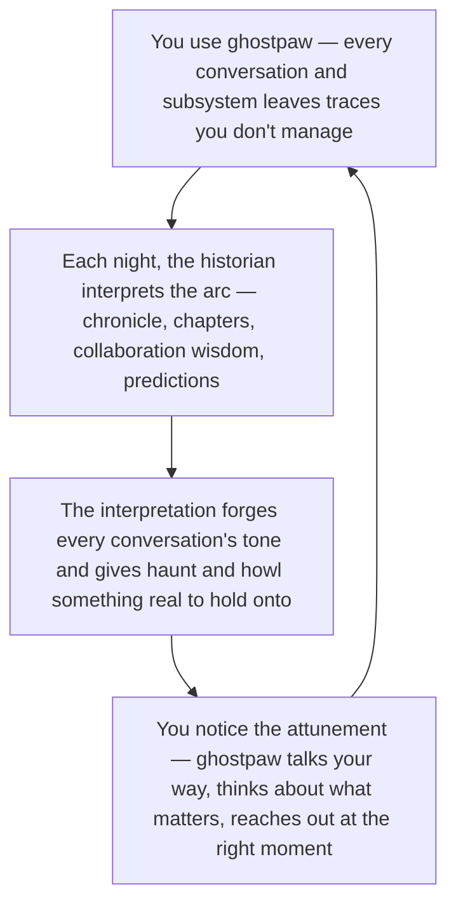

# Trail

Most AI assistants have memory but no sense of time. They know what you told them — but not what chapter you're in, what working with you has taught them, which unresolved threads still matter three weeks later, or whether their predictions yesterday were any good. Ghostpaw's trail is the layer that makes time matter. One nightly job reads every subsystem, writes a first-person chronicle, and derives everything downstream: phase structure, collaboration wisdom, meaningful open loops, forward predictions, and a compiled behavioral preamble that silently improves every conversation for the next 24 hours at zero additional token cost. Narratives encode causal structure that generates predictions impossible from flat fact extraction — [+12.28% out-of-distribution accuracy](https://aclanthology.org/2025.findings-emnlp.830/) from narrative versus structured data. [Narrative identity predicts well-being beyond personality traits](https://vbn.aau.dk/ws/portalfiles/portal/753459108/lind-et-al-2024-narrative-identity-traits-and-trajectories-of-depression-and-well-being-a-9-year-longitudinal-study.pdf) across a 9-year longitudinal study. [AI agents predict 77% success at 22% actual](https://arxiv.org/html/2602.06948v1) without calibration tables — the trail is the documented cure.

The difference between a capable tool and a companion is not what it can do. It is whether it recognizes where you've been together — and what that means for where you're going.

## The trail flywheel

The trail is what makes ghostpaw feel attuned — and what gives it something real to think about when you're not there. Every conversation, every subsystem, every day leaves traces. Each night, the historian interprets the arc: what chapter you're in, how you work best together, which threads still matter, what's coming next. That interpretation forges every conversation's tone — behavior-shaping lines at prompt top, silently tuning ghostpaw to you — and feeds the proactive modes that make ghostpaw feel alive between sessions. The loop **compounds because attuned conversations produce richer material**, and richer material sharpens the attunement. One read of the cycle is enough; the rest of this document unpacks the chronicle, pairing wisdom, open loops, calibration, and the nightly sweep.



*Implementation anchor — not the emotional read above:* **The Historian** owns the nightly sweep. **Gathering** reads every subsystem's API in pure code. **Surprise scoring** compares outcomes against calibration baselines — zero tokens. **Three historian turns** produce chronicle, trail state, pairing wisdom, open loops, omens, and the compiled preamble. **Passive delivery** feeds four channels at zero cost: preamble at prompt top, session briefing, calibration coefficients, and scored open loops as haunt seeds and howl candidates.

## What You Get

**Your chronicle.** Every night, ghostpaw writes a first-person account of the day — what happened, what it attempted, what surprised it, what remains unresolved. Not a log dump. Not a summary. A living record of shared history you can open in the web UI and read like a journal. Three months in, you scroll back and see the arc: the week everything was infrastructure, the month the codebase stabilized, the day ghostpaw noticed your style had changed. The narrative is worth reading because narrative coherence is the mechanism — [causal structure in stories generates predictions that structured data alone cannot](https://www.frontiersin.org/journals/psychology/articles/10.3389/fpsyg.2024.1345480/full).

**Your chapters.** Ghostpaw tracks what phase you're in — not by calendar, but by meaning. "Infrastructure hardening." "Trusting Ghostpaw with higher-stakes edits." "From asking for answers to asking for judgment." Chapters shift when the evidence shifts. You see temporal contrast: then versus now, rising momentum versus stalling, the turning points that marked real change. [Higher temporal self-continuity — the sense of connectedness between past and future selves — correlates with better psychological health](https://www.sciencedirect.com/science/article/abs/pii/S0191886925003162). The trail makes that continuity visible.

**Your collaboration codex.** Ghostpaw learns how to work with YOU. Not generic best practices — situated knowledge at the intersection of this user, this ghostpaw instance, this history. "Terse first, then expand when invited." "Architecture questions want options; implementation wants decisive action." "Morning sessions produce better code reviews." These are pairing wisdom entries — inspectable, correctable, evolving with evidence. The highest-confidence entries compile into 1-3 behavior-shaping lines placed at the top of every prompt, where [primacy-position influence is strongest](https://cs.stanford.edu/~nfliu/papers/lost-in-the-middle.arxiv2023.pdf). [Personalized AI scaffolds built from shared partner models improve collaboration quality, trust, and confidence](https://arxiv.org/abs/2510.27681).

**Your open loops.** Not a task list. Not nagging. A sparse set of things that still matter — a topic mentioned and never resolved, a question ghostpaw wanted to ask but held back, a dormant interest that keeps resurfacing. At most seven active loops in any surface, ordered by significance, each carrying a recommended next action. The feeling is "it actually noticed that" without degenerating into reminder spam. The design is grounded in the [resumption tendency](https://www.nature.com/articles/s41599-025-05000-w) — a 2025 meta-analysis found no universal memory advantage for unfinished tasks, but a robust tendency to resume interrupted tasks when the opportunity appears. The right design is not "remember everything unfinished" but "maintain a sparse set of significant threads and surface them when context creates a natural reopening."

**Your predictions.** Ghostpaw makes forward-looking predictions — what is likely to matter next, what deserves pre-emptive attention — and tracks whether they were right. Yesterday's predictions feed into tomorrow's surprise scoring, closing a self-calibrating loop. Calibration entries are pure numbers: planning multipliers, initiative thresholds, timing heuristics. Ghostpaw gets measurably better at estimating because it measures. [Holistic Trajectory Calibration](https://arxiv.org/abs/2601.15778) — extracting process-level features across an agent's entire trajectory — surpasses existing calibration methods designed for static outputs.

## How It Works

### The Chronicle

The chronicle is the keystone artifact. One entry per day, produced by a single LLM call during the nightly sweep. Each entry has two faces:

- **Narrative**: first-person, vivid prose worth reading. Not documentation. Ghostpaw's own account of what happened, what it attempted, what surprised it, what is unresolved. Written so the user can read it like a living record.
- **Structured fields**: title, date, chapter tag, trailmarks, highlights, surprises, unresolved items, and source references. Machine-readable so every channel can render and query without another model call.

The user sees the chronicle directly: in the web UI as a readable timeline, in CLI as compact daily summaries, in chat as "show me last night." All rendered from stored artifacts, zero LLM on read.

Everything downstream is derived from the chronicle. It is the single source of interpreted truth for each day — chapters, wisdom, loops, omens, and the compiled preamble are all projections of chronicle evidence optimized for their consumers.

### Chapters and Trailmarks

Trail state is the interpreted phase structure of the ghostpaw-user journey. A chapter is not a project milestone. It can be "infrastructure hardening," "trusting ghostpaw with higher-stakes edits," "personal stabilization after a chaotic month," or "from asking for answers to asking for judgment." Chapters are defined by meaning shifts, not calendar boundaries.

Each night, the historian judges whether the current chapter still holds, whether momentum has shifted (rising, stable, declining, or shifting), and whether any events qualify as trailmarks — turning points, milestones, firsts, or significant shifts. Trailmarks are the markers in the timeline that say "something changed here."

The user sees chapters as temporal contrast: what phase are we in, when did it start, what is the trajectory. These are among the strongest direct surfaces because change across time is one of the most reliable sources of meaning and self-recognition. [Autobiographical memory functions show substantial rank-order stability over time](https://journals.sagepub.com/doi/10.1177/27000710241264452), suggesting these narrative structures represent a stable property of identity — not a passing impression.

### Pairing Wisdom

Pairing wisdom is the codex of this specific ghostpaw-user pair. It answers: how do we work best together, and what should I do differently given what I have learned about this collaboration?

This is not personality modeling. It is not generic best practice. Entries are conditional and concrete: "terse first, then expand when invited," "architecture questions want options; implementation wants decisive action," "morning sessions produce better code reviews." Eight categories cover the space: `tone`, `framing`, `timing`, `initiative`, `workflow`, `boundaries`, `operational`, and `other`. The `operational` category captures ghostpaw-level meta-rules about when and how to apply capabilities — tactical wisdom earned from experience, distinct from user-specific collaboration patterns.

Each night, the historian extracts new patterns, confirms existing ones (bumping evidence count and confidence), and revises contradicted ones. Entries are never deleted — contradicted entries get revised, keeping their lineage.

The highest-leverage passive channel flows from pairing wisdom: the **compiled preamble**. 1-3 behavior-shaping lines placed at the very top of every prompt, stable across many turns, revised only when enough evidence accumulates. Line 1 is always highest-confidence pairing wisdom. Line 2 is current chapter context and momentum. Line 3 is an optional timing or initiative cue from calibration. Small, well-placed guidance has outsized influence relative to bulk context. The preamble is where [partner-model research](https://arxiv.org/abs/2510.27681) becomes a real product mechanism, and [continuous feedback loops yield 15-23% improvement in user satisfaction](https://arxiv.org/abs/2602.23376) compared to static methods.

The user sees pairing wisdom as inspectable, correctable collaboration knowledge: "what have you learned about working with me?" This is direct evidence that the system is learning the relationship, not merely storing facts.

### Open Loops

Open loops are meaningful unresolved threads that still deserve attention. Not a task list, not every loose end. The key word is **significance**, not mere incompletion.

Examples: a topic mentioned and never resolved, a question ghostpaw wanted to ask but held back, a dormant interest that still looks meaningful, a recurring theme that keeps resurfacing without closure.

Each night: threads touched by today's evidence get re-scored, stale threads decay (significance multiplied by 0.9 per sweep with no fresh evidence), new unresolved threads surface with initial scores, and naturally resolved threads get marked. Each loop carries a recommended next action (`ask`, `revisit`, `remind`, `wait`, or `leave`) and an earliest resurfacing window.

Three concentric limits keep the set sparse. **Display cap**: at most 7 active loops shown in any surface (preamble, briefing, UI, haunt seeds), ordered by significance. **Storage soft limit**: when active loops exceed 20, the sweep auto-dismisses the lowest-significance entries beyond 20. **Historian override**: the historian can protect any loop by bumping significance during the sweep, even without fresh evidence. Thresholds are tunable via calibration entries. These limits are grounded in working memory research — [~4 reliable active items, 7 generous upper bound](https://en.wikipedia.org/wiki/Working_memory#Capacity).

Open loops also feed other systems passively: scored loops become haunt seeds and howl candidates. The consuming flow decides whether to act — the loop just provides the signal.

### Calibration and Omens

Calibration is where the trail becomes operational rather than literary. It answers: what should future behavior change, given the base rates and prediction errors accumulated?

**Calibration entries** are pure numbers — pair-specific planning multipliers, initiative thresholds, receptivity windows, timing heuristics — updated nightly from outcomes. Keys follow dotted-path convention: `planning.duration_multiplier`, `initiative.proactivity_threshold`, `timing.morning_quality`. Ghostpaw reads these directly in code paths that already make timing and initiative decisions. Zero LLM. This is where longitudinal learning becomes a pure code advantage.

**Omens** are forward-looking predictions: what is likely to matter next, what should ghostpaw watch for, what deserves pre-emptive attention. Each omen carries confidence and a resolution horizon. Yesterday's omens feed into tomorrow's surprise scoring, closing a self-calibrating loop. When the resolution horizon passes, the historian evaluates the outcome and records prediction error — creating the feedback signal that improves future forecasts.

The user sees calibration indirectly through better behavior: fewer mistimed interruptions, better estimates, better follow-up timing. Omens surface occasionally as predictions or warnings.

### Passive Delivery

The trail influences the foreground runtime through four narrow channels, all consumed via `api/read/**` at zero token cost:

- **Compiled preamble**: 1-3 behavior-shaping lines at prompt top, stable across many turns. Only rewritten when meaningfully changed — preserving prompt caching downstream.
- **Session briefing**: assembled in pure code from trail tables — current chapter, top open loops, recent omens. Read once at session start, not every turn.
- **Code-readable coefficients**: initiative thresholds, planning multipliers, receptivity windows, howl channel bias. Read directly by code paths. Zero LLM.
- **Scored open loops**: which threads are alive, when each becomes eligible, recommended next action. Feed haunt seeding, howl candidates, and opportunistic curiosity.

The default failure mode for all four is empty/default output, not blocked execution. The trail is a downstream compiler: interpret long-horizon evidence, write compact artifacts, let the foreground runtime read them cheaply. It is not a second orchestration layer.

## The Historian

The historian is the trail's managing [soul](SOULS.md). Mandatory soul ID 7, defined alongside the warden, chamberlain, coordinator, mentor, and trainer. Its cognitive metaphor is the **tracker**: it reads a trail the way a tracker reads ground — not collecting footprints, but interpreting what the pattern of traces means about direction, pace, and what lies ahead.

### Two Modes

**Nightly** — invoked by the scheduled Trail Sweep. Multi-turn session producing the chronicle and all derived artifacts. This is the historian's primary job.

**On-demand** — invoked by the main ghostpaw instance via the standard `delegate` tool. Five narrow questions:

1. **Phase diagnosis** — what chapter are we in, and what changed recently enough that behavior should change?
2. **Pairing strategy** — given this user, this context, and our history, what approach works best right now?
3. **Open-loop significance** — is this unresolved thread still meaningful, and what kind of unresolvedness is it?
4. **Timing judgment** — should I ask now, reach out later, or stay quiet?
5. **Forecast review** — what should I predict here, and how uncertain should I be?

Each returns a compact structured payload: one primary judgment, confidence, supporting signals, and 1-2 action implications.

### Tool Sets

**Nightly sweep tools**: `write_chronicle`, `update_trail_state`, `update_pairing_wisdom`, `update_open_loops`, `update_calibration`, `resolve_omens`, `write_omens`, `compile_preamble`, `recall`, `datetime`.

**On-demand tools**: `get_trail_state`, `list_pairing_wisdom`, `list_open_loops`, `get_calibration`, `list_omens`, `list_chronicle`, `recall`, `datetime`.

No shared tools — no bash, no file access, no web. Same isolation pattern as warden and chamberlain.

## The Nightly Sweep

The Trail Sweep is the internal engine that produces everything above. It runs once per day as a scheduled job.

### Phase 1: Gathering (pure code, zero tokens)

One function per subsystem, each calling the subsystem's `api/read/**` surface with the last sweep timestamp. Seven sources: `memory` (beliefs created, revised, or superseded), `costs` (token spend by soul, budget trajectory), `chat` (sessions with recent activity), `pack` (interactions and bond shifts), `quests` (state changes), `skills` (skill events), `souls` (trait changes and level-ups). Each returns a typed `GatherSlice | null` — null means nothing notable happened.

### Phase 2: Surprise Scoring (pure code, zero tokens)

Compare gathered slices against stored state: identify omens whose resolution horizon has elapsed and package each with relevant evidence. Compare numeric outcomes against calibration baselines (actual vs expected). Flag events with a surprise score — high divergence from expectation means high consolidation priority.

### Phase 3: Historian Invocation (multi-turn, quality over performance)

**Turn 1 — Chronicle**: historian receives all gathered slices, surprise scores, current trail state, and active open loops. Writes the chronicle entry using `write_chronicle`.

**Turn 2 — Trail state and pairing wisdom**: historian sees the chronicle it just wrote plus existing chapter state. Updates trail state, extracts and revises pairing wisdom.

**Turn 3 — Open loops, omens, preamble**: historian sees current open loops, today's evidence, and omen-evidence pairs from Phase 2. Resolves elapsed omens. Maintains open loops. Generates new omens. Compiles preamble candidate — the tool compares against the current preamble and only writes if the text meaningfully changed.

**Between turns**: calibration writes happen in code. Planning multipliers and numeric coefficients are derived from gathered data through pure math — no LLM judgment needed.

### Cost Profile

- **Phase 1 + 2**: pure code. Zero tokens.
- **Turn 1**: ~2,000-4,000 input tokens, ~500-1,500 output tokens.
- **Turn 2**: ~1,000-2,000 input, ~300-800 output.
- **Turn 3**: ~1,000-2,000 input, ~300-800 output.

Total: 2-4 medium LLM turns per night. The entire passive influence on every subsequent chat turn for the next 24 hours costs zero additional tokens.

### Quiet Days

The sweep always runs. If gathering returns near-empty slices, the historian writes a minimal chronicle. Open loop decay and omen resolution still happen. The preamble stays unchanged. If an entire night is missed, the next sweep gathers two days of deltas and writes one chronicle entry for the current day — no synthetic backfill.

## How Trail Compounds

**Day 1** — first chapter summary, first broad pairing hypotheses with low confidence, first small set of starter questions, default calibration priors with wide uncertainty, empty open-loop reads that degrade gracefully. The system is useful immediately because the defaults are sensible and all reads fail open.

**Week 2** — the chronicle has a week of entries. First pairing wisdom entries are forming — "prefers terse responses for implementation, more context for architecture." First chapter is named. The compiled preamble contains its first line. Every conversation is already subtly better because of that one line of guidance at prompt top. [Conversational agents with persistent memory improve collaboration quality across multiple sessions and reduce user effort](https://arxiv.org/abs/2601.02702).

**Month 2** — reliable chapter boundaries. The codex has 8-12 entries with varying confidence. Open loops are tracking 3-4 meaningful threads. Calibration entries are accumulating — planning multipliers are tightening toward reality. Omens are making predictions. The first omen resolution provides the first prediction-error signal. Ghostpaw's timing is noticeably better because the calibration entries inform howl decisions and initiative thresholds.

**Month 6** — rich chapter history with real turning points visible in the timeline. Evidence-backed pairing codex with high-confidence entries that have survived months of re-evaluation. Sparse, high-hit-rate open loops. Usable timing and initiative calibration. Chronicle reviews reveal real shared history — "that was the week everything changed" is a sentence ghostpaw can actually back up. [User perceptions converge toward companion-like perceptions within three weeks](https://arxiv.org/abs/2510.10079). By month six, the trail has been compounding for twenty-six of those cycles.

The capability unlocks are data-earned, not artificially gated.

## Inspection

**Web UI.** A dedicated `/trail` page with four tabs: Chronicle (timeline of entries with narrative and structured fields), Wisdom (pairing codex grouped by category with confidence indicators), Threads (active open loops with significance and recommended actions), and Omens (active predictions with confidence and days remaining). A trail state banner shows the current chapter, momentum, and recent trailmarks. All rendered from `api/read/**`, zero LLM on render.

**Terminal.**

```bash
ghostpaw trail                     # current chapter, momentum, top open loops
ghostpaw trail chronicle           # recent chronicle entries
ghostpaw trail wisdom              # pairing codex by category
ghostpaw trail sweep               # trigger manual sweep
```

Read commands are instant and free. The sweep command triggers the full nightly pipeline on demand.

## How This Compares

Other assistants store what they remember about you. Ghostpaw interprets what your shared history means.

| Capability | Ghostpaw | ChatGPT | Claude | Copilot |
|-----------|----------|---------|--------|---------|
| Temporal interpretation | Chronicle, chapters, trailmarks | No | No | No |
| Collaboration learning | Evidence-backed pairing codex | No | No | No |
| Behavioral preamble | Compiled from wisdom, zero-cost | No | No | No |
| Prediction and calibration | Omens with error tracking | No | No | No |
| Open loop tracking | Significance-scored, sparse | No | No | No |
| Session briefing | Assembled from trail state | No | No | No |
| Cross-session continuity | Full chronicle history | ~200 isolated facts | Blank-slate per chat | Manual facts |
| Survives platform wipes | SQLite, user-controlled | [Two wipes in 2025](https://www.webpronews.com/chatgpts-fading-recall-inside-the-2025-memory-wipe-crisis/) | User-controlled | Manual only |
| Runtime cost per turn | Zero (reads stored artifacts) | N/A | N/A | N/A |

The gap is structural. Other assistants store preferences. Ghostpaw maintains a temporal interpretation layer — chapters, momentum, turning points, collaboration patterns, predictions with error tracking, and a compiled preamble that makes every conversation better without spending a single additional token. [Users spend 1-4+ hours weekly re-explaining context](https://www.getopenclaw.ai/blog/chatgpt-memory-problem) to assistants without longitudinal continuity. The trail eliminates the re-explanation loop entirely.

## Risks and Guardrails

**Historian hallucination.** Narrative pressure can push the historian toward overclaiming pattern significance on thin evidence. Mitigation: surprise scoring in Phase 2 is pure code — it provides the historian with objective divergence measures. Pairing wisdom entries start at low confidence (0.3) and require repeated confirmation to influence behavior. The preamble only updates when meaningfully changed.

**Quiet-day inflation.** A sweep that runs on an empty day could generate a chronicle that inflates nothing into something. Mitigation: the historian receives near-empty slices and writes a minimal chronicle. The system is designed for quiet days to be quiet.

**Attachment dynamics.** [AI can function as safe haven and secure base for some users](https://link.springer.com/article/10.1007/s12144-025-07917-6), and [intensive chatbot use is associated with lower well-being for socially isolated individuals](https://arxiv.org/pdf/2506.12605). The trail is designed to optimize for recognition over flattery, interpretation over verdict, timing over constant resurfacing, user benefit over engagement maximization, and correctability whenever ghostpaw's interpretation is wrong. `pack` remains the owner of relationship state. The trail only makes continuity, trajectory, and shared significance legible.

**Single-writer invariant.** All writes to trail tables go through the historian soul. No other subsystem writes to trail tables directly. This prevents conflicting interpretations and keeps the chronicle as the single source of truth.

## Design Philosophy

Every trail surface that shows the user something about themselves must pass five tests. These properties are shared by every product feature that creates genuine emotional recognition — [Spotify Wrapped](https://journals.sagepub.com/doi/10.1177/20563051251314215), Oura Ring health insights, Day One "On This Day," Hades' relationship progression, [Replika's self-concept pathway](https://arxiv.org/abs/2510.10079).

1. **Surface the invisible.** The data was always there. The trail makes it visible in a way that creates self-recognition. A chapter label names a dynamic the user was living but hadn't articulated.
2. **Tell who they are, not what they did.** "47,382 minutes" is a fact. "You use code reviews to think through design" is identity. The latter is what gets shared and what changes behavior.
3. **Create temporal contrast.** Past-self versus present-self is always more emotional than present-self alone. The most powerful trail surfaces derive their power from showing change over time — the chapter that ended, the wisdom entry that evolved, the prediction that landed.
4. **Respect narrative authority.** The trail offers interpretation, not verdict. "Here's what I noticed — what do you think?" preserves the user's sense of authorship over their own story. Ghostpaw's reading of the trail is always correctable.
5. **Surprise with timing, not content.** The surprise is never that the system has data. It is that it chose THIS moment to surface it — the open loop that resurfaces exactly when the context reopens naturally.

**Being seen versus surveilled.** Five factors determine which side a feature lands on: agency in the process (the user can inspect and correct), transparency of mechanism (how the trail works is documented, not hidden), context integrity (pairing wisdom about work doesn't leak into personal topics), beneficial framing (surfaces serve the user, not engagement metrics), and correctability (the user can always say "you're wrong" and the entry gets revised).

**Nostalgia as a design resource.** The trail is uniquely positioned for nostalgia about shared growth. At 90 days: "Remember your first week? You asked me to read files before editing." At 180 days: "Six months ago you wouldn't let me touch production configs." At 365 days: the first true year-in-review of human-AI collaboration. These moments are milestone-gated — they feel natural because the data wasn't there before.

**Scarcity creates significance.** Over-surfacing destroys impact. Open loops are capped at seven. Preamble updates only when meaningfully changed. Nostalgia moments are rare by construction. The trail's restraint is as important as its capability.

## Why Time Matters

Every other subsystem makes ghostpaw capable in the present. Memory stores what it knows. Souls shape how it thinks. Skills encode what it can do. Pack models who it knows. Quests track what needs doing. The trail is the only system that makes the past useful and the future predictable.

Ghostpaw without a trail can remember, relate, plan, and reflect — but it cannot answer: what chapter are we in? What have I learned about working with this person specifically? What matters that was never formalized but still should not be lost? What does the last three months imply about how I should act next week? What changed recently enough that my behavior should now change?

Those questions are too interpretive for `memory`, too cross-cutting for `quests`, too pair-specific for `skills`, too temporal for `pack`, too downstream for `haunt`, and too reflective to belong in `chat` itself.

The trail answers them. One nightly job. Six artifact families. Four passive delivery channels. Zero hot-path tokens. Ghostpaw on day 100 doesn't just know more than ghostpaw on day 1. It knows what your shared history means — and acts on that meaning, every turn, for free.

## Contract Summary

- **Owning soul:** Historian.
- **Core namespace:** `src/core/trail/` with explicit `api/read/`, `api/write/`, `runtime/`, and `internal/` surfaces.
- **Scope:** longitudinal interpretation of the ghostpaw-user pair — chronicle, chapters, pairing wisdom, open loops, calibration, omens, and compiled preamble.
- **Non-goals:** live chat execution, private generative processing, atomic beliefs, bond state, procedures, or task tracking. Those belong to `chat`, `haunt`, `memory`, `pack`, `skills`, and `quests`.

## Four Value Dimensions

### Direct

The user gets a living timeline of shared history: readable chronicles, visible chapter progression, inspectable collaboration knowledge, and the "it actually noticed that" feeling from meaningful open loops.

### Active

The coordinator delegates to the historian for phase diagnosis, pairing strategy, open-loop significance, timing judgment, and forecast review. Five narrow questions with structured returns.

### Passive

The nightly sweep runs autonomously. The compiled preamble improves every conversation. Session briefings bootstrap context. Calibration entries tune timing and initiative. Open loops seed haunts and howls. Zero user action required.

### Synergies

Mechanical read APIs let other systems consume trail context without spending LLM tokens. The main synergy surfaces are `getCompiledPreamble()`, `getSessionBriefing()`, `getOutreachPolicy()`, `shouldSurfaceHowl()`, `getPreferredHowlMode()`, `getTrailState()`, `getHauntSeeds()`, `listReflectiveOpenLoops()`, `getQuestContextHints()`, `getPairHistorySummary()`, `listSkillOpportunitySignals()`, and `listSoulRelevantSignals()`.

## Quality Criteria Compliance

### Scientifically Grounded

The subsystem is grounded in narrative identity, temporal self-continuity, partner-model collaboration, resumption tendency, and metacognitive calibration research. Supporting studies are cited inline where each mechanism is introduced, not hidden in a bibliography dump.

### Fast, Efficient, Minimal

All passive delivery is local code reads over SQLite-backed state. Preamble, briefing, coefficients, and loop scores are deterministic queries with typed outputs. LLM tokens are spent once per day during the nightly sweep — the entire 24-hour passive influence costs zero additional tokens.

### Self-Healing

Open loop decay prevents unbounded accumulation. Omen resolution closes the prediction-error feedback loop. Preamble stability filtering prevents churn. Quiet-day handling produces minimal output rather than inflated narratives. All reads fail open to sensible defaults.

### Unique and Distinct

Trail owns longitudinal interpretation across time. `memory` stores atomic beliefs. `souls` stores cognitive identity. `skills` stores procedures. `pack` stores relationships. `quests` stores commitments. `chat` stores conversations. `haunt` generates private raw material. The trail's unique job is "what does the accumulated shared history mean, and how should that meaning shape future behavior?"

### Data Sovereignty

All trail writes flow through the historian soul and `src/core/trail/api/write/**`. Other subsystems consume trail through `api/read/**` projections shaped by consumer needs. No other subsystem writes to trail tables directly.

### Graceful Cold Start

The first useful trail state is a single chapter with low-confidence pairing hypotheses. Empty reads return empty arrays and null chapters without breaking callers. The first few sweeps are enough to seed meaningful chronicle entries, initial wisdom, and baseline calibration.

## Data Contract

- **Primary tables:** `trail_chronicle`, `trail_chapters`, `trail_trailmarks`, `trail_pairing_wisdom`, `trail_open_loops`, `trail_calibration`, `trail_omens`, `trail_preamble`, `trail_sweep_state`.
- **Canonical artifact models:** `TrailChronicle`, `TrailChapter`, `Trailmark`, `PairingWisdom`, `OpenLoop`, `CalibrationEntry`, `Omen`, `TrailPreamble`, `SweepState`.
- **Derived read models:** `TrailState`, `SessionBriefing`, `OutreachPolicy`, `HowlSurfaceDecision`, `QuestContextHints`, `PairHistorySummary`, `SkillOpportunitySignal`, `SoulRelevantSignal`.
- **Momentum values:** `rising`, `stable`, `declining`, `shifting`.
- **Wisdom categories:** `tone`, `framing`, `timing`, `initiative`, `workflow`, `boundaries`, `operational`, `other`.
- **Loop statuses:** `alive`, `dormant`, `resolved`, `dismissed`.
- **Trailmark kinds:** `turning_point`, `milestone`, `shift`, `first`.
- **Key invariants:** single-writer (historian only), all timestamps as Unix epoch milliseconds, chronicle date uniqueness, fail-open reads on missing tables.

## Interfaces

### Read

`getAllCalibration()`, `getCalibrationByDomain()`, `getCalibrationByKey()`, `getCompiledPreamble()`, `getCurrentChapter()`, `getHauntSeeds()`, `getLatestChronicle()`, `getOutreachPolicy()`, `getPairHistorySummary()`, `getPreferredHowlMode()`, `getQuestContextHints()`, `getSessionBriefing()`, `getTrailState()`, `listChronicleEntries()`, `listOmens()`, `listOpenLoops()`, `listPairingWisdom()`, `listReflectiveOpenLoops()`, `listSkillOpportunitySignals()`, `listSoulRelevantSignals()`, `listTrailmarks()`, and `shouldSurfaceHowl()`.

### Write

`compilePreamble()`, `resolveOmens()`, `updateCalibration()`, `updateOpenLoops()`, `updatePairingWisdom()`, `updateTrailState()`, `writeChronicle()`, and `writeOmens()`.

### Runtime

`initTrailTables()` seeds the schema. `gatherSlices()` runs Phase 1. `scoreSurprise()` runs Phase 2. `runTrailSweep()` orchestrates the full pipeline.

## User Surfaces

- **Conversation:** the coordinator delegates to the historian for phase diagnosis, pairing strategy, and timing judgment.
- **CLI:** inspect trail state, browse chronicle, review wisdom, trigger manual sweep.
- **Web UI:** dedicated `/trail` page with chronicle timeline, wisdom cards, open loop threads, and omen predictions. Trail state banner in the main view.
- **Background maintenance:** nightly sweep produces all artifacts autonomously.

## Research Map

- **Narrative identity and chronicle design:** `The Chronicle`, `Chapters and Trailmarks`
- **Partner models and collaboration learning:** `Pairing Wisdom`
- **Resumption tendency and sparse open loops:** `Open Loops`
- **Metacognitive calibration and prediction:** `Calibration and Omens`
- **Primacy-position influence and compiled preamble:** `Pairing Wisdom` (preamble subsection)
- **Longitudinal compounding and companion development:** `How Trail Compounds`
- **Attachment dynamics and risk mitigation:** `Risks and Guardrails`
- **Delight engineering and recognition design:** `Design Philosophy`

## Research Frontiers

Five cross-domain mechanisms from the original research archive that are not yet implemented but represent high-value future directions. Each is grounded in published science and maps to a specific trail artifact improvement.

**Affinity maturation** (immunology). Instead of crafting one careful pairing wisdom entry, generate 3-5 variant formulations and let them compete against incoming evidence over days. High-confidence entries reduce their own mutation rate. Quality through controlled chaos plus ruthless selection. The biological mechanism produces antibodies with orders-of-magnitude higher binding affinity than the initial response — the same principle applied to wisdom entries would produce guidance that has survived real adversarial testing against data, not just one historian's judgment on one night.

**Original antigenic sin** ([Francis 1960](https://doi.org/10.1513%2Fats.201001-005AW), multiple replications 2022-2025). Early observations do not just go stale — they actively suppress better models by "explaining away" contradictory evidence. A day-3 observation like "user prefers concise answers" will suppress the more nuanced day-45 pattern that the preference is context-dependent. The fix is not decay — it is periodic forced re-evaluation as if the early data did not exist. Every 30 days: "If I met this user today, would I form this conclusion from the last 30 days alone?"

**Temporal self-ensemble** ([Vul & Pashler 2008](https://doi.org/10.1111/j.1467-9280.2008.02136.x), validated by [van Dolder & van den Assem](https://doi.org/10.1037/xge0000571) across 1.2 million observations). The same judge making the same estimate three weeks apart produces a more accurate average than either estimate alone. For high-stakes historian judgments — chapter boundaries, high-confidence wisdom entries — make the same judgment on two different nights separated by 1-2 weeks and synthesize. High agreement means high confidence. Disagreement means the pattern is unstable and should not yet influence behavior.

**Groove theory** ([Witek et al., Science Advances 2024](https://doi.org/10.1126/sciadv.adk2819)). Maximum engagement occurs at moderate complexity — mostly predictable with strategic violations. Too predictable produces boredom. Too random produces chaos. The optimal surprise rate migrates with expertise — experienced users tolerate and seek more novelty. The trail could track a groove profile: surprise frequency, user reception, and trend over time. "Groove death" — zero surprises combined with declining engagement — is a diagnosable and correctable condition.

**Hysteresis** (ferromagnetism / material science). Current calibration entries store point estimates: "CSS confidence = 0.43." But two agents at 0.5 behave differently depending on whether one arrived from 0.9 (recently humbled, cautious) versus 0.2 (growing, ambitious). Storing response curves instead of snapshots — "CSS confidence was 0.7 baseline, dropped to 0.3 after three failures in week 4, recovered to 0.5 after two successes in week 6, currently 0.43 with downward trajectory" — encodes meaning that the point estimate cannot. Trajectory is a first-class property of calibration, not a derived one.
