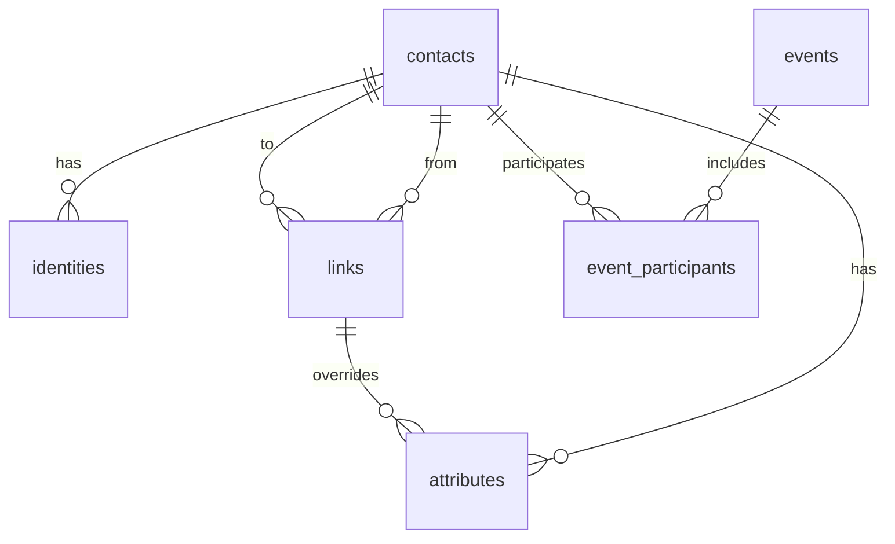

# Standalone Social CRM Core

Design target for a standalone, singleplayer social system that can power a
personal contact manager, a solo-business CRM, or Ghostpaw integration later
without changing its core ontology.

## Thesis

The system is not a toy social layer. It is a real standalone CRM whose
relational feel is inspired by Persona-style confidants and social links.

Its visible product grammar should feel like a coherent standalone system in its
own right:

- system name: `Affinity`
- world records: `Contacts`
- relationship records: `Links`
- personal/deep relationship label: `Social Link`
- structural relationship label: `Tie`
- relationship narrative: `Bond`
- key relationship beat: `Moment`
- history surface: `Journal`
- world graph: `Affinity Chart`
- maintenance surface: `Radar`

To stay lean and powerful, it must separate five different truths that are often
collapsed in weaker designs:

- **entity truth**: who or what exists in the world
- **identity truth**: how to recognize or reach them
- **relational truth**: how any two entities stand in relation to each other
- **evidence truth**: what actually happened
- **operational truth**: how the portfolio is categorized and maintained

If these truths are collapsed into one overloaded record, the system becomes
confusing for both humans and LLMs.

## Core Requirements

The standalone system must work elegantly for all three readings:

1. Personal relationship tracker
2. Solo-business CRM
3. Hybrid life CRM

### Non-Negotiable Capabilities

Every one of these must work out of the box. None may be deferred or treated as
optional.

**Contact diversity**

- humans (friends, family, colleagues, clients, prospects, strangers)
- groups (friend circles, teams, households)
- companies and organizations
- service accounts, APIs, bots (treated as contacts with identities)
- pets and cared-for beings
- the owner themselves as a full participant in the system

**Identity resolution**

- every type of identity: email, phone, social handles (Instagram, Telegram,
  GitHub, LinkedIn, X, ...), websites, external account IDs, aliases
- multiple identities per contact, each typed and labeled
- inbound lookup: given an unknown identifier, resolve to a contact or flag
- owner identities stored the same way as everyone else's
- ambiguous names that are actually different people must remain separate
  contacts with distinct identity records; the system must never silently merge
  without evidence

**Deduplication and merge**

- automated duplicate candidate detection from overlapping identities and
  similar names
- mechanical merge: combine two contact records, reassign all linked identities,
  events, links, participants, and attributes, tombstone the loser
- merge must be deterministic and auditable; the system should track which
  contact was merged into which
- ambiguity tolerance: two contacts named "Alex" are distinct until identity
  evidence says otherwise

**Relational tracking**

- social progression between any pair of contacts (not just owner-to-contact)
- visible progression, hidden accumulation, and trust as separate axes
- relationship state (active, dormant, strained, broken, archived)
- bond narrative per relationship; the interpreted "what this relationship is
  like right now"
- structural ties: org charts, family trees, membership, affiliation, hierarchy
- both structural and relational links can coexist for the same pair
- cadence tracking: expected interaction rhythm per relationship

**Evidence and history**

- typed interaction history (conversation, correction, conflict, gift,
  milestone, observation, transaction, activity, promise, agreement, etc.)
- multi-party events with explicit participant roles
- relationship-defining moments marked inline (breakthrough, rupture,
  reconciliation, milestone, turning point)
- significance weighting on events
- provenance tracking: where evidence came from
- jubilees and important recurring dates (birthdays, anniversaries, contract
  renewals) represented inside the same temporal engine
- agreements, promises, and noted commitments queryable as open commitments

**Operational metadata**

- tags for categorization (client, VIP, prospect, friend, vendor, etc.)
- custom fields for arbitrary structured data (billing rate, account ID,
  preferred channel, timezone, dietary preference, etc.)
- preference-sensitive metadata for channels, gifts, activities, and topics
- filtering and segmentation across the full portfolio

**Maintenance and health**

- drift detection: who am I losing touch with relative to expected cadence?
- reconnection candidates: dormant but valuable links worth reviving
- landmark summaries: the highlight reel of a relationship
- portfolio health sweep: stale links, missing identities, tag gaps, merge
  candidates
- progression readiness: which links are approaching a rank-up?

**Trust and influence**

- trust as a first-class stored axis on relational links, not a derived guess
- trust-weighted influence scores for prioritization and downstream systems
- rank × trust × recency as the composite signal for importance

**Design principles**

- everything grounded in SQL and code; if a derived concept needs operational
  data stored invisibly to make computation fast and reliable, store it
- the database is the system of record and derived views must be cheap to
  compute
- the system must be a serious contender to existing CRM tools at small-to-mid
  scale: Monica, folk, Dex, Clay, Cloze, Attio, HubSpot, Copper
- no feature may depend on Ghostpaw context; the standalone system must be
  fully functional without any AI layer
- the AI layer consumes the system as a client; it does not define the system

## Public Foundation

The public foundation now has **six tables**.

### 1. `contacts`

One row per entity in the world: person, group, company, team, pet, service.

The owner is contact `#1` with `is_owner = true`. This means the owner has
identities, appears in the graph, and participates in links just like any other
contact. There is no separate owner table.

Stores:

- canonical name
- kind (`human`, `group`, `company`, `team`, `pet`, `service`, `other`)
- intrinsic profile fields
- lifecycle state (`active`, `dormant`, `merged`, `lost`)
- `is_owner`

Answers: who or what exists?

### 2. `identities`

One row per identifier or reachable endpoint attached to a contact.

Covers email, phone, handles, external IDs, aliases, websites. Applies equally
to the owner and to other contacts.

Stores:

- `contact_id`
- `type`
- `value`
- `label`
- `verified`

Answers: how do I recognize or reach this contact?

Used for: lookup, deduplication, merge, routing, identity resolution.

### 3. `links`

One row per directed edge between any two contacts. This is the unified graph
and relationship layer.

`links` is the technical table name. In the visible grammar:

- `Link` is the umbrella noun
- a relational link is a `Social Link`
- a structural link is a `Tie`

Some links are structural: `works_at`, `manages`, `married_to`, `member_of`.
These are thin edges with a type and optional role.

Some links are relational: the Persona-style social link tracking depth, trust,
and narrative. These can exist between the owner and a contact or between two
other contacts as observed relational data.

Both structural and relational links can coexist for the same pair.

Stores:

- `from_contact_id`
- `to_contact_id`
- `kind`
- `role`
- `rank`
- `affinity`
- `trust`
- `state`
- `cadence_days`
- `bond`

Answers:

- how do they relate to each other? (structural)
- where do we stand? (relational, owner links)
- what do I know about their relationship? (relational, observed)

### 4. `events`

One row per socially meaningful thing that happened.

This is the unified evidence stream. Every interaction, observation, milestone,
transaction, or noteworthy occurrence is an event.

The caller provides the facts they can actually judge:

- what happened (`type`)
- when it happened
- how important it was (`significance` from `1..10`)
- who was involved
- optional source/provenance

The system derives the mechanical consequences.

`events` is the technical table name. In the visible grammar:

- an ordinary event is shown as a `Journal` entry
- a relationship-defining event is shown as a `Moment`

Stores:

- `type`
- `occurred_at`
- `summary`
- `significance`
- `moment_kind`
- recurrence metadata for anchored recurring events
- provenance/source

Answers:

- what happened?
- what mattered enough to change relationship state?

### 5. `event_participants`

One row per participant in an event.

This is the slight but necessary foundation change. Multi-party events are not
an implementation detail; they are a real part of the ontology.

Stores:

- `event_id`
- `contact_id`
- `role` (`subject`, `actor`, `recipient`, `observer`, `mentioned`, etc.)
- optional directionality metadata

Answers:

- who was involved?
- how were they involved?

### 6. `attributes`

One row per operational metadata item.

Most attributes attach to contacts. Some may attach to links when the metadata
is relationship-specific, such as preferred channel for that specific
relationship.

Stores:

- `contact_id` or `link_id`
- `name`
- `value`

Examples:

- tags (`client`, `vip`, `friend`)
- custom fields (`billing_rate`, `account_id`)
- preferences (`pref.channel.text`, `pref.gift.books`, `pref.activity.walk`)

Answers: how do I categorize and operate on this entity or relationship?

## Internal Operational Support

The public foundation stays lean. The system is still allowed to persist
additional internal structures when they make the math fast, auditable, and
reliable.

These are operational support tables or materialized read models, not new
user-facing ontology.

### `link_event_effects`

Stores per-link effects of an event:

- `event_id`
- `link_id`
- `affinity_delta`
- `trust_delta`
- `state_before`
- `state_after`
- `rank_before`
- `rank_after`
- derived `moment_kind`
- optional preference-match notes or reason codes

Why:

- the same dinner can be a breakthrough with Alice and irrelevant with Bob
- moments become link-scoped and auditable
- hidden accumulation becomes explicit in SQL instead of magical

### `contact_merges`

Stores deterministic merge lineage:

- loser contact
- winner contact
- merged_at
- reason / evidence summary
- automatic vs manual flag

Why:

- real CRMs win by being trustworthy about merges
- ambiguous same-name contacts stay safe

### Rollups and indexes

Recommended internal rollups or materialized views:

- normalized identity key index
- `contact_rollups`
- `link_rollups`
- `upcoming_occurrences`

Typical rollup fields:

- `last_meaningful_event_at`
- `last_positive_event_at`
- `last_negative_event_at`
- `recent_event_count_30d`
- `recent_outbound_count_90d`
- `recent_inbound_count_90d`
- optional `bridge_score`

## Mechanical State Model

### Public stored link variables

Each relational link explicitly stores:

- `rank`: visible relationship level
- `affinity`: hidden progress toward next rank, normalized to `[0, 1)`
- `trust`: confidence/reliability judgment, normalized to `[0, 1]`
- `state`: `active`, `dormant`, `strained`, `broken`, `archived`
- `cadence_days`: expected rhythm in days
- `bond`: current narrative summary

### Hidden operational channels

Trust is exposed publicly as a single number, but the system may maintain two
hidden channels in code or rollups:

- `warmth_signal`
- `reliability_signal`

These are not user-facing fields. They exist to let trust updates be grounded
in benevolence/warmth and competence/reliability research.

### Why this split exists

- `rank` is visible progression
- `affinity` is hidden accumulation
- `trust` is not progress; it is credibility and safety
- `state` introduces real stakes
- `cadence_days` allows drift to be personalized per link

## Event Feature Extraction

Every event should be reduced into a mechanical feature vector before updating
links.

### Inputs provided by caller

- `event_type`
- `significance` in `1..10`
- text summary
- participants and participant roles
- optional directionality if known: owner-initiated, other-initiated, observed,
  mutual

### Derived mechanical features

Compute:

- `intensity = significance / 10`
- `valence` in `[-1, 1]`
- `intimacy_depth` in `[0, 1]`
- `reciprocity_signal` in `[0, 1]`
- `directness` in `[0, 1]`
- `preference_match` in `[0.75, 1.25]`
- `novelty` in `[0.2, 1]`

Suggested directness defaults:

- direct two-way interaction: `1.0`
- owner-initiated one-way action: `0.8`
- passive incoming signal: `0.7`
- observed third-party interaction: `0.45`
- mention only / weak hearsay: `0.25`

### Intimacy depth guidance

Use event type and text cues to approximate disclosure depth:

- superficial coordination / logistics: `0.15`
- casual conversation: `0.35`
- thoughtful check-in or mutual support: `0.55`
- emotionally meaningful conversation: `0.75`
- deep disclosure / rupture / reconciliation: `0.9`

The exact scoring is code, not prompt craft.

## Core Event Weight Formula

For each affected link, compute a base event weight:

```text
base_weight = type_weight(event_type)
            * (0.35 + 0.65 * intensity)
            * directness
            * preference_match
            * novelty
```

Suggested `type_weight` defaults:

- conversation: `1.0`
- activity / hangout: `1.15`
- gift: `1.1`
- help / support / task-sharing: `1.2`
- milestone: `1.35`
- observation: `0.6`
- conflict: `1.25`
- correction: `0.9`
- transaction: `0.7`
- promise / agreement: `1.0`

Rationale:

- significance matters, but type matters too
- direct interactions count more than mentions
- repeated low-information spam should saturate quickly
- preference-sensitive behavior should matter explicitly

## Affinity Formula

Affinity reflects hidden accumulation from repeated meaningful contact.

### Update rule

```text
affinity_gain = base_weight
              * max(valence, 0)
              * (0.55 + 0.45 * intimacy_depth)
              * (0.7 + 0.3 * reciprocity_signal)
              * rank_slowdown
```

Where:

```text
rank_slowdown = 1 / (1 + 0.22 * rank)
```

Negative or conflictual events reduce affinity more modestly:

```text
affinity_loss = base_weight * max(-valence, 0) * 0.35
```

Then:

```text
affinity_next = clamp(affinity + affinity_gain - affinity_loss, 0, 1.5)
```

If `affinity_next >= 1.0` and link state is not `strained` or `broken`:

- increment `rank` by `1`
- carry over `affinity_next - 1.0`
- cap carryover at `0.35`
- derive `moment_kind = breakthrough`

Why this works:

- cold start: first few meaningful events move affinity enough to feel alive
- sparse use: occasional meaningful contact still accumulates
- heavy use: repeated daily micro-events have diminishing returns through
  novelty and rank slowdown

## Trust Formula

Trust moves slower than affinity and is asymmetrical: easier to lose than to
gain.

### Positive trust update

```text
trust_gain = base_weight
           * positive_trust_factor(event_type)
           * (0.6 * warmth_match + 0.4 * reliability_match)
           * (1 - trust)
           * 0.18
```

### Negative trust update

```text
trust_loss = base_weight
           * violation_factor(event_type)
           * trust
           * damage_multiplier
```

Suggested `damage_multiplier`:

- competence/reliability miss: `0.22`
- warmth/care miss: `0.26`
- integrity/betrayal violation: `0.38`

Then:

```text
trust_next = clamp(trust + trust_gain - trust_loss, 0, 1)
```

### Repair rule

Trust repair should not happen from one apology-like event alone. Require
repeated positive evidence after damage:

```text
repair_bonus = min(0.12, consecutive_repair_events * 0.02)
```

Apply only if:

- there was a prior negative event
- no new negative event in the repair window
- recent events show consistent repair behavior

Why:

- trust research shows repair requires repeated consistency
- integrity failures should recover slower than competence failures

## Cadence Formula

Cadence is learned, not fixed.

### Cold-start prior

Initialize cadence by link kind:

- inner personal / family: `14 days`
- close friend: `21 days`
- general personal: `45 days`
- professional active: `30 days`
- weak tie / acquaintance: `120 days`
- service / vendor / bot: `180 days`

### Update rule

Update cadence only from meaningful direct events.

Let `gap_days` be days since previous meaningful direct event:

```text
cadence_days_next = clamp(
  0.75 * cadence_days + 0.25 * gap_days,
  cadence_floor(kind),
  cadence_ceiling(kind)
)
```

Suggested floors/ceilings:

- close personal: `3..60`
- professional active: `5..90`
- weak tie: `21..365`
- service/bot: `30..365`

Why:

- EWMA gives stable adaptation
- weak ties can stay healthy with low frequency
- heavy daily contact will not collapse cadence unrealistically to zero

## Drift Formula

Drift compares actual silence to expected cadence, not one universal timeout.

```text
drift_ratio = days_since_last_meaningful_event / max(cadence_days, 1)
drift_severity = clamp((drift_ratio - 1.0) / 2.0, 0, 1)
drift_priority = drift_severity
               * (0.45 + 0.35 * trust + 0.20 * normalized_rank)
```

Meaning:

- no drift before expected cadence passes
- soft warning after passing cadence
- severe drift after roughly `3x` expected cadence
- high-rank/high-trust links surface sooner than low-value weak ties

## Preference-Sensitive Interaction

Preferences are modeled explicitly via namespaced attributes.

Examples:

- `pref.channel.text = 1`
- `pref.channel.phone = -1`
- `pref.gift.books = 1`
- `pref.activity.walk = 1`
- `pref.activity.clubs = -1`
- `pref.link.channel.email = 1`
- `pref.link.topic.work_updates = 1`

Matching rule:

```text
preference_match = 1.0 + 0.12 * liked_matches - 0.15 * disliked_matches
```

Clamp to `[0.75, 1.25]`.

Why:

- this imports the Midnight Suns / Rune Factory mechanic without turning the
  system into a toy
- one thoughtful well-matched action matters more than a generic one

## Important Dates And Recurring Events

Birthdays, anniversaries, renewals, memorials, and jubilees are represented as
anchored recurring events.

### Date salience bonus

When an event occurs within the configured reminder window around an anchored
recurring event:

```text
date_salience_bonus = 1.0 + min(0.25, significance / 40)
```

Use this as a multiplier on positive affinity and trust gains.

Why:

- important dates are socially legible maintenance anchors
- remembering them matters more than an ordinary same-content message on a
  random day

## Sparse Usage And Mention-Only Handling

The system should build slowly from occasional mentions without hallucinating
depth.

If a contact appears only in mentions or observations:

- create the contact and identities if needed
- create or update weak observational links only
- do not raise rank above `1` from mentions alone
- cap trust growth from non-direct evidence at `0.35`
- allow date reminders, duplicate detection, and graph placement to work anyway

Why:

- the system can start building from scraps
- it avoids inventing a deep relationship from second-hand evidence

## Heavy Daily Usage Protection

Prevent inflation under constant interaction.

### Same-day saturation

For repeated same-pair events on the same day:

```text
novelty = 1 / (1 + 0.35 * same_day_similar_event_count)
```

### Weekly soft cap

If weekly event mass exceeds a threshold for the pair:

```text
mass_penalty = 1 / (1 + excess_weekly_mass / 8)
```

This preserves activity logging while preventing spam from exploding affinity or
trust.

## Moment Derivation

Moments are never classified by the caller. They are derived by the system when
an event is written.

Order of derivation:

- rank-up -> `breakthrough`
- state enters `strained` or `broken` -> `rupture`
- state returns from `strained`/`broken` to `active` -> `reconciliation`
- milestone event with significance `>= 7` -> `milestone`
- otherwise significance `>= 8` and unusually large link effect -> `turning_point`
- else `NULL`

With `link_event_effects`, the same event can be a moment for one link but not
another.

## Derived Scores

### Influence score

For owner-facing prioritization:

```text
influence = 100 * (
  0.35 * normalized_rank +
  0.30 * trust +
  0.20 * recency_score +
  0.15 * bridge_score
)
```

Where:

- `recency_score = exp(-days_since_last_meaningful_event / cadence_days)`
- `bridge_score` defaults low until the system has enough graph evidence to
  identify bridge-like weak ties

### Relationship health

```text
health = 100 * (
  0.30 * trust +
  0.25 * recency_score +
  0.20 * state_score +
  0.15 * reciprocity_score +
  0.10 * positive_event_ratio
)
```

This is a patrol/support score, not a user-facing judgment.

## Derived Read Models

All derived from the public foundation plus operational support tables.

### Event and timeline views

- **Journal**: events filtered by contact or link and ordered by time
- **Moments**: events where `moment_kind IS NOT NULL`
- **Link timeline**: events joined through `event_participants` and
  `link_event_effects`
- **Observed third-party timeline**: link timeline where neither endpoint is the
  owner

### Relationship and maintenance views

- **Owner relationships**: relational links from the owner
- **Progression readiness**: links with high affinity and no blocking strain
- **Drift alerts**: links where silence exceeds cadence
- **Reconnection candidates**: drifting links weighted by trust and rank
- **Landmarks**: moments ordered chronologically per link
- **Bond rewrite inputs**: recent moments + current rank/trust/state + recent
  high-significance events

### Identity and merge views

- **Duplicate candidates**: overlapping normalized identity keys + fuzzy name
  similarity
- **Inbound resolution**: resolve unknown identifier to a contact or flag
- **Merge audit history**: lineage from `contact_merges`

### Temporal and reminder views

- **Upcoming birthdays**
- **Upcoming anniversaries**
- **Upcoming renewals**
- **Open commitments**
- **Upcoming_occurrences** rollup for efficient reminder generation

### Portfolio views

- **Contact profile**: `contacts` + `identities` + owner-facing links + recent
  events + attributes
- **Social map / affinity chart**: `contacts` + `links`
- **Portfolio radar**: drift + duplicates + stale links + missing
  identities + tag gaps

## Entity Relationship Diagram



## Coverage Across Use Cases

### Personal relationship tracker

- `contacts` covers people, pets, and groups
- `links` covers closeness, trust, bond narrative, and observed third-party
  relationships
- `events` + `event_participants` preserve lived history
- recurring events cover birthdays, anniversaries, and memorial dates
- `attributes` handle tags and preferences

### Solo-business CRM

- `contacts` covers clients, prospects, vendors, referrers, services
- `identities` handles reliable contact resolution and inbound matching
- `attributes` handles billing rates, account IDs, preferred channels
- `links` handles company structure and stakeholder relationships
- `events` covers commercial history, commitments, renewals

### Hybrid life CRM

- one portfolio covers both personal and professional contacts
- same `links` grammar works across both worlds
- same event engine works for hangouts, meetings, contracts, renewals, and
  birthdays
- maintenance views reason across both without needing two systems

## Benchmark Coverage Matrix

This is the practical benchmark against existing tools and researched game
systems.

| Capability | Coverage |
|---|---|
| contacts, companies, groups, pets, services | direct |
| multiple identities and endpoint resolution | direct |
| deterministic dedupe and merge lineage | operational support |
| activity timeline / journal | derived |
| reminders for birthdays and anniversaries | derived from recurring events |
| keep-in-touch / resurfacing | derived from cadence + drift |
| tags, fields, segmentation | direct |
| relationships / associations / org structure | direct |
| visible ranks | direct |
| hidden progression | direct |
| preference-sensitive interaction | direct via attributes + formulas |
| moments / threshold scenes | direct via system-derived `moment_kind` |
| weak-tie preservation | derived from cadence + influence |
| radar / maintenance dashboard | derived from rollups |

No major blind gap should remain after the support tables and formulas in this
document are implemented.

## Validation Matrix

Stress-test the formulas against four scenarios.

### Cold start

- one contact created from a single mention
- one direct conversation
- expected behavior: low trust, low rank, some affinity, no over-claiming

### Light usage

- sporadic events every 1–3 months
- birthday remembered once a year
- expected behavior: weak ties remain alive, cadence grows wide, drift is not
  over-aggressive

### Moderate usage

- monthly conversations, occasional gifts, some milestones
- expected behavior: rank rises steadily, trust rises slowly, moments appear at
  sensible thresholds

### Heavy daily usage

- many same-day messages and repeated low-value interactions
- expected behavior: novelty and saturation prevent runaway scores while real
  milestones still matter

## Hard Separation Rules

### Rule 1: Contact Is Not Relationship

The canonical record of who someone is must stay separate from the record of how
any two contacts relate.

### Rule 2: Event Is Not Participation

An event is the thing that happened. `event_participants` records who was
involved and in what role.

### Rule 3: Structural Is Not Relational

`works_at` and `my deep bond with Alice` are both links, but they carry
different data and answer different questions. Both live in `links` and are
distinguished by kind.

### Rule 4: Evidence Is Not Interpretation

Events are evidence. `links.bond` is interpretation. Neither should silently
overwrite the other.

### Rule 5: Metadata Is Not Meaning

Tags, fields, and preferences help operate the portfolio. They are not
substitutes for relational, graph, or evidence semantics.

### Rule 6: Maintenance Is Not Source Data

Drift, landmarks, patrol items, and merge candidates are derived signals, not
new primary truths.

### Rule 7: Trust Is Not Progress

Trust must not be treated as the only relationship progression axis. Rank and
affinity exist for that.

## Current Pack Mapping

How the current Pack concepts map onto the new model.

| Current concept | New home | Notes |
|---|---|---|
| `pack_members` | `contacts` + `links` | split entity from relationship |
| `is_user` | `contacts.is_owner` | owner is a contact now |
| `kind` | `contacts.kind` | clean fit |
| `bond` | `links.bond` | same concept, correct container |
| `trust` | `links.trust` | now accompanied by rank + affinity |
| `status` | `contacts.lifecycle` + `links.state` | split entity lifecycle from relationship state |
| `parent_id` | structural `links` | hierarchy via graph, not entity row |
| `pack_contacts` | `identities` | direct rename |
| `pack_interactions` | `events` + `event_participants` | event + participant split |
| significant interactions | `events.moment_kind` + `link_event_effects` | explicit and link-scoped |
| `pack_fields` | `attributes` | unified metadata |
| `pack_links` | `links` | folded into unified link table |
| drift / patrol / landmarks | derived read models | stays derived |

## RPG Mechanic Mapping

The calibrated model still maps cleanly to known RPG social systems.

| RPG mechanic | Our model |
|---|---|
| Persona Confidant Rank | `links.rank` |
| hidden affinity / support points | `links.affinity` |
| reversed / broken state | `links.state` |
| Heart-to-Heart / Bonding Event / Hangout | `events` + derived `moment_kind` |
| any-to-any affinity graph | `links` between any contacts |
| preference-sensitive gifts / hangouts | `attributes` + `preference_match` |
| visible tiering and predictable milestones | rank + derived readiness |

What games add over plain CRM is now explicitly modeled:

- **visible progression**: `rank`
- **hidden accumulation**: `affinity`
- **preference-sensitive interaction**: attribute-driven modifiers

## Quality Bar

The calibrated foundation is correct only if:

- sparse evidence can start the graph without faking closeness
- weak ties can stay useful with low contact frequency
- heavy usage does not inflate scores uncontrollably
- trust moves slower and breaks faster than affinity
- important dates and preference-sensitive gestures matter mechanically
- the system remains explainable in SQL and code rather than hiding key logic
  in prompts
- it still feels like a true RPG social system rather than disguised tables
- it still functions as a serious standalone solo CRM
- it can later be wired back into Ghostpaw as a higher-quality subsystem without
  changing ontology

## Visible Naming Lock

The visible system name is:

- `Affinity`

This is the broadest RPG-native name that still works for real-life use. It is
warm, legible, and flexible enough for people, groups, companies, pets,
services, and bots.

### Locked visible grammar

| Technical term | Visible name | Notes |
|---|---|---|
| system | `Affinity` | overall product / subsystem name |
| `contacts` | `Contact` | broad enough for all entity kinds |
| `links` | `Link` | umbrella noun for the relationship record |
| relational `links` | `Social Link` | Persona-rooted visible label |
| structural `links` | `Tie` | short, clean graph-facing label |
| `links.rank` | `Rank` | visible relationship progression |
| `links.affinity` | `Affinity` | hidden progress toward next rank |
| `links.trust` | `Trust` | reliability / confidence axis |
| `links.bond` | `Bond` | interpreted narrative of the relationship |
| `events` | `Journal` entry | ordinary history surface |
| `events.moment_kind` | `Moment` | key relationship-defining beat |
| derived world graph | `Affinity Chart` | full world relationship map |
| derived maintenance | `Radar` | maintenance, drift, resurfacing, patrol |

### How the grammar reads

The system should naturally support language like:

- "Add this as a contact."
- "Open my social link with Alice."
- "That moment probably raised the rank."
- "Their bond feels strained right now."
- "Show the affinity chart."
- "Check radar for drift, anniversaries, and people I should reconnect with."

### Terms to avoid as the main grammar

- `Confidant` as the universal base record name
- `Bond` as the main name for every link row
- `Relationship` as the primary visible noun
- `Support` as the universal noun outside specific mechanic references
- `Patrol` as the top-level maintenance surface

### Reserved use of `Confidant`

`Confidant` is still a strong word, but it is too narrow to be the universal
entity noun. It works better as an optional earned label for deep personal human
links rather than as the base term for every contact in the system.

The naming layer follows the model. It does not distort it.
