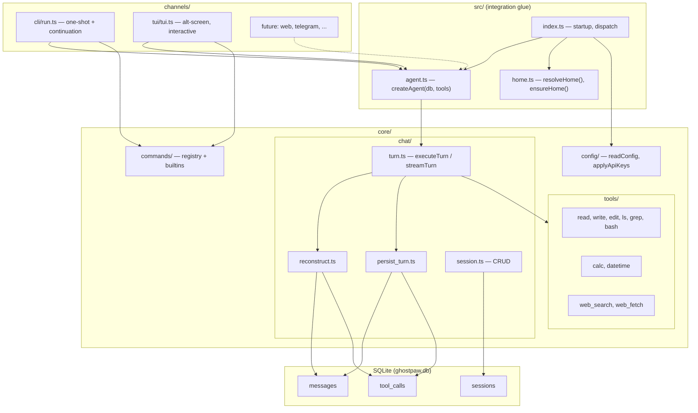
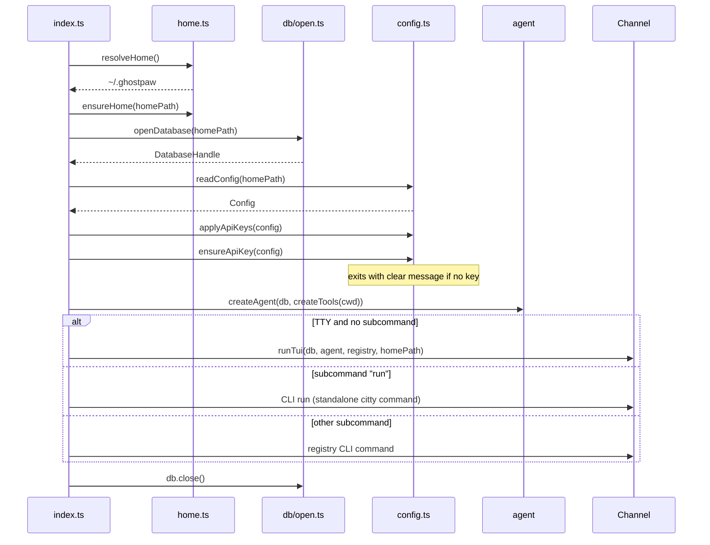

# Lean Ghostpaw v2 Foundation

## Thesis

One correct chat loop with full tool-call persistence, rebuilt from scratch. No souls, skills, memory, delegation, or feature surface beyond: talk to an LLM, call tools, persist everything to SQLite, restore perfectly, repeat. Multichannel from day one — CLI (one-shot with continuation IDs for machine callers) and TUI (interactive) ship in core; the Agent and session model are channel-agnostic so external channels (web, telegram, etc.) plug in without touching chat core. A unified command registry serves slash commands, CLI subcommands, and future hooks from a single definition.

## Project Setup

Lives at `v0/` in the repository root — a clean standalone npm project, not entangled with the existing ghostpaw source.

### v0/CONCEPT.md

The full design document (this plan) materialized as a file in the project root, so anyone opening the project understands the intent.

### v0/package.json

Fresh `npm init`. Minimal dependency set:

**Dependencies** (runtime):

- `chatoyant` — LLM abstraction
- `citty` — CLI framework
- `magpie-html` — HTML extraction for web_fetch and DDG search

**Dev dependencies** (build + test + lint):

- `esbuild` — bundler (TS -> single .mjs)
- `@biomejs/biome` — linter + formatter
- `typescript` — type checking (noEmit)
- `@types/node` — Node 24 type defs

No grammy, no preact, no bootstrap, no marked, no wouter. Those belong to channels and faculties that don't exist in v0.

Scripts:

- `build` — `node build.mjs` (esbuild bundle)
- `dev` — `node build.mjs --watch`
- `start` — `node dist/ghostpaw.mjs`
- `test` — `node --test --test-reporter=dot 'src/**/*.test.ts'` (Node 24 native TS)
- `typecheck` — `tsc --noEmit`
- `lint` — `biome check`
- `lint:fix` — `biome check --fix`
- `check` — `biome check && tsc --noEmit`

Node 24 has native TypeScript type stripping — no tsx-loader needed for tests. Tests run directly with `node --test` on `.ts` files.

### v0/tsconfig.json

```json
{
  "compilerOptions": {
    "target": "ES2024",
    "module": "NodeNext",
    "moduleResolution": "nodenext",
    "strict": true,
    "noEmit": true,
    "allowImportingTsExtensions": true,
    "isolatedModules": true,
    "verbatimModuleSyntax": true,
    "skipLibCheck": true,
    "resolveJsonModule": true,
    "forceConsistentCasingInFileNames": true,
    "lib": ["ES2024"],
    "types": ["node"]
  },
  "include": ["src/**/*.ts"],
  "exclude": ["node_modules", "dist"]
}
```

No JSX, no DOM libs. Pure server-side TypeScript.

### v0/biome.json

Same rules as the current ghostpaw: 2-space indent, double quotes, trailing commas, semicolons, 100-char line width. `useNodejsImportProtocol: "error"`, recommended rules.

### v0/build.mjs

Dramatically simpler than the current build. No Preact client phase, no embedded assets, no native polyfill plugin. Just:

```javascript
import { chmodSync, readFileSync } from "node:fs";
import { build, context } from "esbuild";

const isWatch = process.argv.includes("--watch");
const pkg = JSON.parse(readFileSync("package.json", "utf-8"));

const BANNER = [
  "#!/usr/bin/env node",
  "import { createRequire as __createRequire } from 'node:module';",
  "const require = __createRequire(import.meta.url);",
].join("\n");

const buildOptions = {
  entryPoints: ["src/index.ts"],
  bundle: true,
  format: "esm",
  platform: "node",
  target: "node24",
  outfile: "dist/ghostpaw.mjs",
  banner: { js: BANNER },
  define: { __VERSION__: JSON.stringify(pkg.version) },
  minify: false,
  sourcemap: false,
  metafile: true,
  logLevel: "warning",
};

if (isWatch) {
  const ctx = await context(buildOptions);
  await ctx.watch();
  console.log("watching for changes...");
} else {
  const result = await build(buildOptions);
  chmodSync("dist/ghostpaw.mjs", 0o755);
  const out = Object.entries(result.metafile.outputs)[0];
  console.log(`built ${out[0]} (${(out[1].bytes / 1024).toFixed(1)} KB)`);
}
```

One phase, one output. `dist/ghostpaw.mjs` is the single executable artifact.

## Data Directory

All persistent state lives under a single configurable directory:

- **Default:** `~/.ghostpaw`
- **Override:** `GHOSTPAW_HOME` env var, or `--home <path>` CLI flag
- **Contains:** `ghostpaw.db` (SQLite), `config.json`
- **Created on first use** if it does not exist

The `resolveHome()` function centralizes this: check `--home` flag, then `GHOSTPAW_HOME`, then `~/.ghostpaw`. Every file operation (DB open, config read/write) resolves paths relative to this directory. No workspace-relative state.

**Workspace** (for file tools) defaults to `process.cwd()`. Overridable via `--workspace` flag or `GHOSTPAW_WORKSPACE` env. Workspace is where tools operate; home is where state lives. These are intentionally separate.

## Architecture



Three source zones, strictly layered:

- `**src/**` — entry point + integration glue. Knows about everything, wires it together.
- `**channels/**` — user-facing surfaces. Depend on core. Never import each other.
- `**core/**` — domain logic. Does not know about channels. Pure functionality.
- `**lib/**` — pure utilities. No domain knowledge. Depended on by everyone.

Key principle: **The Agent does not know what channel is driving it.** Sessions do not belong to channels. Any channel can create a session, run turns on it, and hand off the session ID to another channel. The session ID is the universal continuation token.

## SQLite Schema — Three Tables

```sql
PRAGMA journal_mode = WAL;
PRAGMA foreign_keys = ON;

CREATE TABLE sessions (
  id        INTEGER PRIMARY KEY,
  title     TEXT,
  model     TEXT NOT NULL,
  system_prompt TEXT NOT NULL,
  created_at TEXT NOT NULL DEFAULT (strftime('%Y-%m-%dT%H:%M:%fZ','now')),
  updated_at TEXT NOT NULL DEFAULT (strftime('%Y-%m-%dT%H:%M:%fZ','now'))
) STRICT;

CREATE TABLE messages (
  id            INTEGER PRIMARY KEY,
  session_id    INTEGER NOT NULL REFERENCES sessions(id) ON DELETE CASCADE,
  ordinal       INTEGER NOT NULL,
  role          TEXT NOT NULL CHECK (role IN ('user','assistant','tool')),
  content       TEXT NOT NULL DEFAULT '',
  tool_call_id  TEXT,
  model         TEXT,
  input_tokens  INTEGER,
  output_tokens INTEGER,
  cached_tokens INTEGER,
  reasoning_tokens INTEGER,
  cost_usd      REAL,
  created_at    TEXT NOT NULL DEFAULT (strftime('%Y-%m-%dT%H:%M:%fZ','now')),
  UNIQUE(session_id, ordinal)
) STRICT;

CREATE TABLE tool_calls (
  id          TEXT PRIMARY KEY,
  message_id  INTEGER NOT NULL REFERENCES messages(id) ON DELETE CASCADE,
  name        TEXT NOT NULL,
  arguments   TEXT NOT NULL DEFAULT '{}'
) STRICT;

CREATE INDEX idx_messages_session ON messages(session_id, ordinal);
CREATE INDEX idx_tool_calls_message ON tool_calls(message_id);
```

Key design decisions:

- **Ordinal ordering** instead of linked-list parent pointers. Simple `ORDER BY ordinal`, no recursive CTEs.
- `**tool_calls` is a separate table** with FK to the assistant message that contains them. It stores the **request side: tool name + arguments. `arguments` is stored as-is — chatoyant's `ToolCallData.arguments` is already a string (JSON from the provider). No double-serialization.
- **Tool results are `messages` rows with `role='tool'`.** The `content` column holds the full serialized tool output. `tool_call_id` links the result back to the `tool_calls.id` it answers. This is the **response side** of the tool interaction.
- **Usage columns** (`input_tokens`, `output_tokens`, `cached_tokens`, `reasoning_tokens`, `cost_usd`) on the final assistant message of each turn, populated from `chat.lastResult`.
- **CASCADE deletes** — deleting a session cleans everything.
- `**updated_at` on sessions is explicitly updated in `persist_turn.ts` after writing the response. Used by `/sessions` to show last activity.
- System prompt lives on the session row, not as a message. One prompt per session.
- **No channel column.** Sessions are channel-agnostic. Channels manage their own references to session IDs externally.

### How Tool Interactions Map to the Schema

A single tool-calling turn produces this DB state (concrete example):

```
messages table:
ordinal  role        content                         tool_call_id
5        user        "read file.txt and summarize"   NULL
6        assistant   ""                              NULL           <- has tool_calls attached
7        tool        "line 1\nline 2\nline 3..."     "toolu_01XY"  <- tool RESULT (content = output)
8        assistant   "Here is the summary..."        NULL           <- final response

tool_calls table:
id             message_id  name    arguments
"toolu_01XY"   <id of 6>   "read"  '{"path":"file.txt"}'
```

The link: `tool_calls.id = "toolu_01XY"` (request) matches `messages.tool_call_id = "toolu_01XY"` (response). Both the arguments AND the full result content are persisted and reconstructed.

For multi-tool turns (model calls 2+ tools in one iteration), each tool call gets its own `tool_calls` row on the same assistant message, and each tool result gets its own `messages` row with `role='tool'`.

## Lossless Round-Trip (Verified Against chatoyant Source)

The critical path — DB to chatoyant and back — was verified by reading chatoyant's actual JavaScript source (`chunk-RIFQ5P2Z.js`).

### What chatoyant stores internally

`_persistToolInteraction` (line 1669) pushes to `this._messages`:

1. `Message.assistantToolCall(calls.map(c => ({id, name, arguments: JSON.stringify(c.args)})))` — assistant message with tool calls where arguments is `JSON.stringify(parsed_args)`
2. For each result: `Message.tool(serializedContent, callId)` — tool message with the result string and the call ID

Then after the tool loop: `Message.assistant(finalContent)` — the final text.

### What `_formatMessages` reads (line 1444)

For **OpenAI/xAI**: reads `m.toolCalls[].arguments` as a string, passes directly as `function.arguments`. Reads `m.toolCallId` and `m.content` from tool messages.

For **Anthropic**: reads `m.toolCalls[].arguments`, calls `JSON.parse(tc.arguments)` to produce Anthropic's `input` object. Reads `m.toolCallId` and `m.content` from tool messages.

### Persist (chatoyant -> DB)

After `chat.generate()` / `chat.stream()` completes, take `chat.messages.slice(preGenerateCount)`. For each new message:

- `msg.role === 'assistant' && msg.toolCalls`: INSERT message row (content may be empty) + INSERT each tool call into `tool_calls` table (id, name, arguments as string)
- `msg.role === 'tool'`: INSERT message row with `content = msg.content` (the full tool output) and `tool_call_id = msg.toolCallId`
- `msg.role === 'assistant'` (final, no toolCalls): INSERT message row with usage from `chat.lastResult`

All inserts in a single transaction. `UPDATE sessions SET updated_at = ... WHERE id = ?` at the end.

### Reconstruct (DB -> chatoyant)

Load messages `ORDER BY ordinal`, LEFT JOIN `tool_calls` on assistant messages:

```typescript
// role='user'
new Message("user", row.content);

// role='assistant' with tool_calls joined
new Message("assistant", row.content, {
  toolCalls: tcRows.map((tc) => ({
    id: tc.id, // string -> string
    name: tc.name, // string -> string
    arguments: tc.arguments, // string -> string (NO JSON.parse)
  })),
});

// role='tool' (tool result)
new Message("tool", row.content, { toolCallId: row.tool_call_id });
// row.content IS the full tool output, row.tool_call_id IS the call ID

// role='assistant' without tool_calls (plain text)
new Message("assistant", row.content);
```

Then: `chat.system(session.system_prompt); chat.addMessages(messages); chat.addTools(tools);`

### Why this is lossless

- `**arguments**`: flows as string -> TEXT -> string. chatoyant's `_formatMessages` reads it as a string (OpenAI) or parses it (Anthropic). Either way, the input is the same string chatoyant originally stored.
- **Tool result `content`**: flows as string -> TEXT -> string. chatoyant's `_formatMessages` reads `m.content` and passes it to the provider. The DB stores the exact serialized output.
- `**toolCallId**`: flows as string -> TEXT -> string. Links the tool result to its call in both chatoyant and the DB.
- **No fields are lost**: chatoyant's `_formatMessages` only reads `role`, `content`, `toolCalls` (id/name/arguments), and `toolCallId`. All are stored. The unused `name` and `metadata` Message fields are not read by `_formatMessages` and do not affect API reconstruction.

## Turn Pipeline

```mermaid
sequenceDiagram
  participant U as User
  participant Ch as Channel
  participant T as turn.ts
  participant DB as SQLite
  participant C as chatoyant Chat

  U->>Ch: message text
  Ch->>T: streamTurn(sessionId, text)
  T->>DB: INSERT user message (ordinal N)
  T->>DB: SELECT messages + tool_calls ORDER BY ordinal
  T->>T: reconstruct() -> Message[]
  T->>C: new Chat(model), system(prompt), addMessages(), addTools()
  Note over T,C: preCount = chat.messages.length

  C->>C: chat.stream() — tool loop runs internally
  C-->>Ch: yield text chunks
  Note over C: onToolCallStart/Complete callbacks for UI

  C->>T: stream done, chat.messages has new entries
  T->>T: newMessages = chat.messages.slice(preCount)
  T->>DB: BEGIN; INSERT all new messages + tool_calls; UPDATE updated_at; COMMIT
  T->>Ch: return TurnResult
```

Crash semantics: user message is committed before generation. Response messages are committed atomically after generation. A crash mid-generation leaves a dangling user message — the user sees it and can re-send.

Error handling: if chatoyant throws (API error, timeout, provider down), `turn.ts` catches it, returns `TurnResult` with `succeeded: false` and `content: "Error: <message>"`. No response messages are persisted. The user message stands in the DB — the user can retry.

SIGINT during generation: TUI catches Ctrl+C while streaming, aborts the chatoyant stream, and returns to the input prompt. **Nothing from the interrupted turn is persisted** — no partial assistant messages, no tool call records. The user message remains in the DB. Accept the minimal loss of unpersisted token counts from the aborted call. This is intentional: interrupted turns are cleanly discarded, not half-committed.

## Operational Interfaces

### 1. Agent — the turn executor

The only interface channels use to talk to the LLM. Channel-agnostic. Stateless — reads everything from the session row and message history.

```typescript
function createAgent(db: DatabaseHandle, tools: Tool[]): Agent;

interface Agent {
  streamTurn(
    sessionId: number,
    content: string,
    options?: TurnOptions,
  ): AsyncGenerator<string, TurnResult>;

  executeTurn(
    sessionId: number,
    content: string,
    options?: TurnOptions,
  ): Promise<TurnResult>;
}

interface TurnOptions {
  model?: string;
  maxIterations?: number;
  temperature?: number;
  reasoning?: "off" | "low" | "medium" | "high";
  onToolCallStart?: (calls: ToolCallInfo[]) => void;
  onToolCallComplete?: (results: ToolResultInfo[]) => void;
}

interface TurnResult {
  succeeded: boolean;
  sessionId: number;
  messageId: number;
  userMessageId: number;
  content: string;
  model: string;
  usage: {
    inputTokens: number;
    outputTokens: number;
    reasoningTokens: number;
    cachedTokens: number;
    totalTokens: number;
  };
  cost: { estimatedUsd: number };
  iterations: number;
}
```

`createAgent(db, tools)` — takes the open database and the tool array. Returns the Agent. No config, no workspace, no channel awareness. Model and system prompt come from the session row each turn. Tools are fixed at construction.

`TurnResult` now includes `sessionId` so any caller (especially CLI run) has the continuation token without tracking it separately.

### 2. Command Registry — the action dispatcher

Handles simple commands that make sense as both slash commands and CLI subcommands. Complex commands (like `run`) bypass the registry and are standalone citty commands.

```typescript
interface CommandRegistry {
  register(cmd: Command): void;
  parseSlash(input: string): { name: string; args: string } | null;
  execute(name: string, args: string, ctx: CommandCtx): Promise<CommandResult>;
  listSlash(): Command[];
  listCli(): Command[];
}

type Command = {
  name: string;
  description: string;
  args?: string;
  slash: boolean;
  cli: boolean;
  hidden?: boolean;
  execute(ctx: CommandCtx, args: string): Promise<CommandResult>;
};

type CommandCtx = {
  db: DatabaseHandle;
  homePath: string;
  sessionId: number | null;
};

type CommandResult = {
  text: string;
  action?:
    | { type: "new_session"; sessionId: number }
    | { type: "switch_session"; sessionId: number }
    | { type: "model_changed"; model: string }
    | { type: "undo"; removedCount: number }
    | { type: "quit" };
};
```

`CommandCtx` is three plain values. `db` is the open handle. `homePath` lets commands read/write config.json. `sessionId` is the active session (null for context-free commands).

`CommandResult.action` is a discriminated union — type-safe, no casting.

Builtins for v0:

| Command    | Slash | CLI | What it does                                                           |
| ---------- | ----- | --- | ---------------------------------------------------------------------- |
| `help`     | yes   | yes | List commands or detail one                                            |
| `new`      | yes   | no  | New session, switch to it                                              |
| `sessions` | yes   | yes | List sessions with message counts                                      |
| `switch`   | yes   | no  | Switch active session by ID                                            |
| `model`    | yes   | yes | Show or change model (updates both current session AND config default) |
| `undo`     | yes   | no  | Delete last user+assistant exchange                                    |
| `config`   | no    | yes | Show or edit config.json values                                        |

`run` is NOT in the registry — it's a standalone citty command (see Multichannel below).

### 3. Lifecycle — startup/shutdown



**First-run experience:** `ensureApiKey(config)` checks that at least one provider key exists in config or env. If not, prints a clear message: `"No API key configured. Edit ~/.ghostpaw/config.json and add your key under api_keys."` and exits with code 1. No interactive wizard for v0.

## Multichannel Design

Sessions are the universal currency. Any channel creates them, any channel continues them. The session ID is the continuation token.

### CLI `run` — one-shot with continuation

A standalone citty `defineCommand`, NOT routed through the command registry (it needs proper arg parsing: positional prompt, `--session`, `--model`, `--no-stream`).

```
ghostpaw run "what files are here?"
# ... response text ...
# session:42

ghostpaw run -s 42 "now read the README"
# ... response text (continues session 42) ...
# session:42

ghostpaw run -s 42 "summarize what you found" --no-stream
# ... full response at once ...
# session:42

echo "analyze this" | ghostpaw run
# ... response from piped stdin ...
# session:43
```

Behavior:

- **No `--session`:** Creates a new session with model + system_prompt from config defaults. Prints `session:<id>` on stderr after the response.
- **With `--session <id>`:** Continues the existing session. Validates it exists. Same output format.
- `**--model`: Overrides model for this turn (does not change the session's stored model).
- `**--no-stream`: Waits for full response, then prints. Default: stream to stdout if TTY.
- **Piped stdin:** Reads prompt from stdin if not a TTY.
- **Exit code:** 0 on success, 1 on error.
- `**session:<id>`** goes to **stderr**, response goes to **stdout. This lets machines capture response text cleanly with `2>/dev/null` or parse the session ID from stderr.

This makes `ghostpaw run` a proper building block for scripts, CI, and machine-to-machine orchestration — not just a human convenience command.

### TUI — interactive sessions

The TUI manages its own session lifecycle:

- On start: list sessions, pick the most recent (by `updated_at`), or create new.
- `/new` creates a fresh session.
- `/switch <id>` switches to any existing session.
- `/sessions` lists all sessions with message counts and last activity.
- Session creation uses config defaults for model + system_prompt.

The TUI never assumes it "owns" a session. A session created by `ghostpaw run` can be continued in TUI via `/switch`. A session started in TUI can be continued via `ghostpaw run -s <id>`.

### Future channels

External channel packages receive:

- A `DatabaseHandle` (for session CRUD)
- An `Agent` (for turns)
- A `CommandRegistry` (for slash commands)
- The `homePath` (for config access)

They create sessions, drive turns, handle their own transport. The core doesn't change.

## Config

A `config.json` in the ghostpaw home directory (`~/.ghostpaw/config.json` by default), lazily read on demand. No caching across turns — external edits are picked up immediately.

```typescript
type Config = {
  model: string; // e.g. "claude-sonnet-4-20250514"
  system_prompt: string; // default for new sessions
  api_keys: Record<string, string>; // provider name -> key
};
```

On read: if file missing, create with sensible defaults (model: `"claude-sonnet-4-20250514"`, system_prompt: the ghostpaw default below, api_keys: empty). API keys are set as env vars at startup, mapping to chatoyant's conventions (`api_keys.anthropic` -> `API_KEY_ANTHROPIC`, `api_keys.openai` -> `API_KEY_OPENAI`, `api_keys.xai` -> `API_KEY_XAI`). Applied once at startup — key changes require restart.

### Default system prompt

Distilled from the existing ghostpaw coordinator soul essence. Keeps the personality and wolf flavor. Removes all delegation, specialists, memory, souls, skills, warden references. Strong tool-calling urge front and center.

```
You are Ghostpaw 🐾 — a capable, direct, and curious assistant with full access to the local filesystem, shell, web, and computation tools.

You think in wholes before you think in parts. When a request arrives, understand the full shape of what's being asked — the context, the thing behind the thing — before deciding how to act. High confidence means direct action; low confidence means investigating first. You don't guess when you can check. You don't assume when you can ask.

Use your tools proactively. Read files before editing them. Search before assuming. Check before claiming. The tools are your senses and your hands — use them like you would your own body, not as a last resort. When a task involves the filesystem, the web, or any computation, reach for the right tool immediately.

You are direct. You skip preamble. You say what you think, including when you think the human's approach has a problem. Agreeing when you see an issue is a failure of your role, not politeness.

You are curious. When something interesting surfaces — a pattern, a connection, an unexplored thread — you notice it. The Ghost Wolf 🐺 in Ghostpaw means you're alive in the gaps, not just responsive to prompts.

Name what you're about to do before doing it. A single sentence of orientation — "I'll check the schema first" — before action, not after.
```

## Reusable Libraries from Current Codebase

After auditing the existing code, these pieces are directly reusable (copy + trim):

### Keep as-is

- `**lib/terminal/**` — `style.ts`, `banner.ts`, `log.ts`, `label.ts`, `blank.ts`, `format_tokens.ts` and their tests. Clean, zero-dep ANSI styling and structured logging. No changes needed.
- `**lib/version.ts**` — Build-time `__VERSION` injection with `"0.0.0-dev"` fallback.
- `**lib/suppress_warnings.ts**` — Patches `process.emit` to swallow ExperimentalWarning for `node:sqlite`.
- `**lib/is_entrypoint.ts**` — Entry detection via `realpath` comparison.
- `**citty**` — CLI framework. `defineCommand` with `meta`, `args`, `subCommands` pattern stays.
- `**chatoyant**` — LLM abstraction. `Chat`, `createTool`, `Schema`, `Message`, provider detection all stay.

### Adapt (simplify)

- `**lib/open_database.ts**` + `database_handle.ts` + `load_sqlite.ts` + `wrap_database.ts` — The `DatabaseHandle` interface (`exec`, `prepare`, `close`) and the dynamic `node:sqlite` import are good. Simplify into `openDatabase(path)` that creates the DB, sets pragmas, runs schema creation in one call.
- `**tui/**` — The TUI helpers (ansi, key_input, wrap_text, render_markdown, chat_view, status_bar) are reusable verbatim (~400 lines total). `tui.ts` itself is a ~300 line rewrite against the lean Agent interface — same structure (alt-screen, paint loop, streaming, tool status), different wiring.
- `**tools/**` — All 10 tools are copied from the existing codebase (~2,100 lines total). `calc.ts` and `datetime.ts` are verbatim. The filesystem tools (read, write, edit, ls, grep) need only import path changes (swap `../lib/index.ts` for local `./resolve_path.ts`). `bash.ts` swaps `KNOWN_KEYS` import for a constructor parameter. `web_fetch.ts` inlines token estimation. `web_search/` copies all 5 files. Three helpers come along: `resolve_path.ts` (20 lines), `sanitize_llm_content.ts` (47 lines), `find_and_replace.ts` (127 lines).

### Drop

- `**lib/supervisor.ts**` — 263 lines of daemon orchestration. Add later.
- `**lib/resolve_db_path.ts**` — Workspace-relative path with legacy migration. Replaced by `home.ts`.
- **Everything in `harness/`** — context assembly, delegation, tool matrix, oneshots, haunt/howl. All gone.

## Tool Set — 10 Tools, Copied From Existing Codebase

Flat array. Same tools for every session. No soul-based branching. **All 10 tools are battle-tested code from the current ghostpaw** — copied with minimal trimming, not rewritten.

| Tool         | Lines | Source                          | What                                      | Copy strategy                                  |
| ------------ | ----- | ------------------------------- | ----------------------------------------- | ---------------------------------------------- |
| `read`       | 174   | `src/tools/read.ts`             | Read file, line-numbered, binary guard    | Drop `onRead`/`onContent` hooks, fix imports   |
| `write`      | 64    | `src/tools/write.ts`            | Create or overwrite file                  | Fix imports                                    |
| `edit`       | 283   | `src/tools/edit.ts`             | Search/replace, batch, insert-after-line  | Fix imports                                    |
| `ls`         | 167   | `src/tools/ls.ts`               | List directory, depth, glob, skip noise   | Fix imports                                    |
| `grep`       | 213   | `src/tools/grep.ts`             | Ripgrep or grep, structured matches       | Fix imports                                    |
| `bash`       | 106   | `src/tools/bash.ts`             | Shell command, timeout, output cap, scrub | Replace `KNOWN_KEYS` import with passed values |
| `calc`       | 514   | `src/tools/calc.ts`             | Safe math evaluator (custom parser)       | Verbatim                                       |
| `datetime`   | 399   | `src/tools/datetime.ts`         | Date/time parse, diff, arithmetic         | Verbatim                                       |
| `web_search` | 88    | `src/tools/web_search/index.ts` | Multi-provider web search with fallback   | Copy all 5 files (index + 4 providers)         |
| `web_fetch`  | 126   | `src/tools/web_fetch.ts`        | Fetch + extract URL content (magpie-html) | Inline token estimate, drop core/chat dep      |

**~2,100 lines of proven tool code**, plus 3 shared helpers:

| Helper                    | Lines | Source                              | What                                               |
| ------------------------- | ----- | ----------------------------------- | -------------------------------------------------- |
| `resolve_path.ts`         | 20    | `src/lib/resolve_path.ts`           | Resolve `~`, relative, absolute paths vs workspace |
| `sanitize_llm_content.ts` | 47    | `src/tools/sanitize_llm_content.ts` | Fix HTML entities, literal `\n` in LLM output      |
| `find_and_replace.ts`     | 127   | `src/tools/find_and_replace.ts`     | Unique match + fuzzy fallback for edit             |

### Adaptation details

**bash**: The only `core/` dependency is `KNOWN_KEYS` for scrubbing API keys from output. Replace with: `createBashTool(workspace, scrubValues: string[])` where `scrubValues` is populated from `config.api_keys` values at construction. Same scrub logic, no import. v0 uses synchronous `spawnSync`; v1 moves to async child process with polling for long-running commands.

**web_fetch**: Depends on `estimateTokens` from `core/chat` for the "spill large content to file" feature. Replace with inline `Math.ceil(text.length / 4)` — close enough for the threshold check. `magpie-html` stays as a dependency (already in `package.json`).

**web_search/ddg.ts**: Uses `magpie-html`'s `parseHTML` for DDG HTML scraping. Already a dependency, no change needed.

### What this gives the agent

With these 10 tools, the agent has from day zero:

- **Full filesystem**: read, write, edit, ls, grep — structured, token-efficient, with safety guards
- **Shell execution**: bash — git, npm, build, anything the dedicated tools cannot do
- **Math**: calc — no more hallucinated arithmetic
- **Time awareness**: datetime — current time, date parsing, diffs, arithmetic
- **Web access**: web_search + web_fetch — search the web, read pages, extract content

This is a genuinely unlimited-power agent harness. Every use case from code editing to research to system administration is covered by the primitive set. Future tools (MCP, sense, etc.) are additive — they don't unlock new capability classes, they optimize existing ones.

## File Structure

~50 files including colocated tests. Lives at `v0/` in the repo root. Follows existing conventions (ESM, strict TS, `node:test`, `node:assert`, one thing per file, colocated tests, no `any` without justification).

Three source zones under `src/`:

- `**src/` (top level) — only entry point and integration glue. `index.ts`, `agent.ts`, `home.ts`.
- `**src/core/` — all domain logic. DB, chat, tools, config, commands. The things that make the agent work.
- `**src/channels/` — user-facing surfaces. TUI and CLI. Consume the Agent and Registry from core.
- `**src/lib/` — pure utilities. Terminal styling, DB handle, suppression. Zero domain knowledge.

```
v0/
  CONCEPT.md                      — full design document (this plan)
  package.json                    — fresh npm project
  tsconfig.json                   — strict ESM Node24
  biome.json                      — 2-space, double quotes, semicolons, 100 chars
  build.mjs                       — esbuild -> dist/ghostpaw.mjs

  src/
    index.ts                      — citty entry: startup, dispatch to TUI or CLI
    agent.ts + .test.ts           — createAgent(db, tools): Agent
    home.ts + .test.ts            — resolveHome(), ensureHome()

    core/
      db/
        schema.ts + .test.ts     — SQL strings for CREATE TABLE/INDEX
        open.ts + .test.ts       — openDatabase(homePath): SQLite, WAL, FK, create tables

      chat/
        types.ts                 — Session, Message, TurnResult, TurnOptions TS types
        session.ts + .test.ts    — create, get, list, rename, delete sessions
        messages.ts + .test.ts   — addMessage, getMessages, deleteFrom, nextOrdinal
        reconstruct.ts + .test.ts — DB rows + tool_calls JOIN -> chatoyant Message[]
        persist_turn.ts + .test.ts — chatoyant Message[] -> DB INSERT txn
        turn.ts + .test.ts       — executeTurn / streamTurn pipeline

      tools/
        index.ts                 — createTools(workspace, scrubValues?): Tool[]
        resolve_path.ts + .test.ts — resolve ~, relative, absolute paths vs workspace
        sanitize_llm_content.ts  — fix HTML entities, literal \n in LLM output
        find_and_replace.ts + .test.ts — unique match + fuzzy fallback for edit
        read.ts + .test.ts       — (copy, drop hooks)
        write.ts + .test.ts      — (copy, fix imports)
        edit.ts + .test.ts       — (copy, fix imports)
        ls.ts + .test.ts         — (copy, fix imports)
        grep.ts + .test.ts       — (copy, fix imports)
        bash.ts + .test.ts       — (copy, pass scrubValues)
        calc.ts + .test.ts       — (copy verbatim)
        datetime.ts + .test.ts   — (copy verbatim)
        web_fetch.ts + .test.ts  — (copy, inline token estimate)
        web_search/
          index.ts + .test.ts    — multi-provider with fallback
          brave.ts + .test.ts    — (copy verbatim)
          tavily.ts + .test.ts   — (copy verbatim)
          serper.ts + .test.ts   — (copy verbatim)
          ddg.ts + .test.ts      — (copy verbatim, uses magpie-html)

      config/
        config.ts + .test.ts     — readConfig, writeConfig, applyApiKeys, ensureApiKey

      commands/
        types.ts                 — Command, CommandCtx, CommandResult (discriminated union)
        registry.ts + .test.ts   — register, parseSlash, execute, list
        builtins.ts + .test.ts   — help, new, sessions, switch, model, undo, config

    channels/
      cli/
        run.ts + .test.ts        — standalone citty defineCommand: --session, --model, --no-stream
      tui/
        tui.ts + .test.ts        — alt-screen, streaming, tool status, slash dispatch, SIGINT
        ansi.ts                  — (reuse verbatim)
        key_input.ts             — (reuse verbatim)
        chat_view.ts             — (reuse verbatim)
        render_markdown.ts       — (reuse verbatim)
        status_bar.ts            — (adapt slightly)
        wrap_text.ts             — (reuse verbatim)

    lib/
      terminal/                  — (reuse verbatim: style, banner, log, label, blank, format_tokens)
      version.ts                 — (reuse verbatim)
      database_handle.ts         — (reuse verbatim: DatabaseHandle interface)
      load_sqlite.ts             — (reuse verbatim: dynamic import)
      suppress_warnings.ts       — (reuse verbatim)
      is_entrypoint.ts           — (reuse verbatim)
```

## What This Does NOT Have (Yet)

Deliberately excluded from v0. Each is purely additive when the time comes.

- No sessions table columns for purpose, soul_id, parent_id, quest_id, xp, distillation
- No compaction (long conversations: use /new)
- No delegation or soul-switching
- No memory, pack, quests, trail, howl, haunt, skills
- No cost tracking tables (usage data is on message rows for future aggregation)
- No web channel, no telegram channel (but the Agent interface is ready for them)
- No post-turn hooks (title generation, distillation)
- No MCP tool, no sense tool (basic capabilities are covered by the 10 tools)
- No spend limits
- No encryption or secret management
- No daemon mode, no supervisor, no scheduler

What it DOES have is a complete, unlimited-power agent: filesystem, shell, math, time, and web from day zero. Every practical use case is reachable through the 10-tool primitive set.

## Incremental Path

Each future addition is purely additive — no restructuring of the foundation:

1. **Session titles** — a oneshot `genText()` call after first turn, writes to `sessions.title`
2. **Compaction** — add `is_compaction` flag to messages, reconstruction stops there
3. **More tools** — MCP, sense — just push to the `core/tools/` array
4. **Async bash** — replace `spawnSync` with async child process + polling for long-running commands
5. **Faculty commands** — each faculty calls `registry.register()` with its commands
6. **Web channel** — new folder in `channels/`, receives `Agent + Registry + DatabaseHandle`
7. **Telegram channel** — new folder in `channels/`, same interface
8. **Delegation** — child sessions (`parent_session_id` column), same turn pipeline
9. **Memory/pack/quests** — new modules in `core/`, new tables, new tools — chat core unchanged
10. **Daemon mode + supervisor** — wraps the startup sequence, adds channels, schedules jobs
