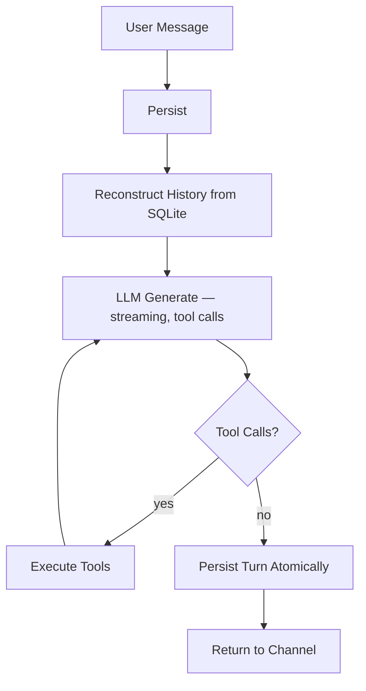
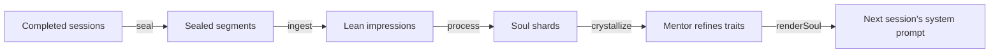

# Harness

The harness is what makes a single `.mjs` file a self-improving multi-agent runtime.

**The exoskeleton** makes the raw LLM loop work properly. One file, one process. `node ghostpaw.mjs` — no containers, no external databases, no compile toolchain. Self-bootstraps on first run. Persistence, session management, compaction, streaming, tool execution, four channels. Pure infrastructure, zero extra tokens. Functionally equivalent to what larger agent frameworks ship, but engineered from the ground up so no tokens are wasted on anything that doesn't require intelligence.

**The investment loops** spend additional tokens — transparently, on cheap models — to make every future turn better. Interceptors enrich context so the main model needs less reasoning. Shade extracts behavioral evidence so system prompts evolve. Delegation routes to specialists so the right identity handles each task. All loops run on small models (GPT-mini, Claude Haiku class). All loops have on/off switches. The upfront cost is real but modest, and it compounds: better context means fewer tool calls, better traits mean better first-pass answers, better routing means less wasted reasoning. The system pays for itself.

## Exoskeleton

Node 24+, `node:sqlite`, single `.mjs` artifact. Bootstraps on first run — creates home directory, initializes databases, seeds souls and schedules. One process, SQLite for all state, no network hops. The world's most widespread runtime, the largest package ecosystem, and a delivery model that ships as a script — no signing, no containers, no compile toolchain on the host.

**Agent loop** — receive message, reconstruct history from SQLite, stream LLM generation with iterative tool calls, persist everything atomically. A single turn can loop through dozens of tool calls (read file → discover dependency → read that → edit both → run test) before producing a final response. Powered by [chatoyant](https://github.com/nicosResworworking/chatoyant) for provider-agnostic streaming and tool execution.

**Persistence** — every message, tool call, and tool result stored in SQLite with foreign-key integrity. Full conversations reconstruct exactly as the LLM saw them. Sessions carry identity, model, system prompt, purpose, and soul attribution. Process restarts continue exactly where they left off.

**Compaction** — bounded-replay summarization at configurable token thresholds. Long conversations compress without losing context. The pre-compaction segment is sealed as shade input — nothing is wasted.

**Channels** — TUI (interactive terminal, streaming, tool status), CLI (one-shot, machine-consumable), Web (Preact SPA with WebSocket streaming), Telegram (long-polling with background notifications). All drive the same `Agent` interface. Pulse runs independently of all channels.

**Settings** — single SQLite table keyed by env var name. Boot syncs env → DB → `process.env`. Changes take effect immediately. Secrets masked in all output, scrubbed from bash stdout/stderr. Immutable write chain with predecessor linkage — undo, reset, full audit trail. This provenance model is [what research identifies](https://arxiv.org/abs/2505.18279) as the key requirement for auditable shared state, and [SQLite transactions prevent the 95% deadlock rate](https://arxiv.org/abs/2602.13255) that emerges when LLM agents compete for shared state.

**Capabilities** — the tool surface:

| Tool                                  | Domain                                                                                             |
| ------------------------------------- | -------------------------------------------------------------------------------------------------- |
| `read`, `write`, `edit`, `ls`, `grep` | Filesystem                                                                                         |
| `bash`                                | Shell execution with timeout and secret scrubbing                                                  |
| `web_search`, `web_fetch`             | Web search and content extraction                                                                  |
| `calc`, `datetime`                    | Deterministic math and time — [compensates known LLM weaknesses](https://arxiv.org/abs/2410.05229) |
| `sense`                               | Proprioceptive text quality measurement                                                            |
| `pulse`                               | CRUD on scheduled background tasks                                                                 |
| `settings`                            | Read/write operational settings                                                                    |

## Investment Loops

Each loop is a small, transparent token investment on a cheap model that compounds into better performance of the main LLM. Every loop has an on/off switch. Every loop is designed so the cost stays negligible relative to the primary interaction.

### Interceptors — enrich the present turn

Before the main model generates, registered subsystems run concurrently in child sessions on the small model. Their summaries are injected as synthetic tool-call entries — the main model sees them as prior tool results and naturally uses the information.

| Subsystem     | Package                                                        | What it gives the main model                                    |
| ------------- | -------------------------------------------------------------- | --------------------------------------------------------------- |
| **Scribe**    | [`@ghostpaw/codex`](https://github.com/GhostPawJS/codex)       | Recalled beliefs, facts, preferences from prior conversations   |
| **Innkeeper** | [`@ghostpaw/affinity`](https://github.com/GhostPawJS/affinity) | Social context — who people are, how they relate, what happened |

The ROI: when the main model already knows the user's preferences and who "Sarah" is, it doesn't need to ask clarifying questions or make wrong assumptions. Fewer wasted turns, fewer tool calls to look things up, better first-pass answers.

Adding a third subsystem means implementing a `run()` function and registering it. See `INTERCEPTOR.md`.

### Delegation — route to the right identity

The coordinator soul routes specialist work to other souls via tool calls.

**`delegate`** — routes to any custom soul by ID. Tool description dynamically lists available specialists — the LLM reads and decides. The delegate runs in a foreground child session with its own evolved system prompt, full shared tools, and a 100-iteration budget.

**`ask_mentor`** — routes to the built-in mentor for soul lifecycle management (creating specialists, refining traits, leveling up). The mentor gets only its specialized [`@ghostpaw/souls`](https://github.com/GhostPawJS/souls) tools — hard-scoped to its domain.

| Tool         | Domain                                 | Notes                                           |
| ------------ | -------------------------------------- | ----------------------------------------------- |
| `delegate`   | Route to custom specialist souls by ID | Dynamic discovery via tool description          |
| `ask_mentor` | Soul management                        | Mentor-only tools, no filesystem/web/delegation |

The ROI: a JS Engineer soul with traits earned from 50 coding sessions produces better code than the generalist coordinator attempting it directly. The coordinator spends one tool call to delegate; the specialist handles it with domain-evolved identity. Better results, often fewer total tokens.

### Shade — learn from the past

The retrospective layer processes completed work after the fact, extracting what was behaviorally notable.

**Sealing** marks work as immutable — mechanical seals at subsystem/pulse return, scheduled sweep for stale sessions. Sessions with soul attribution and substantive purpose (`chat`, `subsystem_turn`, `pulse`, `delegate`) qualify.

**Ingestion** runs a cheap-model oneshot per sealed segment. High notability bar — competent execution is expected, not notable. Only genuine behavioral signals pass: course corrections, reasoning leaps, failures, autonomous judgment. Most segments produce zero impressions.

**Processing** is pluggable. The first processor deposits shards via [`@ghostpaw/souls`](https://github.com/GhostPawJS/souls). Shards accumulate. When evidence converges across independent channels over time, crystallization readiness triggers the attune pulse — a full mentor session that reviews evidence and refines traits. The mentor's own sessions are processed by shade too, enabling recursive self-improvement.

The ROI: the system prompt on day 30 is genuinely different from day 1. Not because someone edited configuration, but because accumulated behavioral evidence drove identity evolution. Better system prompts mean the model needs fewer tokens to understand its role and produce the right kind of output. See `SHADE.md`.

### Pulse — act between conversations

In-process scheduler. Every 60s, checks for due work, claims via compare-and-swap, dispatches. Three modes: **builtin** (in-process TypeScript, zero tokens), **agent** (full LLM turn with tools), **shell** (spawned child process).

| Pulse        | Type    | Interval | Token cost                                                     |
| ------------ | ------- | -------- | -------------------------------------------------------------- |
| heartbeat    | builtin | 5m       | Zero — mechanical health metrics only                          |
| seal_sweep   | builtin | 1h       | Zero — marks stale sessions for shade                          |
| shade_ingest | builtin | 15m      | Small model — extract impressions from sealed work             |
| shade_shards | builtin | 30m      | Small model — deposit shards from impressions                  |
| attune       | builtin | 5m       | Zero unless crystallization ready, then small model for mentor |

The heartbeat proves the agent is alive without burning LLM budget. This avoids the [60–80% token waste](https://arxiv.org/abs/2509.21224) of systems that route "nothing to report" through the LLM on every cycle.

Safety: CAS at-most-once locking, 5-concurrent cap, per-job timeouts with SIGTERM→SIGKILL escalation, startup recovery. See `PULSE.md`.

## The Compound Effect

None of these loops exist in isolation. The interceptors give the main model richer context this turn. The shade feeds evidence into soul evolution, which improves the system prompt for the next session. Delegation routes work to specialists whose own shade-driven evolution makes them better at their domain. The mentor — itself a soul that accumulates shards — gets better at refining other souls.

Every loop feeds every other loop. The token investment is front-loaded and small. The returns compound.
