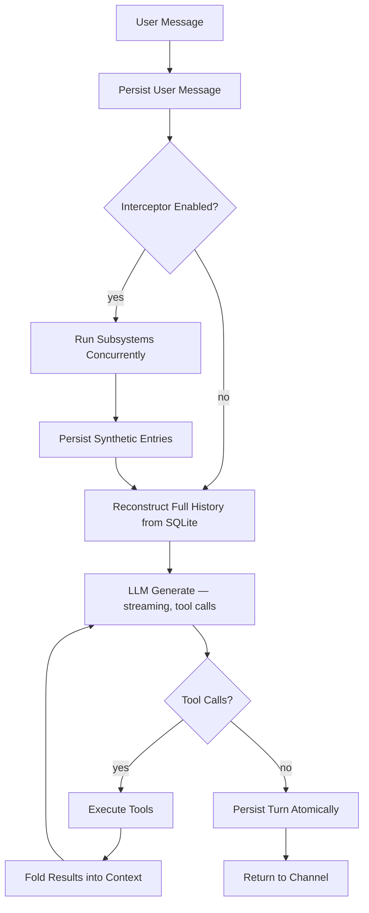
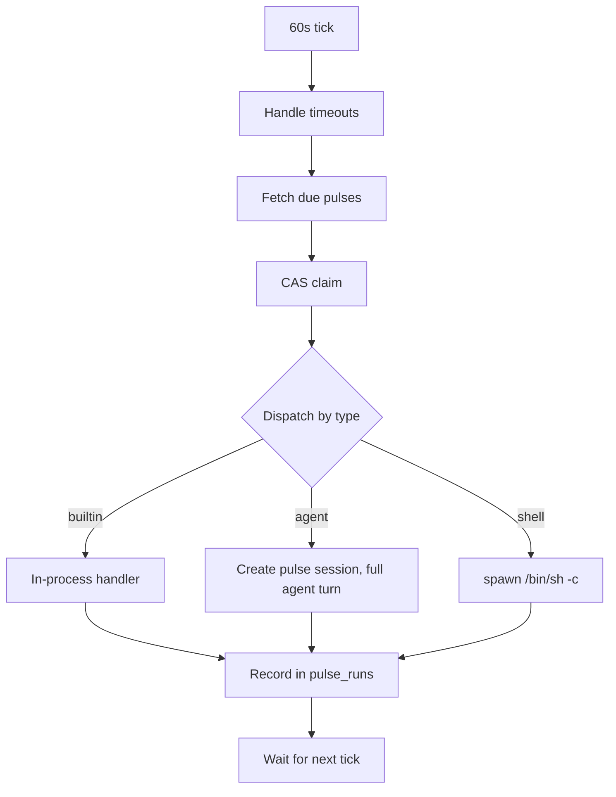
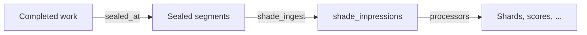

# Harness

A harness turns a raw LLM into a working agent. The LLM alone is stateless — it receives text and produces text, forgetting everything between calls. A harness wraps that core capability with five concerns: **capabilities** that extend what the agent can do, a **synchronous loop** that governs how each interaction runs, an **asynchronous pulse** that gives the agent temporal autonomy between conversations, a **retrospective shade** that extracts signal from completed work, and **channels** that connect the agent to the outside world.

Three enhancement layers handle three temporal orientations. The interceptor augments the present turn with transparent subsystem maintenance. The pulse fires scheduled work between conversations. The shade processes finished work after the fact — sealing completed segments, extracting behavioral impressions, and feeding them to independent processors. Together they make ghostpaw an agent that improves during conversation, acts between conversations, and learns from everything it has done.

But the deepest consequence is none of these layers alone — it's the closed loop between them. Shade extracts behavioral evidence from completed sessions. Pulse-driven attunement crystallizes that evidence into trait refinements via a dedicated mentor agent. And those refined traits feed back into `renderSoul()`, which produces the system prompt for every future session. The system prompt on day 30 is genuinely different from day 1 — not because someone edited a configuration, but because the agent's own behavioral history drove identity evolution. This is not within-session improvement. It is cross-session compounding.

## The Core Mechanic

Every interaction follows the same structure. A chat is a **system prompt** that sets the agent's identity and behavior, a **message history** of alternating user and assistant turns, and **tool calls** the assistant makes in between. The system prompt is fixed for the duration of a session but evolves between sessions — each new session calls `renderSoul()` to produce a prompt that reflects the soul's current traits, which are themselves the product of behavioral evidence from all prior sessions. The message history grows with every turn. Tool calls let the agent act on the world — read files, run code, search the web — and fold the results back into the conversation before producing its final response.

This is powered by [chatoyant](https://github.com/nicosResworworking/chatoyant), a provider-agnostic LLM library that handles streaming, tool execution, and the iterative generate→call→generate loop natively. The harness doesn't orchestrate tool calls — chatoyant does. The harness provides the tools, manages the context, and persists the results.

## The Agent Loop

A single turn can loop through the tool-call cycle many times. The agent reads a file, discovers it needs another, reads that, edits both, runs a test — all within one turn. The channel sees streaming text chunks as the final response forms. When the turn completes, everything is persisted atomically.

The interceptor step is the key addition over a raw LLM loop. Before the LLM generates, registered subsystems run concurrently in child sessions. Their results are injected into the message history as synthetic tool call entries. The LLM sees them as prior tool results and naturally incorporates the information. See `INTERCEPTOR.md` for the full mechanics.

## Pulse

The pulse engine runs alongside the agent loop as an in-process scheduler. Every 60 seconds it checks the `pulses` table for due work, claims it via compare-and-swap, and dispatches it by type. The agent loop handles what happens during a conversation. Pulse handles what happens between conversations — or in parallel with them.

Three execution modes serve different cost/capability tradeoffs:

**Builtin** pulses are in-process TypeScript functions — zero tokens, zero spawn overhead. The default heartbeat is a builtin that runs every 5 minutes, proving the agent is alive through mechanical metrics (session counts, failing pulses, DB page count) without burning LLM budget. This is the key architectural difference from systems like OpenClaw, whose heartbeat reads a static checklist through the LLM on every cycle — [60–80% of tokens wasted](https://arxiv.org/abs/2509.21224) on "nothing to report," [$720+/month](https://www.zenrows.com/blog/ai-agent-cost) at default intervals.

**Agent** pulses create a `purpose: "pulse"` chat session and execute a full agent turn with all tools. Each has a specific prompt and a specific schedule — the LLM gets a focused task, not a vague mandate. Agent pulses persist to the same session/message substrate as conversation turns, so their work is visible, auditable, and can feed into future context.

**Shell** pulses spawn child processes with stdout/stderr capture, PID tracking, and kill escalation. The heaviest mode but the most capable — anything the system can run, pulse can schedule.

Safety is enforced at every level: CAS at-most-once claiming, 5-concurrent-dispatch cap, per-job timeouts with SIGTERM→SIGKILL escalation, memory-bounded output capture (2KB), startup stale-run recovery, and automatic 7-day history pruning.

The `pulse` tool gives the LLM full CRUD management over schedules — all operations by numeric ID. Builtins are protected from deletion and command mutation. See `PULSE.md` for full detail on the scheduling model, safety mechanisms, schema, and implementation.

## Shade

The shade is the retrospective layer. It doesn't augment the current turn or fire independent tasks — it processes work that's already done, extracting what was notable about *how* the agent operated.

The seal mechanism marks completed work as immutable. Three triggers: mechanical seals at subsystem/pulse return and compaction boundaries, plus a scheduled sweep for stale chat sessions. Only sessions with soul attribution and substantive purpose (`chat`, `subsystem_turn`, `pulse`) are eligible — infrastructure sessions are structurally exempt.

The two-stage architecture separates the expensive full-session read (ingestion) from the cheap per-processor work. The ingestion oneshot runs once per sealed segment and persists lean plaintext impressions. Each downstream processor reads only those impressions — typically 100–500 tokens — plus whatever domain context it needs. Adding a new processor retroactively bootstraps over all existing impressions without re-reading any session content.

The notability bar is deliberately high. Most segments produce zero impressions. Competent execution of instructions is expected, not notable. Only genuine behavioral signals pass: course corrections, boundary-setting, reasoning leaps, clear failures, autonomous judgment calls.

The first processor, `shade_shards`, deposits soul shards via `@ghostpaw/souls` — behavioral evidence that accumulates until crystallization readiness triggers the attune pulse. That pulse invokes a full mentor agent session with specialized soul-management tools to review evidence, refine traits, and advance the soul's evolutionary level. The mentor's own sessions are processed by shade in turn, enabling recursive self-improvement of the refinement process itself. The processor framework is generic: any builtin pulse can register as a consumer with its own name, its own interval, and its own exactly-once completion tracking. See `SHADE.md` for full detail on sealing, ingestion, the processor contract, and schema.

## Capabilities

Capabilities are the tools the agent can call. Each tool is a typed function with a name, description, parameter schema, and execute handler. The LLM sees the name and description, decides when to call it, and receives structured results.

**Filesystem** — `read`, `write`, `edit`, `ls`, `grep`. Full read/write access to the local filesystem. The agent can navigate, inspect, create, and modify files and directories.

**Shell** — `bash`. Arbitrary command execution with timeout, output capture, and secret scrubbing.

**Web** — `web_search`, `web_fetch`. Search the web via configurable providers (Brave, Tavily, Serper, DuckDuckGo) and fetch/extract page content.

**Scheduling** — `pulse`. List, create, update, enable, disable, and delete scheduled background tasks. Agent-type pulses run stored prompts as autonomous turns; shell-type pulses run bash commands. All operations by numeric ID.

**Augmentation** — `calc`, `datetime`. These compensate for known LLM weaknesses. LLMs hallucinate arithmetic and lose track of time. A deterministic calculator and a precise date/time engine eliminate both failure modes entirely.

**Subsystem deflection** — one `subsystem_<name>` tool per registered subsystem (e.g., `subsystem_scribe`, `subsystem_innkeeper`). These prevent the LLM from calling subsystem tools directly. When the LLM sees synthetic tool results in its history and tries to invoke the tool itself, the deflection handler returns an instant message explaining the subsystem runs automatically. Zero-cost, one iteration, no child session.

## Lossless Persistence

Every message, every tool call (name + arguments), and every tool result is stored in SQLite with foreign-key integrity and strict typing. The full conversation can be reconstructed exactly as chatoyant saw it — no lossy serialization, no summarization, no dropped fields.

Three core tables carry the chat state:

- **sessions** — identity, model, system prompt, purpose (`chat` | `subsystem_turn` | `system` | `pulse` | `shade`), parent linkage, soul attribution (`soul_id`), timestamps. Pulse sessions are linked via `pulse_runs.session_id`. Shade sessions track ingestion/processing cost with `parent_session_id` pointing to the source.
- **messages** — ordered by `(session_id, ordinal)`. Roles are `user`, `assistant`, or `tool`. Source is `organic` (user/LLM-produced) or `synthetic` (harness-injected). Usage and cost data live on assistant messages. Tool result messages carry `tool_call_id` linking them to the call they answered. `sealed_at` marks completed segment boundaries. `is_compaction` flags summary messages from bounded-replay compaction. `parent_id` links compaction summaries to their predecessor for future tree-style history.
- **tool_calls** — keyed by the provider-assigned `id`, linked to the assistant message that initiated them. Arguments are stored as the original JSON string from the provider — never parsed and re-serialized.

Two additional tables carry the pulse state:

- **pulses** — schedule definition and runtime state machine. Type, command, interval/cron/one-off scheduling, timeout, enabled flag, running state with PID tracking, run count, and last exit code.
- **pulse_runs** — append-only run history with timing, exit code, output, error, and optional session linkage for agent runs. Pruned automatically after 7 days.

Two tables carry the shade state:

- **shade_impressions** — one row per ingested sealed segment. Lean plaintext impressions with soul attribution, impression count, and ingestion session linkage for cost tracking.
- **shade_runs** — per-processor completion tracking. Each (impression, processor) pair has exactly one `done` row. Non-done rows are reclaimed unconditionally on the next sweep.

This is not logging. This is the agent's working memory. Every subsequent turn reconstructs the full history from the chat tables via a single LEFT JOIN query. The pulse tables track the agent's autonomous lifecycle. The shade tables accumulate behavioral evidence from completed work. If the process restarts, conversations continue exactly where they left off, stale pulse runs are recovered cleanly, and shade ingestion resumes from where it stopped.

## Channels

Channels connect the agent to users and systems. The agent and session model are channel-agnostic — channels manage their own session references and presentation, but the underlying turn execution is identical regardless of how the user arrived.

**TUI** — interactive terminal interface with alt-screen rendering, streaming output, scroll, tool status indicators, and slash commands. The default when a TTY is detected.

**CLI** — one-shot command execution. Accepts a prompt, returns the response and a `session:<id>` continuation token on stderr for machine consumption. Enables multi-turn interactions for scripts, pipelines, and automation without an interactive interface.

Both channels drive the same `Agent` interface. Future channels (web, Telegram) plug into the same boundary without touching the loop or the persistence layer. Pulse runs independently of all channels — it fires on timers whether or not any channel is active.

## Settings

A single SQLite table stores every configuration value and every secret. The canonical key is the environment variable name — `ANTHROPIC_API_KEY`, `GHOSTPAW_MODEL`, `GHOSTPAW_BASH_TIMEOUT_S` — no mapping layer, no translation. At boot, environment variables sync into the database; the database then pushes all settings (including code defaults for unset keys) into `process.env`. Every change via tool, slash command, or CLI updates both the database and `process.env` atomically. Child processes inherit the full environment. No restart required for any setting change — it takes effect immediately across the entire process tree.

Secrets are marked at the key level. Their values never appear in tool output (masked as `***`), and an in-memory registry scrubs them from bash stdout/stderr before the LLM sees it. Input cleaning strips whitespace, quotes, and `export VAR=` syntax. Cross-slot validation catches wrong-provider keys (an Anthropic key pasted into the OpenAI slot). The attack surface is structural: the LLM can reference keys by name but never reads secret values — they resolve at the point of use.

Every write creates a new row linked to its predecessor in a per-key chain. Source tracking records `user`, `chat`, or `env`. Undo walks the chain backward one step. Reset deletes the chain, returning to the code default. This immutable provenance is [what research identifies](https://arxiv.org/abs/2505.18279) as the key requirement for auditable shared state in multi-agent systems, and [SQLite transactions prevent the 95% deadlock rate](https://arxiv.org/abs/2602.13255) that emerges when LLM agents compete for shared state without external coordination.

Three model tiers — `GHOSTPAW_MODEL_SMALL`, `GHOSTPAW_MODEL`, `GHOSTPAW_MODEL_LARGE` — auto-resolve per provider on boot. Today they define a global default. When the quest system provides per-task complexity estimation and independent sessions, they become the routing targets for [per-task model selection](https://arxiv.org/abs/2601.19402) — trivial work on the small model, hard reasoning on the large, everything else on the default. The settings infrastructure is the menu; the quest dispatcher will be the router.

## What's Built

The harness is minimal but complete. It runs the LLM loop with tool access, persists everything losslessly, exposes the agent through two channels, augments every turn via the interceptor, schedules autonomous work via the pulse engine, extracts behavioral signal via the shade, evolves identity across sessions via the attune cycle, and manages all operational state through a unified settings layer.

**Interceptor subsystems** (synchronous, every turn):

- **Scribe** — belief-based memory via `@ghostpaw/codex`. Maintains a store of atomic beliefs extracted from conversation, with recall, revision, and supersession. Tested across five LLM providers.
- **Innkeeper** — social graph via `@ghostpaw/affinity`. Maintains contacts, relationships, interactions, commitments, and recurring dates. Knows every face and every story that passes through.

Both run concurrently on every turn. The interceptor is generic — adding a third subsystem means implementing a `run()` function and registering it. The harness, the turn loop, the synthetic entry format, the context filtering, the configuration — all of it works for N subsystems without modification.

**Pulse engine** (asynchronous, scheduled):

- **Heartbeat** — builtin, every 5 minutes, zero tokens. Mechanical health check: session counts, failing pulses, DB page count.
- **Seal sweep** — builtin, hourly. Seals the tail of stale sessions (>6h since last activity) to make them available for shade ingestion.
- **Attune** — builtin, every 5 minutes. Phase 1 is pure SQL: runs shard maintenance (fading exhausted shards) and checks crystallization readiness. If no soul is ready, returns immediately — zero tokens. Phase 2 creates a mentor agent session with `@ghostpaw/souls` tools, reviews evidence, and refines traits. The mentor session has `purpose: "pulse"` with the mentor's own `soul_id`, so shade processes it too.
- **Agent pulses** — user/LLM-created. Run stored prompts as full agent turns on a schedule. Autonomous reasoning tasks with all tool access.
- **Shell pulses** — user/LLM-created. Run bash commands on a schedule. Backups, monitoring, external integrations.

Three scheduling modes (interval, cron, one-off), CAS at-most-once locking, 5-concurrent-dispatch cap, per-job timeouts, startup recovery. The `pulse` tool gives the LLM full CRUD management. See `PULSE.md` for full detail.

**Shade** (retrospective, post-hoc):

- **Ingestion** — builtin pulse, every 15 minutes. Seals sealed segments into lean behavioral impressions via cheap-model oneshot. High notability bar: most segments produce zero impressions.
- **Shard processor** — builtin pulse, every 30 minutes. Compares impressions against soul baselines and deposits behavioral shards via `@ghostpaw/souls`. Shards accumulate until crystallization thresholds are met, then feed the attune pulse's mentor agent. First consumer of the generic processor framework.
- **Compaction** — bounded-replay summarization at configurable token threshold. Creates a summary message, advances the replay head, and seals the pre-compaction segment as a shade input.

The shade is infrastructure, not a feature. Sealed segments and structured impressions are primitives that any future processor can build on — quality scoring, skill extraction, cost analysis — without re-reading any session content. See `SHADE.md` for full detail.

**Settings** (operational infrastructure):

- **30 known keys** — model tiers, provider secrets, tool limits, interceptor config, pulse tuning. Code defaults apply without database rows; explicit overrides are attributed and reversible.
- **Secrets** — 7 provider/channel keys with output scrubbing, input cleaning, cross-slot validation. Masked in all tool output and list views.
- **Surfaces** — `settings` LLM tool, `/config` and `/secret` slash commands, `ghostpaw config` and `ghostpaw secret` CLI with interactive masked input for secrets.
