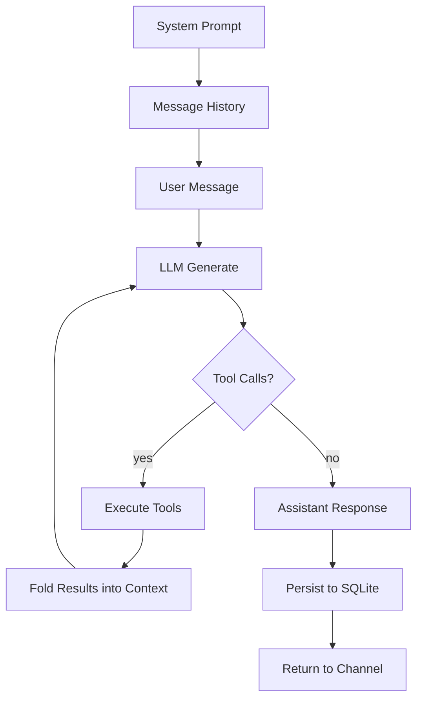

# Harness

A harness turns a raw LLM into a working agent. The LLM alone is stateless — it receives text and produces text, forgetting everything between calls. A harness wraps that core capability with three concerns: **capabilities** that extend what the agent can do, a **mechanical loop** that governs how each interaction runs and what survives between them, and **channels** that connect the agent to the outside world.

## The Core Mechanic

Every interaction follows the same structure. A chat is a **system prompt** that sets the agent's identity and behavior, a **message history** of alternating user and assistant turns, and **tool calls** the assistant makes in between. The system prompt is fixed for the session. The message history grows with every turn. Tool calls let the agent act on the world — read files, run code, search the web — and fold the results back into the conversation before producing its final response.

This is powered by [chatoyant](https://github.com/nicosResworworking/chatoyant), a provider-agnostic LLM library that handles streaming, tool execution, and the iterative generate→call→generate loop natively. The harness doesn't orchestrate tool calls — chatoyant does. The harness provides the tools, manages the context, and persists the results.

A single turn can loop through the tool-call cycle many times. The agent reads a file, discovers it needs another, reads that, edits both, runs a test — all within one turn. The channel sees streaming text chunks as the final response forms. When the turn completes, everything is persisted atomically.

## Capabilities

Capabilities are the tools the agent can call. Each tool is a typed function with a name, description, parameter schema, and execute handler. The LLM sees the name and description, decides when to call it, and receives structured results.

**Filesystem** — `read`, `write`, `edit`, `ls`, `grep`. Full read/write access to the local filesystem. The agent can navigate, inspect, create, and modify files and directories.

**Shell** — `bash`. Arbitrary command execution with timeout, output capture, and secret scrubbing.

**Web** — `web_search`, `web_fetch`. Search the web via configurable providers (Brave, Tavily, Serper, DuckDuckGo) and fetch/extract page content.

**Augmentation** — `calc`, `datetime`. These compensate for known LLM weaknesses. LLMs hallucinate arithmetic and lose track of time. A deterministic calculator and a precise date/time engine eliminate both failure modes entirely.

Together these ten tools make the agent capable of arbitrary local work from day one. No task requires leaving the agent to do manually what it could do with the tools it already has.

## The Agent Loop

The mechanical loop governs what happens on each turn and what persists between them.

1. **User message arrives** — inserted into `messages` with the next ordinal.
2. **History reconstruction** — all prior messages and their tool calls are loaded from SQLite and rebuilt into chatoyant's native `Message[]` format. This is the agent's memory of the conversation so far.
3. **LLM generation** — chatoyant streams the response, executing tool calls as they arise. The harness provides streaming chunks and tool-status callbacks to the channel.
4. **Persistence** — every new message (assistant responses, tool calls, tool results) is written to SQLite in a single transaction. Nothing is partially committed. If the process dies mid-turn, the last complete turn survives intact.
5. **Result returned** — the channel receives the final content, token usage, cost, and model information.

### Lossless Persistence

The first and most fundamental augmentation to the agent loop. Every message, every tool call (name + arguments), and every tool result is stored in SQLite with foreign-key integrity and strict typing. The full conversation can be reconstructed exactly as chatoyant saw it — no lossy serialization, no summarization, no dropped fields.

Three tables carry the state:

- **sessions** — identity, model, system prompt, timestamps.
- **messages** — ordered by `(session_id, ordinal)`. Roles are `user`, `assistant`, or `tool`. Usage and cost data live on assistant messages. Tool result messages carry `tool_call_id` linking them to the call they answered.
- **tool_calls** — keyed by the provider-assigned `id`, linked to the assistant message that initiated them. Arguments are stored as the original JSON string from the provider — never parsed and re-serialized.

This is not logging. This is the agent's working memory. Every subsequent turn reconstructs the full history from these tables. If the process restarts, the conversation continues exactly where it left off. The persistence layer is not an add-on — it is the mechanism by which the agent maintains continuity across turns, sessions, and restarts.

## Channels

Channels connect the agent to users and systems. The agent and session model are channel-agnostic — channels manage their own session references and presentation, but the underlying turn execution is identical regardless of how the user arrived.

**TUI** — interactive terminal interface with alt-screen rendering, streaming output, scroll, tool status indicators, and slash commands. The default when a TTY is detected.

**CLI** — one-shot command execution. Accepts a prompt, returns the response and a `session:<id>` continuation token on stderr for machine consumption. Enables multi-turn interactions for scripts, pipelines, and automation without an interactive interface.

Both channels drive the same `Agent` interface. Future channels (web, Telegram, API) plug into the same boundary without touching the loop or the persistence layer.

## What's Next

The harness is deliberately minimal. It does exactly three things well: run the LLM loop with tool access, persist everything losslessly, and expose the agent through two channels. Every future addition — memory, identity, delegation, scheduling — layers on top of this foundation without replacing it. The harness grows by augmentation, not by rewrite.
