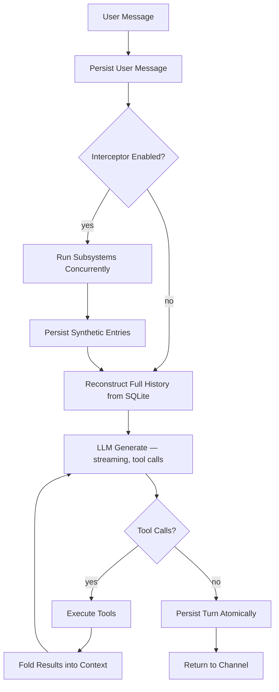

# Harness

A harness turns a raw LLM into a working agent. The LLM alone is stateless — it receives text and produces text, forgetting everything between calls. A harness wraps that core capability with three concerns: **capabilities** that extend what the agent can do, a **mechanical loop** that governs how each interaction runs and what survives between them, and **channels** that connect the agent to the outside world.

## The Core Mechanic

Every interaction follows the same structure. A chat is a **system prompt** that sets the agent's identity and behavior, a **message history** of alternating user and assistant turns, and **tool calls** the assistant makes in between. The system prompt is fixed for the session. The message history grows with every turn. Tool calls let the agent act on the world — read files, run code, search the web — and fold the results back into the conversation before producing its final response.

This is powered by [chatoyant](https://github.com/nicosResworworking/chatoyant), a provider-agnostic LLM library that handles streaming, tool execution, and the iterative generate→call→generate loop natively. The harness doesn't orchestrate tool calls — chatoyant does. The harness provides the tools, manages the context, and persists the results.

## The Agent Loop

A single turn can loop through the tool-call cycle many times. The agent reads a file, discovers it needs another, reads that, edits both, runs a test — all within one turn. The channel sees streaming text chunks as the final response forms. When the turn completes, everything is persisted atomically.

The interceptor step is the key addition over a raw LLM loop. Before the LLM generates, registered subsystems run concurrently in child sessions. Their results are injected into the message history as synthetic tool call entries. The LLM sees them as prior tool results and naturally incorporates the information. See `INTERCEPTOR.md` for the full mechanics.

## Capabilities

Capabilities are the tools the agent can call. Each tool is a typed function with a name, description, parameter schema, and execute handler. The LLM sees the name and description, decides when to call it, and receives structured results.

**Filesystem** — `read`, `write`, `edit`, `ls`, `grep`. Full read/write access to the local filesystem. The agent can navigate, inspect, create, and modify files and directories.

**Shell** — `bash`. Arbitrary command execution with timeout, output capture, and secret scrubbing.

**Web** — `web_search`, `web_fetch`. Search the web via configurable providers (Brave, Tavily, Serper, DuckDuckGo) and fetch/extract page content.

**Augmentation** — `calc`, `datetime`. These compensate for known LLM weaknesses. LLMs hallucinate arithmetic and lose track of time. A deterministic calculator and a precise date/time engine eliminate both failure modes entirely.

**Subsystem deflection** — one `subsystem_<name>` tool per registered subsystem (e.g., `subsystem_scribe`). These prevent the LLM from calling subsystem tools directly. When the LLM sees synthetic tool results in its history and tries to invoke the tool itself, the deflection handler returns an instant message explaining the subsystem runs automatically. Zero-cost, one iteration, no child session.

## Lossless Persistence

Every message, every tool call (name + arguments), and every tool result is stored in SQLite with foreign-key integrity and strict typing. The full conversation can be reconstructed exactly as chatoyant saw it — no lossy serialization, no summarization, no dropped fields.

Three tables carry the state:

- **sessions** — identity, model, system prompt, purpose (`chat` | `subsystem_turn`), parent linkage, timestamps.
- **messages** — ordered by `(session_id, ordinal)`. Roles are `user`, `assistant`, or `tool`. Source is `organic` (user/LLM-produced) or `synthetic` (harness-injected). Usage and cost data live on assistant messages. Tool result messages carry `tool_call_id` linking them to the call they answered.
- **tool_calls** — keyed by the provider-assigned `id`, linked to the assistant message that initiated them. Arguments are stored as the original JSON string from the provider — never parsed and re-serialized.

This is not logging. This is the agent's working memory. Every subsequent turn reconstructs the full history from these tables via a single LEFT JOIN query. If the process restarts, the conversation continues exactly where it left off.

## Channels

Channels connect the agent to users and systems. The agent and session model are channel-agnostic — channels manage their own session references and presentation, but the underlying turn execution is identical regardless of how the user arrived.

**TUI** — interactive terminal interface with alt-screen rendering, streaming output, scroll, tool status indicators, and slash commands. The default when a TTY is detected.

**CLI** — one-shot command execution. Accepts a prompt, returns the response and a `session:<id>` continuation token on stderr for machine consumption. Enables multi-turn interactions for scripts, pipelines, and automation without an interactive interface.

Both channels drive the same `Agent` interface. Future channels (web, Telegram) plug into the same boundary without touching the loop or the persistence layer.

## What's Built

The harness is minimal but complete. It runs the LLM loop with tool access, persists everything losslessly, exposes the agent through two channels, and runs subsystem maintenance automatically via the interceptor. The first subsystem — the **scribe** (belief-based memory via `@ghostpaw/codex`) — is live and tested across five LLM providers.

The interceptor is generic. Adding a second subsystem means implementing a `run()` function and registering it. The harness, the turn loop, the synthetic entry format, the context filtering, the configuration — all of it works for N subsystems without modification.
