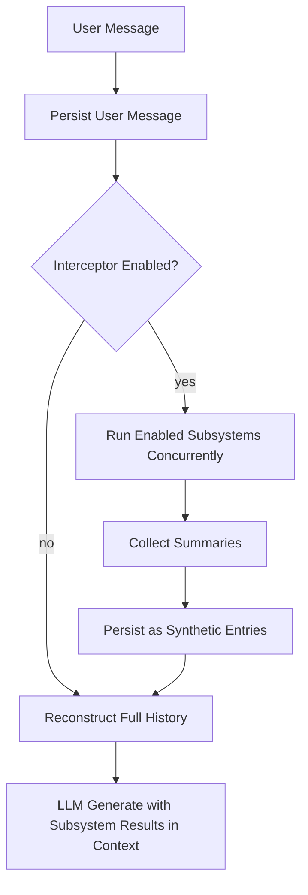

# Interceptor

Transparent harness-level augmentation that runs subsystem maintenance automatically on every turn, removing the LLM's responsibility to decide when side-effects should happen.

## The Problem

The conventional approach to agent subsystems — memory, knowledge management, task tracking — relies on the main LLM choosing to invoke them. The LLM sees a tool like `remember` in its tool list and is expected to call it when the conversation contains information worth persisting. In practice, this delegation almost never happens reliably.

The LLM's intrinsic motivation is to answer the user's question. Maintaining subsystem state is an orthogonal concern that the LLM must be convinced to care about on every single turn. That convincing fails predictably:

- **Weaker models** lack the meta-cognitive capacity to simultaneously answer a question and reason about which side-effects to trigger.
- **Under cognitive load** — long conversations, complex tool chains — the LLM drops non-essential operations first, and subsystem delegation is always non-essential to the immediate response.
- **Casual conversation** carries the richest signals (preferences, facts, relationships) but feels the least like "work that needs delegation."

The subsystem souls themselves work well when invoked. The problem is invocation reliability. The most capable subsystem is worthless if it never runs.

## Why Synthetic Tool Calls

The interceptor injects subsystem results as tool call entries appended to the message history — structurally identical to LLM-initiated tool calls, but produced by the harness. This preserves LLM provider prefix caching.

Prefix caching is the key constraint. Providers cache the system prompt and prior messages from the start of the conversation forward. Any content that's identical to the previous call gets a cache hit. Injecting a changing context section at the *beginning* (between system prompt and history) would invalidate the cache on every turn, making long conversations dramatically more expensive. Appending synthetic entries at the *end* — where new content naturally goes — keeps the entire prior conversation cached.

The LLM sees:

```
[system prompt]                                       ← cached, never changes
[user₁] [assistant₁] ... [userN₋₁] [assistantN₋₁]   ← cached, prior turns
[userN]                                               ← new user message
[assistant: tool_calls=[subsystem_scribe]]            ← synthetic, harness-generated
[tool: scribe result summary]                         ← synthetic
→ LLM generates actual response here
```

This is valid LLM protocol. An assistant message with tool calls, followed by tool results, followed by the LLM continuing — that's exactly how multi-step tool calling works. The LLM naturally incorporates the tool results into its response without knowing they were synthetic.

On the next turn, the entire sequence through the assistant's actual response becomes cached prefix. Synthetic entries from turn N are paid for once and cached for all subsequent turns.

## Turn Flow



The interceptor runs between user message persistence and LLM generation. It checks the config, spawns child sessions for all enabled subsystems concurrently via `Promise.all`, collects results, persists the successful ones as synthetic entries, then hands off to the normal turn loop.

If a subsystem fails or times out, it's silently skipped. Other subsystems' results still appear. If all fail or none are enabled, the turn proceeds as if the interceptor didn't exist.

## Components

### Registry

A plain `Map<string, SubsystemDefinition>` behind a thin interface. Each subsystem registers with:

- **name** — unique identifier, used in config keys, synthetic tool names, and call IDs.
- **defaultLookback** — how many recent user messages to include in the child context (overridable via config).
- **defaultTimeoutMs** — maximum wall-clock time for the child session (overridable via config).
- **run()** — the function that executes the subsystem. Receives a `SubsystemRunOpts` bundle (databases, context, model, timeout) and returns a `SubsystemResult` (session ID, summary text, success boolean).

The registry is generic. Adding a subsystem means implementing `run()` and calling `registry.register()`. No changes to the interceptor, turn loop, or persistence layer.

### Context Filter

Each child session sees a filtered view of the parent conversation. The filter runs a single `LEFT JOIN` query over `messages` and `tool_calls`, then applies a single-pass array filter:

- **User messages** — always included.
- **Organic assistant responses** (text without tool calls) — always included.
- **This subsystem's own synthetic entries** — included, so it can follow its own prior work across turns.
- **Other subsystems' synthetic entries** — stripped. No cross-subsystem noise.
- **Organic tool calls and results** (file reads, bash, web fetches) — stripped. The subsystem processes the conversation, not the main agent's actions.

The filter applies a **lookback window** — only the last N user messages and their surrounding context. This bounds the child session's input size regardless of how long the parent conversation grows.

The filtered rows are then converted to clean `chatoyant.Message[]` by `buildSubsystemContext`. Synthetic tool results from prior turns are re-wrapped as user messages prefixed with `[prior subsystem result]` to avoid protocol coupling (tool messages require matching tool_call_ids on preceding assistant messages, which would be fragile to reconstruct).

### Child Sessions

Each child session is a real, persistent session in the chat database:

- **Purpose** — `subsystem_turn`, linking it to the parent session and the triggering user message.
- **System prompt** — the subsystem's own identity and behavioral instructions.
- **Context** — the filtered messages from the parent conversation.
- **Tools** — the subsystem's own tool surface.
- **Model** — the same model as the main conversation (unified model policy — subsystem quality should match main conversation quality).

The child session runs `chat.generate()` with up to 15 iterations. It may call multiple tools across multiple LLM roundtrips. When done, the final assistant message becomes the summary that gets injected into the parent session.

All child session messages and tool calls are persisted normally. The full reasoning chain is preserved for debugging and introspection.

### Synthetic Persistence

Results are written in a single transaction with manual ordinal tracking:

1. One synthetic `assistant` message with empty content, carrying `tool_calls` entries (one per successful subsystem).
2. One synthetic `tool` message per subsystem, carrying the summary text, linked by `tool_call_id`.

The `source` column distinguishes synthetic entries (`'synthetic'`) from organic ones (`'organic'`). The call ID encodes the subsystem name and triggering message ID for traceability: `ic_scribe_142`.

### Deflection Tools

The main LLM sees tools named `subsystem_scribe` (etc.) in its history and might try to call them directly. The harness registers these as real tools with instant handlers that return:

> "This subsystem runs automatically every turn. Its latest results are already in your context above. You do not need to call it."

Zero-cost deflection. One iteration, no child session, no LLM call.

## Database Schema

No new tables. The existing schema gains minimal columns:

```sql
-- sessions: parent linkage and purpose
parent_session_id  INTEGER REFERENCES sessions(id)
triggered_by_message_id  INTEGER REFERENCES messages(id)
purpose  TEXT NOT NULL DEFAULT 'chat'  -- 'chat' | 'subsystem_turn'

-- messages: source tracking
source  TEXT NOT NULL DEFAULT 'organic'  -- 'organic' | 'synthetic'
```

Child sessions are regular session rows with `purpose = 'subsystem_turn'` and parent links. Synthetic messages are regular message rows with `source = 'synthetic'`. Fully queryable with existing tools and views.

### Lineage Example

```
Session #3 (chat)
  ├── message #140 (user, organic): "Had a great weekend hiking with Sarah"
  ├── message #141 (assistant, synthetic): tool_calls=[subsystem_scribe]
  │     └── child session #47 (subsystem_turn, parent=#3, triggered_by=#140)
  │           └── [scribe's own messages and tool calls against codex.db]
  ├── message #142 (tool, synthetic): scribe summary
  ├── message #143 (assistant, organic): actual agent response
  └── ...
```

## Configuration

```json
{
  "interceptor": {
    "enabled": true,
    "subsystems": {
      "scribe": { "enabled": true, "lookback": 3, "timeout_ms": 10000 }
    }
  }
}
```

- **enabled** — global kill switch. When false, no interception runs.
- **per-subsystem enabled** — individual toggles. Disabled subsystems don't spawn child sessions.
- **lookback** — how many recent user messages to include in the child context window. Falls back to the subsystem's `defaultLookback`.
- **timeout_ms** — maximum wall-clock time per subsystem. Falls back to `defaultTimeoutMs`.

All fields have sensible defaults. The minimal config to enable the scribe is `{ "interceptor": { "enabled": true } }` — the subsystem default config fills in the rest.

## Cost Profile

Measured across five LLM providers (Claude Haiku, GPT-5.4-mini, GPT-5.4-nano, Grok 4.1 fast, Grok 4.1 fast-reasoning) with the scribe subsystem:

- **Latency overhead**: 1-4 seconds per turn, depending on model speed and how many tool calls the scribe makes.
- **Token cost**: 500-3000 tokens per child session (input + output across 1-3 LLM roundtrips). With cheap models this is fractions of a cent per turn.
- **Context overhead**: 50-150 tokens per synthetic entry in the main conversation. Negligible against modern context windows.

The overhead scales linearly with the number of enabled subsystems. With N subsystems running concurrently, wall-clock latency is bounded by the slowest one.

## Adding a Subsystem

1. Create a directory under `src/core/` for the subsystem.
2. Implement a `run(opts: SubsystemRunOpts): Promise<SubsystemResult>` function that:
   - Creates a child session via `createSession(chatDb, model, systemPrompt, { purpose: "subsystem_turn", ... })`.
   - Instantiates a `Chat`, loads the provided context, adds the subsystem's tools.
   - Runs `chat.generate()`.
   - Persists the turn via `persistTurnMessages()`.
   - Returns `{ sessionId, summary, succeeded }`.
3. Create a register function that calls `registry.register({ name, defaultLookback, defaultTimeoutMs, run })`.
4. Call the register function from the entry point (e.g., `src/index.ts`).
5. Add the subsystem's config entry to `DEFAULT_INTERCEPTOR.subsystems` in `config.ts`.

The interceptor, context filter, synthetic persistence, deflection tools, and configuration all work for N subsystems without modification.
