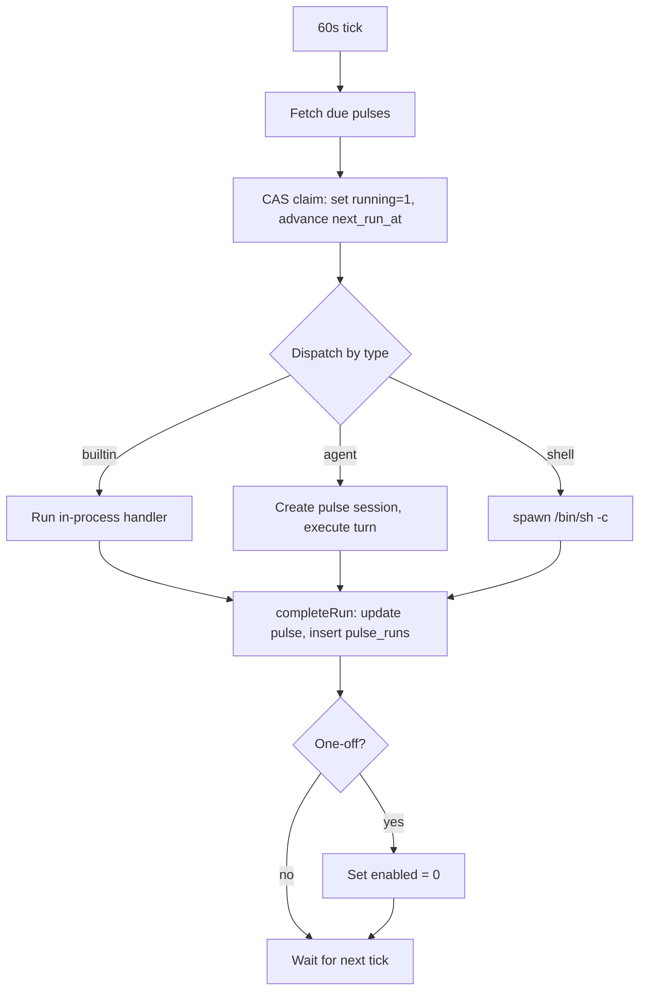

# Pulse

In-process scheduler and mechanical heartbeat. Gives ghostpaw temporal autonomy — the ability to wake itself, do useful work, and go quiet when there is nothing worth doing. Without it, the agent only exists when spoken to.

The [fundamental shift](https://zylos.ai/research/2026-02-16-autonomous-task-scheduling-ai-agents) is from reactive to temporally autonomous. The [PROBE benchmark](https://arxiv.org/abs/2510.19771) found GPT-5 and Claude Opus-4.1 achieve only 40% on autonomous proactive problem-solving — any agent that does this reliably is genuinely differentiated. [ProAgentBench](https://arxiv.org/abs/2602.04482) (500+ hours, 28,000+ events) found long-term memory significantly enhances proactive intervention timing. The pulse engine makes this possible: two SQLite tables, one 60-second tick loop, [compare-and-swap locking](https://docsaid.org/en/blog/sqlite-job-queue-atomic-claim) for at-most-once execution, three execution backends, and zero external dependencies.

## Three Execution Modes

Every pulse has a `type` that determines how it runs. The three modes exist because different jobs have different cost profiles, isolation needs, and capability requirements.

**Builtin** — in-process TypeScript function. Zero tokens, zero spawn overhead, zero network. Runs inside the Node event loop with an `AbortSignal`. The optimized path for internal bookkeeping: health checks, system diagnostics, anything that needs database access but not LLM reasoning. The heartbeat is a builtin.

**Agent** — creates a `purpose: "pulse"` chat session and executes a full agent turn with all tools. The LLM receives a specific prompt, a specific schedule, and a specific timeout. This is what systems like OpenClaw do with their heartbeat, but precise: no "read HEARTBEAT.md and figure out what to do." Each agent pulse encodes exactly what it should accomplish. [Persistent identity enables autonomous goal generation](https://arxiv.org/abs/2512.18202) — agent pulses get more productive over time as the soul, memory, and skills compound.

**Shell** — spawns `/bin/sh -c` as a child process with stdout/stderr capture, PID tracking, and kill escalation. Heaviest on system resources (fork + memory) but can do anything: backups, workspace monitoring, external API calls, system maintenance. The simple default most scheduling systems use, following the [Erlang "let it crash" model](https://www.javacodegeeks.com/2026/01/elixirs-let-it-crash-philosophy-when-failing-fast-is-a-feature.html) — isolate and supervise instead of trying to handle every failure in-process. Error handling code contains [2–10x more bugs](https://www.javacodegeeks.com/2026/01/elixirs-let-it-crash-philosophy-when-failing-fast-is-a-feature.html) than business logic at 20–40% test coverage.

| Mode | Tokens | Spawn cost | Capabilities | Isolation | Best for |
|------|--------|-----------|--------------|-----------|----------|
| Builtin | 0 | 0 | DB + in-process | None (event loop) | Health checks, metrics |
| Agent | Full LLM turn | Session + model call | All tools | Chat session | Autonomous reasoning tasks |
| Shell | 0 | fork + exec | Anything on the system | Child process | Backups, scripts, commands |

### Why Not Just Shell?

Shell-only scheduling is the industry default (cron, systemd timers, Celery). It works, but it forces every job through fork+exec even when the job is "count rows in a SQLite table." The builtin mode eliminates that overhead entirely for internal operations. And shell cannot run an LLM turn — you'd need a separate CLI invocation that opens the database, loads config, bootstraps the agent, runs one turn, and tears everything down. The agent mode does this in-process with the already-running agent, sharing the database connection and tool surface.

The three modes are a tradeoff spectrum: builtin is cheapest but most limited, shell is most capable but heaviest, agent is the middle path for tasks that need intelligence.

## The Heartbeat

The default builtin pulse. Runs every 5 minutes, consumes zero LLM tokens. A pure mechanical health check:

- Counts untitled chat sessions (incomplete conversations)
- Counts failing pulses (last exit code != 0)
- Counts currently running pulses
- Reads the database page count (growth indicator)

Output is structured JSON stored in `pulse_runs.output`. This is the evidence that the agent process is alive and the database is healthy, without burning budget on an LLM reading a checklist.

### Contrast with Token-Burning Heartbeats

OpenClaw's heartbeat reads a static `HEARTBEAT.md` at fixed intervals — whether or not anything changed. [60–80% of tokens wasted](https://arxiv.org/abs/2509.21224) on "nothing to report." At default intervals: [2–3M tokens/day](https://e2b.dev/blog/how-much-do-ai-agents-cost-comprehensive-cost-analysis) in overhead, [$720+/month](https://www.zenrows.com/blog/ai-agent-cost). Agents cost [3–10x more than chatbots](https://www.zenrows.com/blog/ai-agent-cost) — near-zero idle cost is the difference between sustainable and budget sinkhole.

Ghostpaw's heartbeat is pure infrastructure. It rings the bell; the data is there for anything that wants to read it. Microsoft's [SentinelStep](https://arxiv.org/abs/2502.09228) validated dynamic polling for reduced idle computation — the principle applies directly.

| Dimension | Token-burning heartbeat | Ghostpaw pulse heartbeat |
|-----------|------------------------|--------------------------|
| Per-cycle cost | Thousands of tokens | Zero tokens |
| What runs | LLM reads a static checklist | TypeScript function |
| Output | Natural language "nothing to report" | Structured JSON metrics |
| Idle cost | $1–5/day | ~0.1ms CPU per tick |
| Failure detection | LLM must notice and report | Mechanical — always accurate |

## Scheduling Model

Three scheduling modes, mutually exclusive per pulse:

**Interval** — fixed frequency in milliseconds. After each run completes, `next_run_at = now + interval_ms`. Minimum 60 seconds. Simple, predictable, no timezone concerns.

**Cron** — 5-field expression (`minute hour day month weekday`) interpreted in local time. Supports step values (`*/15`), ranges (`9-17`), comma-separated lists (`1,15`), and shortcuts (`@hourly`, `@daily`, `@weekly`, `@monthly`). After each run, `next_run_at = nextCronRun(expr, now)`. Iteration capped at ~4 years to prevent infinite loops on impossible expressions.

**One-off** — single ISO 8601 timestamp via `at`. Fires once, then auto-disables (`enabled = 0`). For deferred tasks: "remind me tomorrow," "run this backup at midnight."



## The Tick Loop

A `setInterval` fires every 60 seconds. Each tick runs these steps in order:

1. **Handle timeouts** — find pulses where `started_at + timeout_ms < now`. First tick: send `SIGTERM` and mark as aborted. Second tick (if still running): `SIGKILL` and record failure. Two-tick protocol gives processes a grace period.

2. **Fetch due pulses** — `WHERE enabled = 1 AND running = 0 AND next_run_at <= now`, ordered by `next_run_at ASC`, capped at `MAX_CONCURRENT - active.size` (max 5 concurrent). [Doubling task duration quadruples failure rate](https://zylos.ai/research/2026-01-16-long-running-ai-agents) — bounding concurrency limits cascading failures.

3. **Claim and dispatch** — for each due pulse, compute the next `next_run_at`, then attempt a [CAS claim](https://docsaid.org/en/blog/sqlite-job-queue-atomic-claim):

```sql
UPDATE pulses
SET running = 1, started_at = ?, next_run_at = ?, updated_at = ?
WHERE id = ? AND running = 0 AND enabled = 1
  AND next_run_at <= strftime('%Y-%m-%dT%H:%M:%fZ','now')
```

`changes === 1` means the caller won the claim. SQLite's serialized writes provide atomicity. If the claim fails (another tick or instance won), skip silently.

4. **Prune history** — every 60 ticks (~1 hour), delete `pulse_runs` older than 7 days.

On startup: all pulses with `running = 1` are completed as errors ("stale: process restarted") and history is pruned immediately. This handles unclean shutdowns — no orphaned running state survives a restart.

On shutdown: `SIGTERM` to all active children, abort all in-flight agent/builtin tasks, wait up to 5 seconds for completion, then exit.

## Safety

**At-most-once execution.** CAS locking guarantees a pulse never runs twice concurrently, even across multiple instances sharing the same SQLite database.

**Concurrency cap.** Maximum 5 concurrent dispatches. The tick loop skips claiming when all slots are occupied. This prevents resource exhaustion from many pulses becoming due simultaneously.

**Per-job timeouts.** Every pulse has a `timeout_ms` (default: 5 minutes). Shell processes get SIGTERM → 5s grace → SIGKILL. Agent and builtin tasks get `AbortSignal` cancellation. [Degradation after 35 minutes](https://zylos.ai/research/2026-01-16-long-running-ai-agents) of continuous agent work — per-job timeouts are a correctness guarantee, not just a safety net.

**Memory-bounded output.** Shell stdout/stderr capture is capped at 2KB per stream. `pulse_runs.output` and `pulse_runs.error` are capped at 2KB. No runaway process can bloat the database.

**Startup recovery.** Any pulse still marked `running = 1` on startup is assumed stale (the process that owned it is gone). Completed as an error with a `pulse_runs` record for auditability.

**History pruning.** Run records older than 7 days are automatically deleted. The `pulse_runs` table stays bounded without manual intervention.

**Guarded tick.** A `tickRunning` flag prevents overlapping ticks. If a tick takes longer than 60 seconds (shouldn't happen — all dispatches are async), the next tick is silently skipped.

## The Tool Surface

The `pulse` tool exposes CRUD management to the LLM. All operations use numeric IDs — the LLM calls `list` to see IDs, then references pulses by ID for all subsequent actions. No name matching.

**Actions:**

| Action | Requires | What it does |
|--------|----------|-------------|
| `list` | — | All pulses with ID, name, type, status, schedule, run count |
| `show` | `id` | Full details + last 5 run records |
| `create` | `name`, `type`, `command`, schedule | Insert new pulse, return ID |
| `update` | `id` | Modify command, schedule, or timeout |
| `enable` | `id` | Set `enabled = 1` |
| `disable` | `id` | Set `enabled = 0` |
| `delete` | `id` | Remove non-builtin pulse |

**Protections:**
- Builtin pulses cannot be deleted or have their command changed (only schedule and timeout).
- Running pulses cannot be updated or deleted.
- One-off pulses cannot have their scheduling mode changed via update.
- All validation errors return `{ error, hint }` with actionable guidance.

## Database Schema

### `pulses`

The schedule definition and runtime state machine.

| Column | Type | Purpose |
|--------|------|---------|
| `id` | `INTEGER PRIMARY KEY` | Stable identifier for all operations |
| `name` | `TEXT NOT NULL UNIQUE` | Human-readable label |
| `type` | `TEXT NOT NULL` | `'builtin'`, `'agent'`, or `'shell'` |
| `command` | `TEXT NOT NULL` | Handler name (builtin), prompt (agent), or shell command |
| `interval_ms` | `INTEGER` | Fixed-frequency interval, null if cron or one-off |
| `cron_expr` | `TEXT` | 5-field cron expression, null if interval or one-off |
| `timeout_ms` | `INTEGER NOT NULL` | Max execution time (default 300000 = 5 min) |
| `enabled` | `INTEGER NOT NULL` | 1 = active, 0 = disabled |
| `next_run_at` | `TEXT NOT NULL` | ISO 8601 UTC — when this pulse is next due |
| `running` | `INTEGER NOT NULL` | 1 = currently executing |
| `running_pid` | `INTEGER` | Shell process PID (null for builtin/agent) |
| `started_at` | `TEXT` | When current run started (null when idle) |
| `last_run_at` | `TEXT` | When the most recent run finished |
| `last_exit_code` | `INTEGER` | Exit code of most recent run |
| `run_count` | `INTEGER NOT NULL` | Total completed runs |
| `created_at` | `TEXT NOT NULL` | Row creation timestamp |
| `updated_at` | `TEXT NOT NULL` | Last modification timestamp |

### `pulse_runs`

Append-only run history. Pruned automatically after 7 days.

| Column | Type | Purpose |
|--------|------|---------|
| `id` | `INTEGER PRIMARY KEY` | Run identifier |
| `pulse_id` | `INTEGER NOT NULL` | FK to `pulses.id` (CASCADE delete) |
| `pulse_name` | `TEXT NOT NULL` | Denormalized for readability after pulse deletion |
| `session_id` | `INTEGER` | FK to `sessions.id` for agent runs (SET NULL on delete) |
| `started_at` | `TEXT NOT NULL` | When the run started |
| `finished_at` | `TEXT` | When the run completed |
| `duration_ms` | `INTEGER` | Wall-clock runtime |
| `exit_code` | `INTEGER` | 0 = success, nonzero = failure |
| `error` | `TEXT` | Error message (capped at 2KB) |
| `output` | `TEXT` | Stdout/result (capped at 2KB) |
| `created_at` | `TEXT NOT NULL` | Row creation timestamp |

## Cost Profile

| Mode | Per-run cost | Idle overhead | Notes |
|------|-------------|---------------|-------|
| Builtin (heartbeat) | ~0.1ms CPU, 0 tokens | 0 | Pure TypeScript, in-process |
| Shell | fork + exec (~10ms), 0 tokens | 0 | Child process, PID tracked |
| Agent | 1 full LLM turn (model-dependent) | 0 | Bounded by timeout, session persisted |
| Tick loop | ~1ms per tick | 1 timer | 60s interval, skips when nothing due |

An idle ghostpaw with only the default heartbeat enabled burns zero LLM tokens. The heartbeat itself is a sub-millisecond in-process function call every 5 minutes. The tick loop checks the database once per minute. Total idle overhead is negligible.

## Implementation

All code lives in `src/core/pulse/`:

| File | Lines | What it does |
|------|-------|-------------|
| `types.ts` | 53 | `Pulse`, `PulseRun`, `PulseType`, `BuiltinHandler`, `JobResult`, `RunAgentTask` |
| `schema.ts` | 45 | DDL for both tables, `initPulseTables` |
| `cron.ts` | 164 | 5-field cron parser, `nextCronRun` (local TZ, 4-year cap) |
| `claim.ts` | 16 | CAS atomic claim: `claimPulse(db, id, nextRunAt)` |
| `complete.ts` | 53 | Run completion, history insert, one-off auto-disable |
| `builtins.ts` | 50 | Handler registry, `heartbeatHandler`, `runBuiltin` |
| `defaults.ts` | 47 | `ensureDefaultPulses` — seeds heartbeat on first boot |
| `engine.ts` | 325 | Tick loop, dispatchers, timeout handling, startup recovery |

Tool surface in `src/core/tools/pulse.ts` (313 lines). Wired into the harness via `src/index.ts`: `initPulseTables`, `ensureDefaultPulses`, `startPulse`, graceful `stop()` on shutdown.
