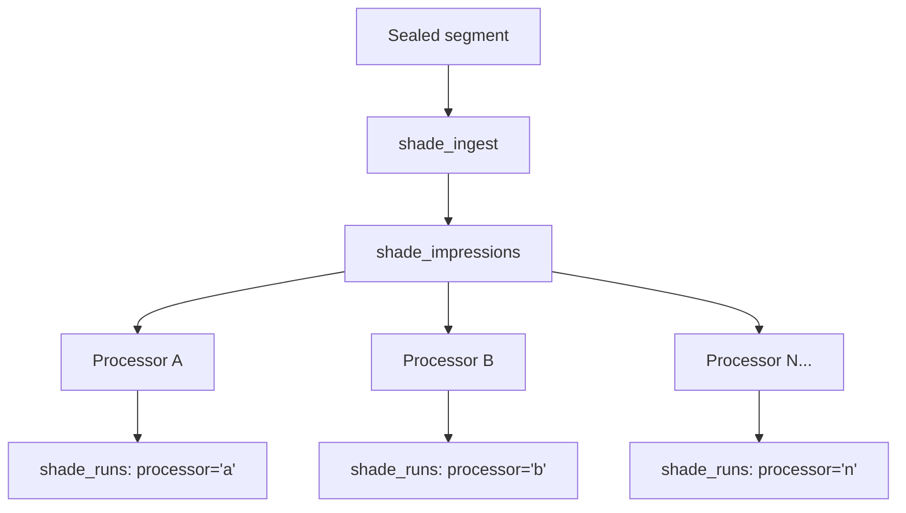
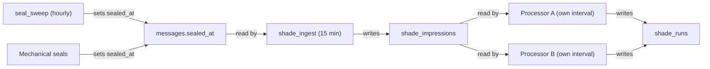

# Shade

Retrospective extraction from completed work. Seals finished session segments, ingests them into lean structured impressions, and lets independent processors consume those impressions on their own schedule. The ghost that follows every soul — carrying forward what was notable about the work that was, without changing it.

## The Problem

An LLM produces a response and moves on. The conversation history records *what* was said and *what* tools were called, but nothing about what was notable in *how* the work happened — where the reasoning was strong, where it went sideways, where it recovered. That process-level signal vanishes the moment the turn completes.

The LLM itself can't preserve it. Under cognitive load — long tool chains, complex debugging, ambiguous requirements — the model focuses entirely on producing the response. Noticing and recording meta-observations about its own reasoning is orthogonal to that goal, and it's always the first thing dropped. Self-evaluation during active work is unreliable even in the most capable models.

Inline evaluation doesn't solve it either. Running an observer on every turn eats tokens on every single interaction (most of which are routine), produces low-quality assessment because the evaluator runs in the same cognitive moment as the work being evaluated, and couples evaluation latency to user-facing response time.

The fundamental problem: completed work contains rich process-level signal, but no component is responsible for extracting it. Quality scoring, behavioral evidence for identity evolution, cost analysis, skill extraction — all of these need structured observations about *how* work happened, not just *what* was produced. The work finishes, the session moves on, and the signal is lost.

The shade solves this at the infrastructure level. It processes completed work after the fact, extracts structured impressions, and makes them available to any downstream consumer. The shade doesn't know what processors exist or what they do with the impressions. It knows about sealed segments, impressions, and the tables that connect them.

## Sealed Segments

A sealed segment is a bounded stretch of a soul's work with a defined beginning and end. It is the universal input to the shade — the thing that "died" and left a shade behind.

Two schema changes define the seal boundary:

```sql
-- messages: segment boundary marker
sealed_at TEXT  -- NULL until sealed, ISO 8601 when sealed

-- sessions: soul attribution
soul_id INTEGER  -- which soul's identity produced this session, NULL for infrastructure
```

The `soul_id` on sessions provides airtight attribution. Every session is created with a specific soul's rendered prompt. Persisting the soul ID at creation time means the shade always knows which soul produced the work, even if the soul's content has since evolved through trait refinement.

### Seal Triggers

Four segment types get sealed, each by the code path that already knows the work is done:

**Subsystem turns** (`purpose: "subsystem_turn"`) — sealed immediately on function return. Each interceptor child session is a single sealed segment. Always bounded, never reused.

**Pulse agent turns** (`purpose: "pulse"`) — sealed immediately on agent turn return. Each scheduled agent task is one segment.

**Interactive chat at compaction** (`purpose: "chat"`) — sealed at compaction boundaries. When the message history compacts, the window from the previous seal (or session start) to the compaction marker becomes one sealed segment.

**Stale interactive chat** (`purpose: "chat"`) — sealed by a scheduled builtin pulse (`seal_sweep`, hourly, configurable). Finds sessions where the last message is older than a threshold (default: 6 hours) and no seal exists past the last sealed point. Catches conversations the user walked away from.

### The Seal Rule

Inclusion-based, not exclusion-based. Only sessions with purposes that represent substantive soul-driven work are eligible:

```sql
WHERE purpose IN ('chat', 'subsystem_turn', 'pulse') AND soul_id IS NOT NULL
```

Everything else — `"system"` oneshots, `"shade"` processing sessions, `"ghost"` sessions, any future infrastructure purpose — is exempt because it's not in the inclusion set. No exclusion list to maintain. Adding a new infrastructure purpose never requires updating the seal logic.

## The Two-Stage Architecture

Two independent jobs connected by a shared bridge table. Not a single pipeline — each stage is a separate scheduled pulse with its own table, its own timestamps, its own exactly-once guarantees.



**Stage 1 — Ingestion.** The only stage that reads full session content. A builtin pulse reads each sealed segment once, runs a cheap-model oneshot to extract behavioral impressions, and persists the lean result into the `shade_impressions` table. This is the expensive step, bounded by the compaction window's token cap.

**Stage 2 — Processing.** Independent consumers read from `shade_impressions` and do whatever they want with the small plaintext impression. Each consumer tracks its own completion in `shade_runs`. Consumers don't know about each other.

**The efficiency guarantee:** Full session content is read by the LLM exactly once during ingestion. Every downstream processor works from the small persisted impression — typically 100–500 tokens. Adding a new processor retroactively does not re-read any session content. It bootstraps over existing impressions for free.

## Ingestion

A builtin pulse (`shade_ingest`, default: every 15 minutes). Finds sealed messages with no corresponding `shade_impressions` row. Runs one cheap-model oneshot per segment.

- **Input**: the sealed segment's messages (bounded by compaction window — no context explosion)
- **Model**: `config.model_small`
- **Session purpose**: `"shade"` — structurally exempt from sealing, invisible to other systems
- **Output**: plaintext impressions persisted into `shade_impressions`

### Impression Format

Plaintext paragraphs, double-newline separated. Each impression is a self-contained observation with inline evidence:

```
The assistant tightened from generic refusal to evidence-based boundary setting,
explicitly refusing to invent details about an ambiguous CVE rather than offering
a hedged explanation. [assistant: "I don't know which real CVE you're referencing"]

The assistant corrected its own factual error promptly when challenged on the
Berlin U-Bahn opening date, revising the comparison without defending the
original claim. [user correction in turn 3 → immediate acknowledge in turn 4]
```

The notability bar is deliberately high. Most sealed segments produce zero impressions — the agent did its job competently, which is expected, not notable. Only genuine behavioral signals pass: course corrections, boundary-setting, reasoning leaps, clear failures, autonomous judgment calls. Answering correctly, following instructions, and being well-formatted are not notable.

Trivial interactions produce zero impressions. Ingestion records `impression_count = 0` and `impressions = ""` so downstream processors can skip with a pure SQLite WHERE clause, paying zero tokens for zero-signal segments.

## Processors

A processor is any builtin pulse that reads from `shade_impressions` and writes to `shade_runs`. The contract:

1. Query for `shade_impressions` rows with `impression_count > 0` and no `done` `shade_runs` row for the processor's own name. Non-done rows (stale `running`, `error`) are ignored — they will be reclaimed.
2. Read the lean impression text plus whatever additional context the processor needs — a rendered soul, a cost summary, a skill index. This is processor-dependent and deliberately unspecified by the shade.
3. Run a cheap-model oneshot producing domain-specific output.
4. Record completion in `shade_runs` with `result_count` linking to the processing session.

Processors are independent. They don't know about each other. They share only the `shade_impressions` table as input and the `shade_runs` table as their completion record. Adding a new processor means: write a builtin pulse handler, give it a processor name, query for unprocessed impressions. No changes to the shade, the ingestion pipeline, or any other processor.

### Bootstrapping

When a new processor is registered, it finds all historical `shade_impressions` rows with no `done` `shade_runs` row for its name — and processes them all. The expensive ingestion was already done. A thousand historical impressions can be retroactively processed by a new consumer for a few cents.

## Database Schema

Two new tables in the chat database. Both follow the existing conventions — `STRICT` typing, ISO 8601 timestamps, foreign keys to `sessions`.

### `shade_impressions`

The bridge table. One row per ingested sealed segment. The shade's testimony — what it carries forward from the session that was.

| Column | Type | Purpose |
|--------|------|---------|
| `id` | `INTEGER PRIMARY KEY` | Impression identifier |
| `session_id` | `INTEGER NOT NULL` | FK to `sessions.id` — the session that was analyzed |
| `sealed_msg_id` | `INTEGER NOT NULL` | The message that marks the seal boundary |
| `soul_id` | `INTEGER NOT NULL` | Which soul produced the source session |
| `impressions` | `TEXT NOT NULL DEFAULT ''` | Lean plaintext, double-newline separated |
| `impression_count` | `INTEGER NOT NULL` | Number of impressions extracted (0 = nothing notable) |
| `ingest_session_id` | `INTEGER` | FK to `sessions.id` — the ingestion oneshot (cost tracking) |
| `created_at` | `TEXT NOT NULL` | Row creation timestamp |

`UNIQUE(sealed_msg_id)` enforces exactly-once ingestion. A sealed segment can only produce one impression row, ever. `soul_id` is `NOT NULL` because only sessions with a soul attribution are eligible for sealing — an impression without a soul can never exist.

```sql
CREATE TABLE IF NOT EXISTS shade_impressions (
  id              INTEGER PRIMARY KEY,
  session_id      INTEGER NOT NULL REFERENCES sessions(id),
  sealed_msg_id   INTEGER NOT NULL,
  soul_id         INTEGER NOT NULL,
  impressions     TEXT NOT NULL DEFAULT '',
  impression_count INTEGER NOT NULL DEFAULT 0,
  ingest_session_id INTEGER,
  created_at      TEXT NOT NULL DEFAULT (strftime('%Y-%m-%dT%H:%M:%fZ','now')),
  UNIQUE(sealed_msg_id)
) STRICT;
```

### `shade_runs`

Per-processor tracking. One row per (impression, processor) pair. Each processor questions each shade independently, exactly once.

| Column | Type | Purpose |
|--------|------|---------|
| `id` | `INTEGER PRIMARY KEY` | Run identifier |
| `impression_id` | `INTEGER NOT NULL` | FK to `shade_impressions.id` |
| `processor` | `TEXT NOT NULL` | Consumer name (`"shards"`, `"quality"`, etc.) |
| `status` | `TEXT NOT NULL` | `"running"`, `"done"`, or `"error"` |
| `result_count` | `INTEGER` | Whatever the processor produced (shards, scores, etc.) |
| `process_session_id` | `INTEGER` | FK to `sessions.id` — the processing oneshot (cost tracking) |
| `error` | `TEXT` | Error message if processing failed |
| `started_at` | `TEXT` | Set when processing starts |
| `finished_at` | `TEXT` | Set when processing completes or fails |
| `created_at` | `TEXT NOT NULL` | Row creation timestamp |

`UNIQUE(impression_id, processor)` is the exactly-once guarantee per consumer.

```sql
CREATE TABLE IF NOT EXISTS shade_runs (
  id              INTEGER PRIMARY KEY,
  impression_id   INTEGER NOT NULL REFERENCES shade_impressions(id),
  processor       TEXT NOT NULL,
  status          TEXT NOT NULL DEFAULT 'running',
  result_count    INTEGER,
  process_session_id INTEGER,
  error           TEXT,
  started_at      TEXT,
  finished_at     TEXT,
  created_at      TEXT NOT NULL DEFAULT (strftime('%Y-%m-%dT%H:%M:%fZ','now')),
  UNIQUE(impression_id, processor)
) STRICT;
```

Claiming follows a check-delete-insert pattern: check for a `done` run (skip if exists), delete any non-`done` run (reclaiming stale or errored attempts unconditionally), insert a fresh `running` row. No timeout tuning required — any incomplete run is reclaimed on the next sweep.

### Schema Changes to Existing Tables

The `messages` table gains `sealed_at TEXT` (NULL until sealed, ISO 8601 when sealed). The `sessions` table gains `soul_id INTEGER` (which soul's identity produced this session, NULL for infrastructure). `SessionPurpose` gains `"shade"`.

## Scheduling

Three independent concerns connected only by columns and tables:



**Sealing** marks segments as done. Two paths: mechanical (subsystem turn return, pulse turn return, compaction boundaries set `sealed_at` inline) and scheduled (a builtin pulse `seal_sweep` runs hourly, finds stale unsealed chat sessions, seals the last message).

**Ingesting** extracts impressions from sealed segments. A builtin pulse `shade_ingest` runs on a configurable interval (default: 15 minutes). Queries for sealed messages without a corresponding `shade_impressions` row. Runs one cheap-model oneshot per segment, persists impressions. All ingestion is scheduled, never inline — no user-facing latency impact.

**Processing** consumes impressions. Each processor runs as its own builtin pulse on its own interval. Each queries `shade_impressions` for unprocessed rows matching its processor name. Processors are registered independently and don't coordinate.

The three concerns run on their own intervals, own tables, own timestamps. They don't know about each other. The `sealed_at` column connects sealing to ingestion. The `shade_impressions` table connects ingestion to processing.

## Recursion Safety

The shade processes all souls' work — the main coordinator, every subsystem soul, every future custom expert soul, mentor itself when wired. Universal coverage without special-casing, achieved entirely through the inclusion-based seal rule:

- Only `purpose IN ('chat', 'subsystem_turn', 'pulse')` with non-null `soul_id` are eligible for sealing.
- Shade sessions have `purpose: "shade"` — not in the inclusion set, structurally exempt.
- System oneshots have `purpose: "system"` — also not in the inclusion set.
- New infrastructure purposes are exempt by default. No list to update.

The shade never processes its own sessions. This is not a special-case check — it's a structural consequence of the seal rule. Shade sessions are never sealed, therefore never ingested, therefore never visible to any processor.

## Cost Profile

| Stage | Input tokens | Output tokens | Model | Frequency |
|-------|-------------|---------------|-------|-----------|
| Ingestion | 500–2000 (compaction-bounded) | 200–500 | `model_small` | Once per sealed segment |
| Processing (per processor) | 200–800 (impression + context) | 200–500 | `model_small` | Once per impression per processor |

**Compared to a naive single-pass approach:** A pipeline that reads the full session for every consumer would cost 500–2000 input tokens per consumer per segment. The modular approach pays the full read once during ingestion. Each additional processor reads only the 100–500 token impression. With N processors, the saving is `(N-1) * (500–2000)` tokens per segment.

**Pre-LLM skipping:** Empty or trivial segments produce zero impressions. Ingestion records `impression_count = 0` and processors skip them with a pure SQLite WHERE clause. Zero tokens for zero-signal segments.

**Aggregate estimate:** At default intervals with 2 subsystem turns per user turn: roughly 4 sealed segments per user turn, 3000–5000 tokens total across ingestion and one processor on the cheap model. Well under $0.01 per user turn in shade overhead.

**Retroactive processing:** When a new processor bootstraps over N existing impressions, it pays only 200–800 input tokens per impression. No re-ingestion of original sessions. A thousand historical impressions could be processed for $0.05–0.20.

## What This Enables

The shade is infrastructure, not a feature. It creates two primitives that other systems build on:

**Sealed segments** are a universal completion signal. Any system that needs to process finished work — not just the shade — can hook into the same `sealed_at` column. The seal mechanism is the harness's way of saying "this chunk of work is done and will not change."

**Structured impressions** are a queryable audit log. The `shade_impressions` table records what was notable about every meaningful session segment the agent ever processed. This is independently valuable — for debugging, for understanding behavioral patterns over time, for answering "what did the agent struggle with last week?" — regardless of whether any processor ever consumes them.

The `processor` column in `shade_runs` supports unlimited independent consumers. Each registers by name, processes at its own pace, and has no dependency on any other consumer's existence or progress.

## Usage

### Soul Shard Processor

The first shade processor: `shade_shards`. A builtin pulse (default: every 30 minutes) that reads impressions and deposits soul shards via `@ghostpaw/souls`.

For each unprocessed impression, it reads the lean impression text plus the rendered soul (via `renderSoul()`) and runs a cheap-model oneshot that compares the impressions against the soul's current baseline. Impressions that merely confirm existing behavior are filtered out. Only deviations — corrections, unexpected strengths, repeated failures, creative leaps — become shards. Each shard is deposited via `write.dropShard(soulsDb, input)` with source `"shade"`, linked to the impression's soul. Shards land in the souls inbox for future mentor processing.

### Future Processors

Cost analysis, quality scoring, skill extraction, pattern detection — each follows the same pattern: register a builtin pulse, query for unprocessed impressions, produce domain-specific output, record completion in `shade_runs`. No changes to the shade infrastructure required.

## What Is Explicitly Out of Scope

- Mentor wiring — trait proposals from accumulated shards
- Custom soul lifecycle management
- Shade configuration via LLM tools (the shade is infrastructure, not user-facing)
- Cross-impression pattern detection (finding patterns across multiple shade runs)
- Adaptive shade intervals based on processor output velocity
